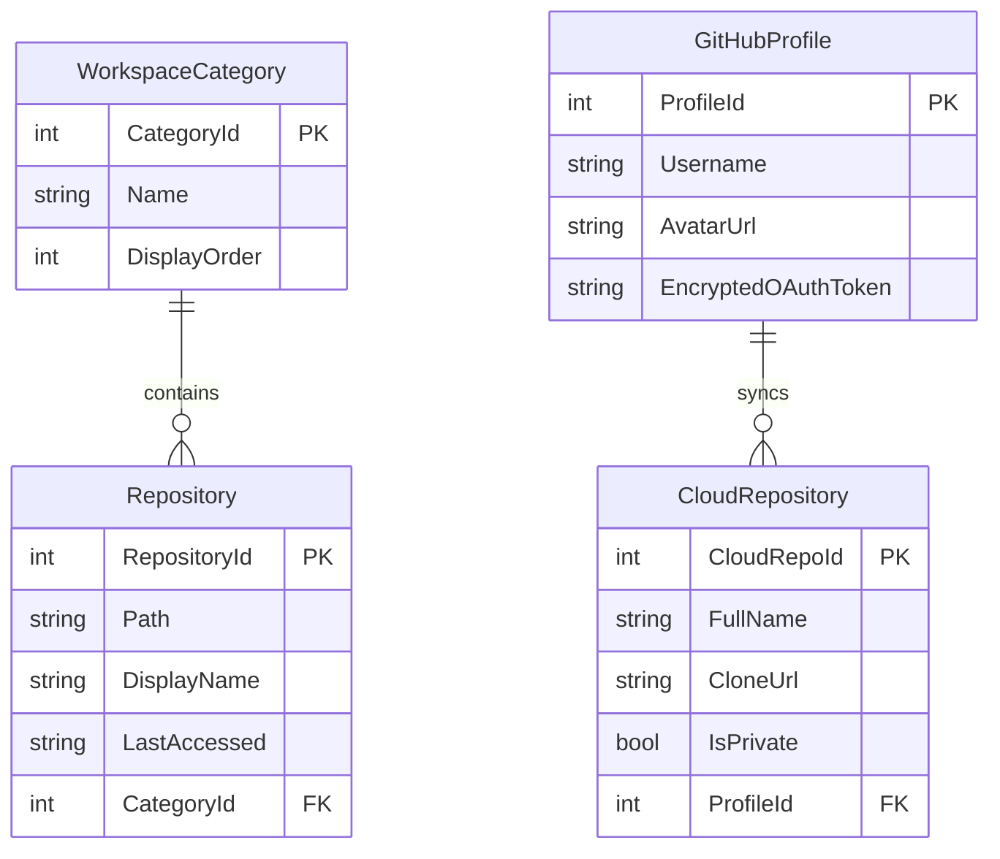

# GitLoom: Technical Roadmap & Architecture Blueprint

GitLoom is a premium, offline-first, cross-platform desktop **Git GUI** built natively in C# and Avalonia UI. It serves as a beautiful, high-performance, and entirely free alternative to commercial clients like GitKraken, powered by the optimized C-based `libgit2` engine.

---

## 1. Core Vision & Architectural Goals

- **Zero Cloud Friction:** 100% offline-first, no accounts, no telemetry, and no developer API keys. It runs entirely on the local file system.
- **Visual Superiority:** Outperform traditional GUIs with a glowing, modern theme, micro-animations, and high-fidelity branch vector graphs.
- **Double-Layer Optimization:**
  - **Native Layer:** Use `LibGit2Sharp` (compiled C-bindings) as the primary engine for near-instantaneous indexing, commits, and local diff parsing, with a fallback Git CLI provider to execute native shell commands for advanced SSH configurations or edge-case Git features.
  - **Metadata Layer:** Use a local SQLite database to store repository categorization, settings, and bookmarked paths. History data is parsed live on the fly with debounced watchers (tracking `.git/refs`, `.git/index`, and `.git/HEAD` with a 300-500ms delay) and virtualized view rendering to avoid cache invalidation and UI lockup risks.

---

## 2. Technical Stack & Dependencies

- **Desktop Framework:** Avalonia UI (v11.1.3 - Stable)
- **MVVM Engine:** `CommunityToolkit.Mvvm` (v8.4.2)
- **Git Engine:** `LibGit2Sharp` (v0.30.0+ - standard native libgit2 bindings)
- **Local Database:** SQLite via Entity Framework Core (`Microsoft.EntityFrameworkCore.Sqlite`)
- **Data Visualization:** `LiveChartsCore.SkiaSharpView.Avalonia` (v2.0.4)
- **Vector Rendering:** Custom Avalonia `DrawingContext` and canvas vector paths for the commit graph lines.

---

## 3. Recommended Project Structure

```text
GitLoom/
├── GitLoom.sln
├── GitLoom.Core/                       # Domain logic, Git engine, SQLite database store
│   ├── GitLoom.Core.csproj
│   ├── GitService.cs                     # Core LibGit2Sharp wrappers & CLI fallback
│   ├── Models/
│   │   ├── Repository.cs                 # Bookmarked repositories
│   │   └── WorkspaceCategory.cs          # Custom folders/groups for projects
│   ├── Graph/
│   │   └── CommitGraphRouter.cs          # Isolated, unit-tested DAG lane routing engine
│   ├── AppDbContext.cs                   # SQLite Entity Framework DbContext (bookmarks only)
│   └── Analytics/
│       └── RepositoryAnalyzer.cs         # Parses punchcards & language stats (.gitignore aware)
│
├── GitLoom.App/                        # Avalonia UI desktop application
│   ├── GitLoom.App.csproj
│   ├── App.axaml                         # Global styles, fonts, and assets
│   ├── ViewLocator.cs
│   ├── ViewModels/
│   │   ├── ViewModelBase.cs
│   │   ├── MainWindowViewModel.cs        # Orchestrates workspace navigation
│   │   ├── RepoDashboardViewModel.cs     # Commits, diffs, and staging
│   │   └── AnalyticsViewModel.cs         # Churn and language breakdowns
│   └── Views/
│       ├── MainWindow.axaml              # Sidebar navigation and workspace tabs
│       ├── RepoDashboardView.axaml       # Commit timeline, Staging lists
│       ├── DiffViewerControl.axaml       # Side-by-side green/red code diffs
│       └── CommitGraphCanvas.cs          # Custom SkiaSharp canvas for branch lines
│
└── GitLoom.Tests/                      # xUnit testing suite
    ├── GitLoom.Tests.csproj
    ├── GitServiceTests.cs
    └── AnalyticsTests.cs
```

---

To ensure rapid load times, GitLoom stores bookmarked directories and categories in a lightweight SQLite database, secures cloud tokens in the platform keychain, and stores user preferences in a fast-parsing local JSON configuration file (`config.json`).



---

## 5. Phase-by-Phase Implementation Plan

### 🚀 Phase 1: Scaffolding & Workspace Manager
* **Phase 1.1: Project Scaffolding & Solution Setup (COMPLETED)**
  - Initialize the `GitLoom.Core` class library, `GitLoom.App` Avalonia MVVM application, and `GitLoom.Tests` xUnit test suite on .NET 10.0.
  - Wire assemblies together with project references and construct the solution map (`GitLoom.slnx`).
* **Phase 1.2: Dependencies & Local config.json Store**
  - Install NuGet dependencies: `LibGit2Sharp`, `Microsoft.EntityFrameworkCore.Sqlite`, `LiveChartsCore.SkiaSharpView.Avalonia`.
  - Design a strongly typed preferences model (`config.json`) targeting local AppData and implement O(1) in-memory settings service (theme).
* **Phase 1.3: Database Scaffolding & Bookmarks Store**
  - Setup SQLite EF Core `AppDbContext` and migrations to handle Workspace Categories and Repository bookmarks.
* **Phase 1.4: Debounced Watcher & CLI Fallback scaffold**
  - Implement the `GitService` interface supporting direct `LibGit2Sharp` methods.
  - Design the strict `IDisposable` C-handle release block patterns.
  - Implement a debounced `FileSystemWatcher` targeted at `.git/refs`, `.git/index`, and `.git/HEAD` that suppresses intermediate bursts and emits a debounced (300-500ms) final state reload.
* **Phase 1.5: Modern Shell & Sidebar UI**
  - Build main window grid layout with a sidebar category browser, workspace tabs, and a local directory crawler to bookmark `.git` folders.

### 🛠️ Phase 2: Staging, Diffs, & Committing (MVP Core)
* **Phase 2.1: Staging Status & Index Inspector**
  - Query direct repo statuses via LibGit2Sharp to group files (Staged, Modified, Untracked, Deleted).
  - Create a side panel in `RepoDashboardView` showing the file change trees with stage/unstage checkboxes.
* **Phase 2.2: Plain-Text DiffViewerControl**
  - Implement line-by-line patch generation comparing working directories against the index or HEAD.
  - Build the custom `DiffViewerControl` displaying unified or side-by-side lines with plain light-green/red line background accents (with tokenization deferred to keep UI thread load flat).
* **Phase 2.3: Commit Composer Pane**
  - Design the commit message composer with emoji auto-replacements.
  - Implement staged committing in `GitService`, handling author signatures, and triggering a post-commit local watcher refresh.
* **Phase 2.4: Push/Pull & Remote Sync**
  - Query upstream tracking references to calculate `Ahead` and `Behind` commit indices.
  - Implement LibGit2Sharp Network Push/Pull commands with credential callbacks.

### 🧬 Phase 3: High-Performance Commit History & Graph
* **Phase 3.1: Chunked Commit Querying & Virtual Timeline**
  - Implement `GetRecentCommits` with skip/take chunked paging.
  - Design scrollable commit card items inside Avalonia `ListBox` with `VirtualizingStackPanel`.
* **Phase 3.2: Isolated DAG Lane-Routing Engine**
  - [x] Create the `CommitGraphRouter` logical module inside `GitLoom.Core.Graph` completely decoupled from UI controls.
  - [x] Support incremental 500-commit topological mapping with a "Fringe State" contract to stitch seams between adjacent pages.
  - [x] Implement a comprehensive suite of unit tests under `GitLoom.Tests` validating octopus merges and complex overlapping track lanes.
* **Phase 3.3: Virtualized Vector CommitGraphCanvas**
  - Build the custom `CommitGraphCanvas` control utilizing a DrawingContext.
  - Bind canvas rendering to only draw glowing path tracks and node circles intersecting the visible viewport's row indexes.

### 🌿 Phase 4: Branch & Remote Management
* **Phase 4.1: Branch Tree & Checkout Control**
  - Query local and remote heads to render a nested branch browser in the sidebar.
  - Implement checkout safety validation checks (safely handling uncommitted changes).
* **Phase 4.2: Stashing & Creation Management**
  - Build stashing list control and stash push/pop commands.
  - Design new branch dialogs with safety tracking checkboxes.
* **Phase 4.3: In-App Code Editor & Conflict Resolution**
  - Upgrade the DiffViewer to an interactive AvaloniaEdit control for direct code modifications and quick fixes.
  - Implement a 3-way merge UI and parsing engine for resolving merge conflicts directly within the app.

### 📊 Phase 5: Repository Analytics & Churn (Premium Polish)
* **Phase 5.1: Asynchronous gitignore-Aware Language Parser**
  - Build directory tree crawler that parses `.gitignore` recursively.
  - Process language byte counts in the background and wire data up to SkiaSharp Donut Charts.
* **Phase 5.2: Churn & Punch Card Calculations**
  - Asynchronously traverse history to compile Code Churn stats (net additions/deletions over time) and developer activity Punch Cards.
* **Phase 5.3: UI Transitions & Micro-Animations**
  - Apply clean transitions to tab navigation and analytics loading indicators.

### ☁️ Phase 6: JetBrains-Style Credential Keyring & GitHub Sync (Opt-in Extension)
* **Phase 6.1: Audited Cross-Platform Secure Keyring**
  - Implement a JetBrains-style internal credential manager that intercepts Git auth prompts and caches credentials securely using OS native storage (DPAPI on Windows, Keychain on macOS, Secret Service on Linux).
* **Phase 6.2: Decentralized Device Flow Client**
  - Implement secure client-to-GitHub OAuth 2.0 Device Flow browser integrations.
* **Phase 6.3: Remote Repository Cloner panel**
  - Fetch user repository lists asynchronously over REST.
  - Design a dedicated "Clone Remote Repository" dashboard allowing one-click staging into local categories.

---

## 6. Premium Design Token Specifications

To ensure the app looks premium and futuristic, the styling will strictly adhere to the following color palette settings:

| Token Key | HEX / HSL Value | Purpose |
| :--- | :--- | :--- |
| `BgObsidian` | `#0C0F12` | Solid background, deep base |
| `PanelSurface` | `#14191F` | Solid panels, primary widgets |
| `BorderGlow` | `rgba(255, 255, 255, 0.12)` | Clean 1.5px glowing borders |
| `TextWhite` | `#FFFFFF` | Primary titles, bold text |
| `TextMuted` | `#A6ADC8` | secondary details, dates, author names |
| `BranchCyan` | `#89B4FA` / HSL Blue | Cyan path for `main` or active branch |
| `BranchPink` | `#F5C2E7` / HSL Pink | Pink path for feature branches |
| `BranchGreen` | `#A6E3A1` / HSL Green | Staged badges, green diff additions |
| `BranchRed` | `#F38BA8` / HSL Red | Deleted files, red diff deletions |


---

## 7. Next Steps & Active Checklist

- [x] **Step 1:** Create new solution folder, initialize C# projects (`Core`, `App`, `Tests`).
- [x] **Step 2:** Reference package dependencies (Avalonia, LibGit2Sharp, EF Core SQLite, MVVM, LiveCharts2).
- [x] **Step 3:** Implement SQLite database setup and folder bookmarks metadata models.
- [ ] **Step 4:** Build the Repository Browser Sidebar shell.
