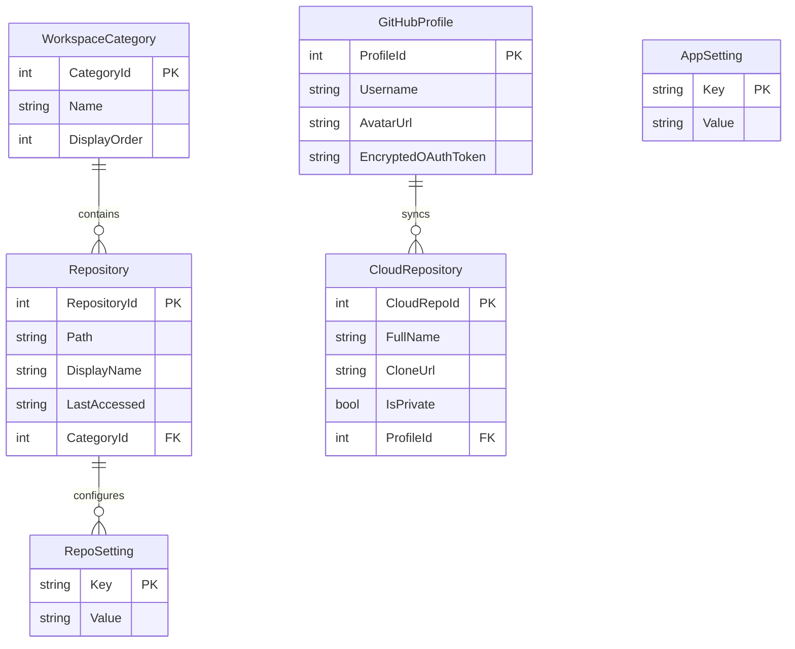

# 🧬 GitLoom: Technical Roadmap & Architecture Blueprint

GitLoom is a premium, offline-first, cross-platform desktop **Git GUI** built natively in C# and Avalonia UI. It serves as a beautiful, high-performance, and entirely free alternative to commercial clients like GitKraken, powered by the optimized C-based `libgit2` engine.

---

## 1. Core Vision & Architectural Goals

- **Zero Cloud Friction:** 100% offline-first, no accounts, no telemetry, and no developer API keys. It runs entirely on the local file system.
- **Visual Superiority:** Outperform traditional GUIs with a glowing, modern glassmorphic theme, micro-animations, and high-fidelity branch vector graphs.
- **Double-Layer Optimization:**
  - **Native Layer:** Use `LibGit2Sharp` (compiled C-bindings) as the primary engine for near-instantaneous indexing, commits, and local diff parsing, with a fallback Git CLI provider to execute native shell commands for advanced SSH configurations or edge-case Git features.
  - **Metadata Layer:** Use a local SQLite database to store repository categorization, settings, and bookmarked paths. History data is parsed live on the fly with debounced watchers (tracking `.git/refs`, `.git/index`, and `.git/HEAD` with a 300-500ms delay) and virtualized view rendering to avoid cache invalidation and UI lockup risks.

---

## 2. Technical Stack & Dependencies

- **Desktop Framework:** Avalonia UI (v11.1.3 - Stable)
- **MVVM Engine:** `CommunityToolkit.Mvvm` (v8.4.2)
- **Git Engine:** `LibGit2Sharp` (v0.30.0+ - standard native libgit2 bindings)
- **Local Database:** SQLite via Entity Framework Core (`Microsoft.EntityFrameworkCore.Sqlite`)
- **Data Visualization:** `LiveChartsCore.SkiaSharpView.Avalonia` (v2.0.4)
- **Vector Rendering:** Custom Avalonia `DrawingContext` and canvas vector paths for the commit graph lines.

---

## 3. Recommended Project Structure

```text
GitLoom/
├── GitLoom.sln
├── GitLoom.Core/                       # Domain logic, Git engine, SQLite database store
│   ├── GitLoom.Core.csproj
│   ├── GitService.cs                     # Core LibGit2Sharp wrappers
│   ├── Models/
│   │   ├── Repository.cs                 # Bookmarked repositories
│   │   ├── WorkspaceCategory.cs          # Custom folders/groups for projects
│   │   └── AppSetting.cs                 # User configurations (theme, credentials)
│   ├── AppDbContext.cs                   # SQLite Entity Framework DbContext
│   └── Analytics/
│       └── RepositoryAnalyzer.cs         # Parses punchcards and language stats
│
├── GitLoom.App/                        # Avalonia UI desktop application
│   ├── GitLoom.App.csproj
│   ├── App.axaml                         # Global styles, fonts, and assets
│   ├── ViewLocator.cs
│   ├── ViewModels/
│   │   ├── ViewModelBase.cs
│   │   ├── MainWindowViewModel.cs        # Orchestrates workspace navigation
│   │   ├── RepoDashboardViewModel.cs     # Commits, diffs, and staging
│   │   └── AnalyticsViewModel.cs         # Churn and language breakdowns
│   └── Views/
│       ├── MainWindow.axaml              # Sidebar navigation and workspace tabs
│       ├── RepoDashboardView.axaml       # Commit timeline, Staging lists
│       ├── DiffViewerControl.axaml       # Side-by-side green/red code diffs
│       └── CommitGraphCanvas.cs          # Custom SkiaSharp canvas for branch lines
│
└── GitLoom.Tests/                      # xUnit testing suite
    ├── GitLoom.Tests.csproj
    ├── GitServiceTests.cs
    └── AnalyticsTests.cs
```

---

## 4. SQLite Metadata Database Schema

To ensure rapid load times and secure credentials, GitLoom stores bookmarked directories, category groupings, and GitHub user settings.



---

## 5. Phase-by-Phase Implementation Plan

### 🚀 Phase 1: Scaffolding & Workspace Manager
- **Core Goals:** Set up projects, install NuGet libraries, configure the SQLite local metadata store, and design the initial folder browser.
- **Key Actions:**
  - Create the `GitLoom.Core`, `GitLoom.App`, and `GitLoom.Tests` assemblies.
  - Implement `AppDbContext` and migrations to support workspaces, categories, and `AppSetting` (including key `EnableGlassmorphism`).
  - Scaffold `GitService.cs` interface supporting both direct `LibGit2Sharp` operations and fallbacks to native Git CLI commands for advanced network/SSH configurations.
  - Design a robust, debounced `FileSystemWatcher` service targeted at `.git/refs`, `.git/index`, and `.git/HEAD` to batch change notifications with a 300-500ms cool-down.
  - Build the glassmorphic sidebar panel listing repository categories.
  - Integrate a directory browser to let users add existing `.git` folders to the app.

### 🛠️ Phase 2: Staging, Diffs, & Committing (MVP Core)
- **Core Goals:** Parse index modifications, render side-by-side or unified code diffs, stage files, and author commits.
- **Key Actions:**
  - Implement staging status checks (Modified, Untracked, Staged, Deleted) using direct `LibGit2Sharp` staging APIs.
  - Create the custom `DiffViewerControl` displaying added (green) and removed (red) lines side-by-side or unified (sticking to pure text rendering with simple line backgrounds for the MVP to keep UI thread performance flat, ensuring any future syntax highlighting tokenization occurs asynchronously).
  - Implement `StageFile` and `UnstageFile` commands in the `GitService`.
  - Create a highly polished commit message pane supporting quick emoji shortcuts (e.g. `:bug:`, `:sparkles:`).

### 🧬 Phase 3: High-Performance Commit History & Graph
- **Core Goals:** Query repositories using `LibGit2Sharp` on the fly and render a vertically scrolling commit timeline with high-performance, virtualized branch vector paths.
- **Key Actions:**
  - Write `GitService.cs` to query commits, hashes, authors, and dates directly from the local repo.
  - Design the scrollable history card stream in `RepoDashboardView` utilizing virtualized item rendering.
  - Implement an incremental background layout engine to pre-calculate graph coordinates/lanes. Calculations will be computed in chunked increments (e.g. 500 commits at a time) and loaded asynchronously as the user scrolls, passing the active leaf branch states from the end of the previous chunk to maintain flat CPU usage.
  - Create `CommitGraphCanvas.cs`, a custom Avalonia control utilizing virtualized rendering (bezier paths only for rows visible in the viewport) to prevent UI thread stuttering.

### 🌿 Phase 4: Branch & Remote Management
- **Core Goals:** Branch tree navigation, checkouts, branch creation, stash integration, and push/pull commit counts.
- **Key Actions:**
  - Build the left pane branch tree showing local and remote tracking heads.
  - Implement `CheckoutBranch` with safety checks for unstaged file overwrites.
  - Implement branch creation, deletion, and basic stashing operations.
  - Query upstream remotes to display `Ahead` (outgoing) and `Behind` (incoming) commit counters.

### 📊 Phase 5: Repository Analytics & Churn (Premium Polish)
- **Core Goals:** Add elite, asynchronous analytics widgets to make GitLoom feel premium, modern, and engaging without blocking the UI thread.
- **Key Actions:**
  - Implement `RepositoryAnalyzer` to parse repository data completely in the background:
    - **Activity Punch Card:** Hours and days of high developer activity (processed off the UI thread).
    - **Code Churn:** Net lines added vs. deleted over time.
    - **Language Composition:** SkiaSharp donut chart mapping codebase file ratios by running a non-blocking directory tree iteration.
  - Ensure all analytics calculations run asynchronously using task-based threading to keep `RepoDashboardView` perfectly responsive.
  - Add smooth transitions and micro-animations to tab switching.

### ☁️ Phase 6: GitHub OAuth Integration & Cloud Cloner (Opt-in Extension)
- **Core Goals:** Provide a 100% optional, non-intrusive GitHub cloud connection for list-cloning remote repositories, adhering to the zero-telemetry vision.
- **Key Actions:**
  - Ensure the core application works perfectly offline without any nag screens or internet requirements.
  - Build a custom, client-to-GitHub **OAuth 2.0 Device Flow Client** (`https://github.com/login/device/code`) allowing direct, secure browser logins with zero intermediate servers.
  - Securely encrypt the token locally leveraging an audited, cross-platform secure storage library abstraction (rather than rolling custom platform-conditional encryption blocks) and store in SQLite (`GitHubProfile`).
  - Implement `GitHubApiService.cs` to fetch remote repositories purely on user request.
  - Build a dedicated, non-disruptive cloud cloner view in settings/workspaces.

---

## 6. Premium Design Token Specifications

To ensure the app looks premium and futuristic, the styling will strictly adhere to the following color palette and glassmorphism settings:

| Token Key | HEX / HSL Value | Purpose |
| :--- | :--- | :--- |
| `BgObsidian` | `#0C0F12` | Solid background, deep base |
| `PanelGlass` | `rgba(20, 25, 31, 0.85)` | Blur panels, primary widgets |
| `BorderGlass` | `rgba(255, 255, 255, 0.12)` | Clean 1.5px glowing borders |
| `TextWhite` | `#FFFFFF` | Primary titles, bold text |
| `TextMuted` | `#A6ADC8` | secondary details, dates, author names |
| `BranchCyan` | `#89B4FA` / HSL Blue | Cyan path for `main` or active branch |
| `BranchPink` | `#F5C2E7` / HSL Pink | Pink path for feature branches |
| `BranchGreen` | `#A6E3A1` / HSL Green | Staged badges, green diff additions |
| `BranchRed` | `#F38BA8` / HSL Red | Deleted files, red diff deletions |
| `AcrylicBlur` | `BackgroundSource=Digger` | Windows/macOS native acrylic backing (toggled off via `EnableGlassmorphism` settings for performance fallback) |

---

## 7. Next Steps & Active Checklist

- [x] **Step 1:** Create new solution folder, initialize C# projects (`Core`, `App`, `Tests`).
- [ ] **Step 2:** Reference package dependencies (Avalonia, LibGit2Sharp, EF Core SQLite, MVVM, LiveCharts2).
- [ ] **Step 3:** Implement SQLite database setup and folder bookmarks metadata models.
- [ ] **Step 4:** Build the Repository Browser Sidebar shell.
