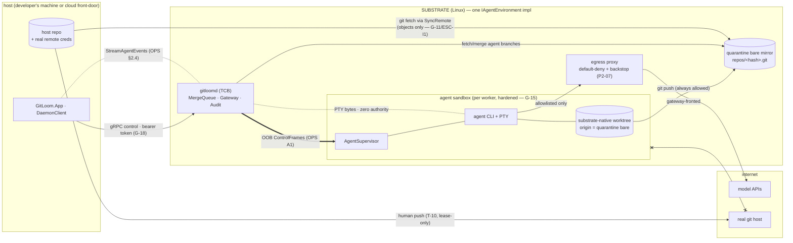

# GitLoom — Environment Substrate Contract (ESC / B1 — the platform-agnostic umbrella)

**Status:** Draft for review · **Revision:** 2026-07-11 (initial cut) · **Subordinate to:** `docs/phase-2/GitLoom_Master_Implementation_Document_v2.md` (the binding spec) and consistent with `docs/phase-2/GitLoom_Orchestration_Protocol_Spec.md` (OPS v1). Where this document and the master doc disagree, **the master doc wins** and the disagreement is drift to be fixed here — the same precedence rule AGENTS.md applies to CLAUDE.md and OPS applies to itself.

This document specifies the **substrate**: the Linux environment in which the daemon (`gitloomd`), the sandboxes, and the agent worktrees live, and the contract every platform that hosts them MUST satisfy. It is the **umbrella**; it deepens the existing architecture, renames nothing (`IRepoProvisioner`, `IAgentWorktreeManager`, `RepoSyncService`, `SandboxEngine`, `EgressProxyConfigurator`, `ProvisionResult`, the `gitloom-vm` remote all keep their names and semantics), and introduces no parallel system. It introduces exactly one new type, `IAgentEnvironment`, as a **facade that composes the existing contracts** — §1.1 states the relationship precisely.

## Contents

- §0 Scope, source-of-truth pointers, what is umbrella vs per-platform
- §1 The `IAgentEnvironment` contract — interface + invariants matrix
- §2 Reference topology — one shape, four instantiations
- §3 Per-platform variability surface — fixed vs free
- §4 Portability conformance suite — the one test set every substrate passes
- §5 Cold-start / mount-latency budget framework — the metrics every platform reports
- §6 Open decisions
- §7 Conformance tests this document implies (index into §4)

---

# 0. Scope, source-of-truth pointers, and umbrella boundary

## 0.1 What this document is

The master doc specifies the substrate task-by-task: **P2-05** (the `GitLoomOS` bootstrapper), **P2-06** (repo provisioner + quarantine remotes — the Git-native sync boundary), **P2-07** (sandbox hardening + default-deny egress), **P2-25** (cloud worktrees guardrails). OPS §2 specifies the *control-plane vs data-plane* split, the daemon gRPC surface, and G-18 (the UI never touches Docker/WSL/PTYs directly). What no single one of those specifies is the **portability contract**: the shape every hosting platform MUST present so that the daemon, the merge queue, the gateway, and the protocol run unchanged whether the Linux underneath is a WSL2 VM, a bare-metal Linux box, a macOS-hosted Linux VM, or a cloud pod. This document is that contract.

Its output is one interface (`IAgentEnvironment`, §1.1), one invariants matrix (§1.2), one reference topology with four instantiations (§2), one variability surface (§3), one conformance suite (§4), and one measurement framework (§5).

## 0.2 What this document binds

| ESC section | Deepens / binds | Governing invariants |
|---|---|---|
| §1 `IAgentEnvironment` | P2-06 (`IRepoProvisioner`/`IAgentWorktreeManager`/`ProvisionResult`/`RepoSyncService`), P2-05 (bootstrap → health/upgrade), P2-07 (`SandboxEngine`/`EgressProxyConfigurator` posture), P2-25 (`RemoteEnvironment` picker) | G-11, G-12, G-13, G-14, G-15, G-16, G-17, G-18 |
| §2 Topology | P2-06 (Git-objects boundary), P2-07 (hardened sandbox), OPS §2.3/§2.7 (channels, trust-boundary map) | G-11, G-15, G-18 |
| §3 Variability | P2-05 (bootstrap verbs), P2-06 (transport), P2-07 (backend: WSL2 native vs sbx), P2-25 (cloud) | G-11…G-18 (the fixed column) |
| §4 Conformance | P2-06 required tests (round-trip, worktree round-trip), P2-07 `docker inspect` + egress matrix, OPS §9 (adversarial set), P2-25 WAN CI job | G-11, G-12, G-15, G-16, S-1, S-2 |
| §5 Metrics | P2-05 (fresh import < 60 s), P2-06 (incremental fetch), OPS §2.8 (`RttBudget`, WAN timing), P2-25 (echo < 100 ms @ 80 ms RTT) | G-14 |
| §6 Open decisions | P2-06/P2-07/P2-25 boundaries this umbrella exposes | — |

## 0.3 Umbrella boundary — what lives here vs in B2…B5

**This document is platform-agnostic.** It states the *shape* and the *invariants*; it never states how a specific platform realizes them. Per-platform realizations are **sibling documents**, each an `IAgentEnvironment` implementation plus its §4 conformance results and its §5 filled-in metric table:

| Doc | Substrate | `IAgentEnvironment.SubstrateId` | Status |
|---|---|---|---|
| **B1** (this doc) | umbrella — the contract | — | drafting |
| **B2** — `docs/phase-2/GitLoom_Substrate_WSL2.md` | WSL2 VM (`GitLoomEnv`) | `"wsl2"` | to be written (owns P2-05/P2-06/P2-07 WSL specifics: 9P object transfer, `\\wsl.localhost` UNC, `.wslconfig` merge, `wsl --terminate`) |
| **B3** (future) | native Linux host / dev container | `"native-linux"` | deferred |
| **B4** (future) | macOS-hosted Linux VM | `"macos-vm"` | deferred |
| **B5** (future) | cloud pod (P3-06) | `"cloud-pod"` | deferred (guardrails now via P2-25) |

Anything WSL-specific (9P, `drvfs`, `\\wsl.localhost\GitLoomEnv\...`, `.wslconfig`, `wsl --terminate GitLoomEnv`), macOS-specific, or cloud-specific (mTLS, per-tenant encryption, `gitloom-cloud` HTTPS transport) is **out of scope here** and belongs in the relevant B-doc. Where this document must illustrate the variability surface (§3) it names such mechanics only as *examples of what varies*, not as specifications.

---

# 1. The `IAgentEnvironment` contract

## 1.1 Relationship to the existing contracts

P2-06 already defines two daemon services with no UI dependency: `IRepoProvisioner` (`Provision → ProvisionResult`) and `IAgentWorktreeManager` (`CreateAgentWorktree`/`RemoveAgentWorktree`/`Prune`). P2-07 defines `SandboxEngine` and `EgressProxyConfigurator`. **None of these is renamed, moved, or altered by this document.**

`IAgentEnvironment` is a **facade that composes them** (composition, not inheritance — §6 SC-1) and adds the four capabilities no existing contract owns: sync-remote resolution, health check, teardown, and upgrade. It is the single object the daemon resolves once per platform at startup; from it the rest of the daemon obtains a *matched* provisioner, worktree manager, sandbox engine, and egress configurator for the running substrate. A platform is "supported" iff it ships one conforming `IAgentEnvironment` implementation.

> Composition means `IAgentEnvironment` **holds** the P2-06/P2-07 services as members; it does not re-declare their methods. Callers that already depend on `IRepoProvisioner` keep doing so and are unaffected; only substrate-selection code depends on `IAgentEnvironment`. This keeps the P2-06 services independently registered and unit-tested (their own required tests stand) while giving the daemon one seam to swap platforms.

## 1.2 Interface

```csharp
// daemon-side GitLoom.Core/Agents/IAgentEnvironment.cs
namespace GitLoom.Core.Agents;

/// The per-platform substrate facade. Exactly one conforming implementation per platform
/// (WSL2, native-Linux, macOS-VM, cloud-pod). Composes the P2-06/P2-07 contracts unchanged.
public interface IAgentEnvironment
{
    // ---- Identity & capability ------------------------------------------------
    string SubstrateId { get; }                 // "wsl2" | "native-linux" | "macos-vm" | "cloud-pod"
    SubstrateCapabilities Capabilities { get; } // declares which MAY-vary features this impl offers (§3)

    // ---- Composed P2-06/P2-07 contracts (NOT redeclared — held, unchanged) ----
    IRepoProvisioner       Repos     { get; }   // P2-06: Provision(windowsRepoPathNormalized) -> ProvisionResult
    IAgentWorktreeManager  Worktrees { get; }   // P2-06: CreateAgentWorktree / RemoveAgentWorktree / Prune
    ISandboxEngine         Sandboxes { get; }   // P2-07: hardened CreateContainerAsync + persistent jail
    IEgressPolicy          Egress    { get; }   // P2-07: EgressProxyConfigurator surface (allowlist, verdicts)

    // ---- Sync-remote resolution (the gitloom-vm-style remote) -----------------
    // Returns the ONE remote the Windows/host repo registers to fetch agent branches.
    // Name is conventionally "gitloom-vm" (P2-06); Url is an OPAQUE HANDLE (G-14) whose
    // concrete form (UNC path, https endpoint, unix path) is platform-defined (§3, SC-2).
    SyncRemote ResolveSyncRemote(string repoHash);

    // ---- Lifecycle ------------------------------------------------------------
    Task<SubstrateHealth> HealthCheckAsync(CancellationToken ct);                       // idempotent, read-only
    Task<UpgradeResult>   UpgradeAsync(SubstrateUpgradeRequest req, CancellationToken ct); // idempotent (no-op if current)
    Task TeardownAsync(TeardownScope scope, CancellationToken ct);                      // NEVER host-destroying (G-12 generalized, SC-5)
}

public enum TeardownScope
{
    Worktree,   // one agent worktree      — delegates to IAgentWorktreeManager.RemoveAgentWorktree
    Repo,       // one provisioned repo    — bare mirror + its worktrees for this repoHash
    Instance    // this substrate instance — the GitLoom-owned VM/pod ONLY; never the host, never siblings
}

public sealed record SyncRemote(string Name, string Url);          // Name defaults to "gitloom-vm"; Url is opaque (G-14)
public sealed record SubstrateHealth(
    bool Reachable, bool DaemonUp, bool ContainerRuntimeUp,
    long DiskHeadroomBytes, string ReleaseId, IReadOnlyList<string> FailedChecks); // FailedChecks empty ⇒ healthy
public sealed record SubstrateUpgradeRequest(string TargetReleaseId, bool PreserveProvisionedRepos);
public sealed record UpgradeResult(bool Applied, string FromReleaseId, string ToReleaseId); // Applied=false ⇒ already current
public sealed record SubstrateCapabilities(
    bool SupportsMaxIsolationBackend,   // P2-07 sbx MAY
    bool SupportsWarmPoolPrestart,      // §5 cold/warm
    string FilesystemTransport,         // opaque label: "ext4-native" | "9p" | "virtiofs" | "network-fs" (§3)
    string LifecycleDialect);           // opaque label: "wsl" | "systemd" | "vmctl" | "k8s" (§3)
```

`ISandboxEngine`/`IEgressPolicy` are the interface-fronts of the P2-07 `SandboxEngine`/`EgressProxyConfigurator` (P2-07 defines the concretes; this umbrella names the interface seam so the facade can hold them substrate-agnostically — additive, no rename). Their bodies land in P2-07.

All types are UI-free and daemon-side (P2-06 invariant 3; G-18). Every field crossing to the client via `RepoSyncService` is either a scalar or an opaque handle (G-14) — no substrate filesystem path leaks except through `SyncRemote.Url`, which is itself an opaque handle the Windows side registers verbatim.

## 1.3 Invariants every implementation MUST uphold

Legend: **[STRUCT]** — structurally impossible / no code path exists (proof = an absence assertion); **[CHECK]** — a runtime guard evaluates and fails closed (proof = an adversarial test that trips it). The taxonomy is OPS §1.4's, applied to the substrate. No blank cells.

| # | Invariant (MUST) | Class | How every impl asserts it | Binds |
|---|---|---|---|---|
| **ESC-I1** | **Git-objects-only boundary.** No container ever mounts a host path; the only cross-boundary repo data path is Git objects (fetch/push between the host repo and the substrate's bare mirror). The substrate-native worktree is the sole mount source. | [STRUCT] | container-spec inspect shows zero host-path mounts (no `/mnt/c`, `drvfs`, UNC, `virtiofs`-of-host-home); the only mount is the substrate worktree — §4 `NoHostPathMount` | G-11; P2-06 inv.1; P2-07 |
| **ESC-I2** | **Control only via the daemon gRPC surface.** The UI reaches the substrate (Docker/PTYs/worktrees/VM lifecycle) exclusively through `gitloomd`'s gRPC; `IAgentEnvironment` and its members live in the daemon and are never referenced from `GitLoom.App`. | [STRUCT] | reference sweep: no `Docker.DotNet`/`Porta.Pty`/`IAgentEnvironment` in `GitLoom.App`; substrate acts are RPCs on `RepoSyncService`/`TerminalService` — §4 `ControlPlaneOnly` | G-18; OPS §2 |
| **ESC-I3** | **Quarantine remote.** Each agent worktree's `origin` is the daemon-owned bare repo and **only** that; the sandbox holds no credential for, and no configured remote pointing at, the user's real remote. A prompt-injected `git push --force origin main` is structurally impossible (no credential, no such remote), not merely firewalled. | [STRUCT] | the sandbox's configured remotes are exactly `[quarantine]`; no credential material present — §4 `SandboxRemotesExactlyQuarantine` | P2-06 quarantine ext.; OPS S-1; A6 |
| **ESC-I4** | **No host-destroying teardown.** No substrate operation can destroy, restart, or reconfigure the host OS or sibling tenants. Teardown scopes are `Worktree`/`Repo`/`Instance`; `Instance` targets only the GitLoom-owned VM/pod. The WSL rule (`--terminate GitLoomEnv`, never `wsl --shutdown`) is the WSL2 *profile* of this general rule. | [STRUCT] + [CHECK] | grep shows no host-wide destructive verb (`wsl --shutdown`, `systemctl poweroff`, host-root `rm`); `TeardownScope` has no host member; teardown-residue test confirms host + siblings untouched — §4 `TeardownNoResidue` | G-12 (generalized, SC-5) |
| **ESC-I5** | **No runtime image build.** Toolchains sideload into a static base image (`devbox add` into the running sandbox); the substrate never invokes an image build at runtime (it severs PTYs and is non-reproducible). | [STRUCT] | daemon code has no `ImageBuild`/`docker build` call path; base image is prebuilt + versioned (`ReleaseId`) — §4 `NoRuntimeImageBuild` | G-16; P2-07 |
| **ESC-I6** | **Hardened sandbox spec + anti-memory-inspection quartet.** Every agent container carries `no-new-privileges`, userns remap, memory+pids limits, default seccomp, and default-deny egress. It MUST additionally carry the **anti-memory-inspection quartet** on which the OPS A1 forgery-[STRUCT] guarantee depends (per OPS §6.1 decision C / G2): (1) the OOB HMAC key **K** / credential tmpfs is mode 0400 owned by a dedicated *supervisor uid* ≠ the agent-CLI uid **[per-container]**; (2) yama `kernel.yama.ptrace_scope` ≥ 2 **[VM-wide boot sysctl — non-namespaced, cannot be a container flag; provisioned by the substrate's bootstrap, e.g. P2-05 on WSL2]**; (3) a seccomp profile denying `process_vm_readv`/`process_vm_writev`/`ptrace` container-wide **[per-container]**; (4) no `CAP_SYS_PTRACE` in the agent's capabilities **[per-container]**. Controls (1)+(3)+(4) make "the agent uid cannot obtain K" structural on their own (no file path, no memory-scrape syscall); (2) is boot-provisioned defense-in-depth. A container without the hardened spec *or* missing any per-container quartet member — or a substrate whose boot omits (2) — is a bug, not a variation. | [STRUCT] (spec builder emits no un-hardened path; the agent has no code path to another uid's memory) + [CHECK] (inspect; live memory-scrape attempt denied) | container-spec builder unit-asserts the per-container members (the seccomp denylist, no `CAP_SYS_PTRACE`, supervisor-uid tmpfs ownership); a **substrate-boot check asserts `ptrace_scope ≥ 2`**; inspect confirms on the live container; an agent-uid `ptrace`/`process_vm_readv` against the supervisor is denied — §4 `HardenedSpec` (+ §4 `SecretChannelsOnly` for the K-scrape leg) | G-15; P2-07; OPS §6.1 (decision C / G2), S-9 |
| **ESC-I7** | **Secrets stay on their channels.** Secrets (API keys, tokens, HMAC session keys, passphrases) cross boundaries only via OS keyring, tmpfs files mode 0400, or gRPC fields marked `// SECRET` and excluded from the logging interceptor. Never argv, never env files on persistent disk, never proto logs. The OOB session HMAC key **K** in particular MUST sit on a tmpfs file **owned by a dedicated *supervisor uid* distinct from the agent-CLI uid** — never the agent-readable credential path — and MUST also be unreadable from the supervisor's process memory (the ESC-I6 quartet), so the agent uid can obtain K by no path (per OPS §6.1 decision C / G2). | [STRUCT] (no other channel plumbed; K's tmpfs owned by a uid the agent cannot read; the quartet closes the memory path) + [CHECK] (mask + tmpfs mode + memory-scrape denial) | injector delivers to tmpfs 0400 only; K's tmpfs is supervisor-uid-owned and the agent-uid read + `ptrace`/`process_vm_readv` scrape are both denied; `// SECRET` mask test; new `ProcessStartInfo`/proto/log site review — §4 `SecretChannelsOnly` | G-13; P2-07; OPS S-6, S-9 |
| **ESC-I8** | **Transport-agnostic handles.** No RPC or `SyncRemote` leaks a substrate filesystem path except as an opaque handle; no timeout or path assumes localhost. The same protocol survives WSL loopback, native, and WAN. | [CHECK] | proto-descriptor + `SyncRemote.Url` review; the P2-25 WAN CI job (80 ms `tc netem`) runs the flows unchanged — §4 `WanLatencyNoSpuriousTimeout` | G-14; P2-25; OPS §2.8 |
| **ESC-I9** | **Audit on authority.** Every substrate-mediated authority action (worktree create/remove, provision, teardown, egress-allowlist change, upgrade) emits exactly one audit event. | [CHECK] | each mutating substrate op shows an `AuditLog.Append` in the same change; `AuditProbe` per touchpoint — §4 `AuditPerAuthorityAction` | G-17; OPS S-7 |

**ESC-I1/I3 carry the thesis.** They are the substrate's half of PRODUCT.md's promise (*supervising a swarm without losing control of the working directory*): I1 keeps the host repo unmountable (agent code cannot reach into it — OPS S-2), I3 keeps the real remote unreachable (agent code cannot escape to it — OPS S-1). Both are [STRUCT]; a substrate that can only enforce them by [CHECK] does not conform.

---

# 2. Reference topology — one shape, four instantiations

Every supported substrate is the **same shape**: a Linux environment running `gitloomd` (the TCB), a Git-objects-only data boundary to the host repo, per-agent hardened sandboxes each with the quarantine bare as its sole remote, and a gRPC control plane the UI speaks. Only the *realization* of each abstract element varies. The pattern (matches OPS §2.7's trust-boundary map, generalized off WSL):



The `x--x` sandbox→real-host edge is the structural absence ESC-I3 names. The four platforms differ **only** in how the labelled abstract nodes/edges are realized:

| Abstract element (fixed) | `wsl2` (B2) | `native-linux` (B3) | `macos-vm` (B4) | `cloud-pod` (B5) |
|---|---|---|---|---|
| SUBSTRATE boundary | WSL2 VM `GitLoomEnv` | the Linux host itself (namespace-isolated) | Linux VM on a macOS hypervisor | per-tenant cloud pod |
| `SyncRemote.Url` realization | `\\wsl.localhost\GitLoomEnv\...\repos\<hash>.git` (UNC) | local unix path (host == substrate) | shared-folder or VM IP path | `https://.../gitloom-cloud/<hash>.git` |
| host↔bare object transport | 9P (object transfer only; no file *watching*) | direct ext4 (same host) | virtiofs / shared folder | HTTPS git |
| `Capabilities.FilesystemTransport` | `"9p"` | `"ext4-native"` | `"virtiofs"` | `"network-fs"` |
| `Capabilities.LifecycleDialect` | `"wsl"` (`--terminate GitLoomEnv`) | `"systemd"` | `"vmctl"` | `"k8s"` |
| `Instance` teardown verb | `wsl --terminate` → poll → `--unregister` | stop the GitLoom namespace/units only | stop the guest VM only | delete the pod only |
| sandbox backend | Docker on WSL2 (default); sbx optional (P2-07 MAY) | Docker/rootless | Docker in guest | pod-nested or one-pod-per-agent (P3-06 ADR) |

Every cell in the "fixed" column is identical across all four; every cell to its right is a permitted variation whose only constraint is that it satisfy §1.3. This is the whole claim of the umbrella: **four instantiations of one pattern.**

---

# 3. Per-platform variability surface

What an implementation is free to choose vs what is fixed. Fixed = the §1.3 invariants; free = mechanics that cannot affect them. No blank cells.

| Capability / aspect | Fixed — MUST NOT vary | Free — MAY vary (impl's choice) |
|---|---|---|
| **Repo data path** | Git objects only; host repo never mounted into a container (ESC-I1/G-11); round-trip byte-identical (P2-06 inv.2) | the object *transport* (9P, native ext4, virtiofs, HTTPS git); whether the bare mirror is local or a caching mirror |
| **Sync remote** | exactly one remote registered on the host side; role = fetch agent branches only; URL is an opaque handle (ESC-I8/G-14) | the remote *name string* (`gitloom-vm` vs `gitloom-cloud` — see SC-2) and the URL's concrete form (UNC / unix path / https) |
| **Worktree location** | substrate-native filesystem only; never the host filesystem "temporarily" (P2-06 rejection trigger) | the substrate path layout (`~/gitloom/worktrees/<repo>/<agentId>` or equivalent); the filesystem type |
| **Sandbox isolation** | hardened spec always (ESC-I6/G-15); no un-hardened path | the *backend* — Docker on the native path (default) or the sbx microVM "maximum isolation" backend behind the same `ISandboxEngine` (P2-07 MAY) |
| **Base image / toolchain** | prebuilt, versioned (`ReleaseId`); no runtime build (ESC-I5/G-16) | the image contents, the Nix/Devbox package set, sideload mechanics |
| **Egress** | default-deny + a backstop that is not proxy-env-only (P2-07 rejection trigger); quarantine keeps the real remote unreachable (ESC-I3); git-host reach via the daemon read-proxy per A6 | the proxy implementation; the allowlist contents (user-editable); DNS pinning mechanics |
| **Substrate cold start** | health-checkable before use (`HealthCheckAsync`); idempotent bootstrap (P2-05) | the *cold-start path* — VM import, VM boot, pod schedule, container start; whether a warm pool pre-starts (`Capabilities.SupportsWarmPoolPrestart`) |
| **Lifecycle verbs** | teardown never host-destroying (ESC-I4/G-12) and scoped to `Worktree`/`Repo`/`Instance` | the *dialect* (`wsl --terminate`, `systemctl stop`, `vmctl`, pod delete) — `Capabilities.LifecycleDialect` |
| **Secret delivery** | keyring / tmpfs 0400 / `// SECRET` gRPC only (ESC-I7/G-13); per-agent tmpfs, no global auth-dir mounts | the tmpfs mount point; the keyring backend (OS keyring vs DataProtection) |
| **Control transport** | gRPC control plane, UI never touches Docker/PTYs (ESC-I2/G-18); frames transport-agnostic (G-14) | the *listener* — loopback session token (local) vs mTLS + user auth (cloud, P2-25); the OOB socket vs network binding |
| **Upgrade** | idempotent; preserves provisioned repos when asked (`PreserveProvisionedRepos`) | in-place VM upgrade, image re-pull, pod redeploy |

The rule: an implementation MAY choose anything in the right column; it MUST NOT weaken anything in the left. A choice in the right column that is observable to the daemon is declared through `SubstrateCapabilities` so the daemon adapts without platform sniffing (mirrors OPS §0.5's capability-flag model).

---

# 4. Portability conformance suite

One test set **every** `IAgentEnvironment` implementation MUST pass — the substrate analogue of OPS §9's adversarial set, generalizing the P2-06 round-trip tests and the P2-25 WAN suite off WSL. Each B-doc runs this suite against its impl and pastes results; a green suite is the definition of "supported platform."

**Parametrization.** The suite is a theory keyed by substrate. Each test carries the `RequiresDocker` trait (per OPS §A.3) and a `[SubstrateConformance("<id>")]` trait so a platform whose runtime is absent **skips with a reason** — a missing precondition never reads as a pass (OPS §9.1 rule). Pure/spec-builder assertions run on the normal leg; runtime assertions run on the leg that has the substrate.

| # | Test id | Trait | Setup | Pass assertion (single, unambiguous) | Proves |
|---|---|---|---|---|---|
| 1 | `GitObjectsRoundTrip_ShouldBeByteIdentical` | `RequiresDocker` + `SubstrateConformance` | provision a fixture repo; an agent commits in a substrate worktree; host runs `git fetch <SyncRemote> && git merge agent/<id>` | the merged tree/blob SHAs on the host equal those produced in the substrate — **byte-identical** (generalizes P2-06 inv.2) | ESC-I1, ESC-I8 |
| 2 | `NoHostPathMount_ShouldHoldForEveryContainer` | `RequiresDocker` + `SubstrateConformance` | spawn an agent sandbox | container inspect shows **zero** host-path mounts (no `/mnt/c`, `drvfs`, UNC, host-home virtiofs); the only mount is the substrate worktree | ESC-I1 (G-11) |
| 3 | `SandboxRemotes_ShouldBeExactlyQuarantine` | `RequiresDocker` + `SubstrateConformance` | spawn a sandbox; enumerate its git remotes + credential stores; attempt `git push --force origin main` and a push to the real remote | configured remotes == `[quarantine]`; no real-remote credential present; the push reaches only the quarantine bare; **no route to the real remote exists** | ESC-I3 (OPS S-1, test 10) |
| 4 | `TeardownNoResidue_AndHostUntouched` | `RequiresDocker` + `SubstrateConformance` | provision + create worktrees; `TeardownAsync(Repo)` then `TeardownAsync(Instance)` | no worktree/bare/container residue for the scope; **the host OS and any sibling substrate instances are untouched**; grep shows no host-destroying verb on the teardown path | ESC-I4 (G-12) |
| 5 | `HealthAndUpgrade_ShouldBeIdempotent` | `SubstrateConformance` | call `HealthCheckAsync` twice; `UpgradeAsync(current)` then `UpgradeAsync(current)` again | health is side-effect-free and stable; the first upgrade to the current release returns `Applied=false` (no-op) and the second is identical; provisioned repos survive when `PreserveProvisionedRepos` | P2-05 idempotence; ESC-I9 |
| 6 | `ControlPlaneOnly_UiHasNoSubstrateHandle` | (pure) `SubstrateConformance` | static reference sweep of `GitLoom.App` + proto-descriptor sweep | no `Docker.DotNet`/`Porta.Pty`/`IAgentEnvironment` reference in `GitLoom.App`; every substrate act is an RPC; no RPC exposes a host-repo write (`NoRpcWritesWindowsRepo`) | ESC-I2 (G-18, OPS S-2) |
| 7 | `NoRuntimeImageBuild_ShouldHold` | (pure) `SubstrateConformance` | grep the daemon + substrate impl | no `ImageBuild`/`docker build` call path; base image is prebuilt with a versioned `ReleaseId` | ESC-I5 (G-16) |
| 8 | `HardenedSpec_EveryFlagAsserted` | `RequiresDocker` + `SubstrateConformance` | build the container spec (unit) + inspect the live container + check the substrate boot sysctl | `no-new-privileges`, userns remap, memory+pids limits, seccomp (incl. the `process_vm_readv`/`process_vm_writev`/`ptrace` denylist), no `CAP_SYS_PTRACE`, supervisor-uid-owned K/credential tmpfs, default-deny egress **all present on the create request**; **plus the VM-boot sysctl `kernel.yama.ptrace_scope ≥ 2`** (the quartet's non-namespaced control (2), boot-provisioned — not a container flag); a spec built without any per-container member, or a boot missing the sysctl, fails | ESC-I6 (G-15, OPS §6.1 C/G2, S-9) |
| 9 | `SecretChannelsOnly_NoArgvNoEnvFile` | `RequiresDocker` + `SubstrateConformance` | inject a credential + the OOB session key K; from the agent uid attempt to read K from its tmpfs file **and** scrape it from supervisor process memory (`ptrace`/`process_vm_readv`) | material lands only on tmpfs mode 0400 (per-agent) / keyring / `// SECRET` gRPC; **K's tmpfs is supervisor-uid-owned and both the agent-uid file read and the memory scrape are denied — the agent obtains zero key bytes**; the logging-mask test passes; no argv/env-file/proto-log site carries it | ESC-I7 (G-13, OPS S-6, S-9) |
| 10 | `WanLatency_ProvisionAndWorktree_NoSpuriousTimeout` | `SubstrateConformance` (per-release) | run provision → worktree-create → merge round-trip under injected latency (P2-25 `tc netem` 80 ms) | every timeout is `RttBudget`-scaled; none fires spuriously; echo stays < 100 ms @ 80 ms RTT (P2-25 acceptance) | ESC-I8 (G-14) |
| 11 | `AuditPerAuthorityAction_ExactlyOne` | `SubstrateConformance` | drive provision, worktree create/remove, egress-allowlist edit, teardown, upgrade; observe `AuditProbe` | each authority action emits **exactly one** audit event; a probed/denied action also audits | ESC-I9 (G-17, OPS S-7) |

**CI placement.** Tests 1–4, 8, 9 are `RequiresDocker` and **PR-blocking on the substrate leg** (substrate invariants are launch-tier, per OPS §9.3 / TI A.5). Tests 6, 7 are pure and PR-blocking on the normal leg. Test 10 runs per-release (P2-25 WAN job). Test 11 rides the per-touchpoint `AuditProbe` coverage. A platform whose §4 suite is not fully green is not a supported substrate — it does not ship.

---

# 5. Cold-start / mount-latency budget framework

This document fixes the **metrics and the method**, not the numbers. Each B-doc fills the same table for its substrate so the four are directly comparable and a regression is visible. Numbers here would be platform-specific and thus out of the umbrella's scope; the *framework* is not.

## 5.1 Reported metrics

| Metric | Definition | Measured by | Cold vs warm |
|---|---|---|---|
| **Provision time** | wall-clock for `IRepoProvisioner.Provision` to return a usable `ProvisionResult` | `SubstrateBenchmark` around the `RepoSyncService.ProvisionRepo` RPC | **cold** = first provision (full clone of the bare mirror); **warm** = second provision of the same repo (incremental fetch — P2-06 measures "no re-clone") |
| **Worktree-create time** | wall-clock for `IAgentWorktreeManager.CreateAgentWorktree` (branch + worktree + post-worktree install) | benchmark around `RepoSyncService.CreateWorktree` | **cold** = first worktree in a fresh repo (install populates store); **warm** = Nth worktree (content-addressable store hit — P2-06 step 4) |
| **First-byte PTY latency** | interval from `TerminalService.Attach` to the first rendered output byte | benchmark tap on the terminal stream | **cold** = sandbox not yet started (container start on the path); **warm** = persistent jail already running (`docker start` skipped) |
| **Mount/FS read latency** | time to `stat` + read a representative worktree file from inside the sandbox | in-sandbox microbenchmark, reported via a health/telemetry field | one number per transport (`Capabilities.FilesystemTransport`); the axis on which 9P ≠ ext4 ≠ virtiofs ≠ network-fs shows up |
| **Substrate cold start** | time from "substrate absent/stopped" to `HealthCheckAsync` green | benchmark around the P2-05 bootstrap / instance start | **cold** = import/boot/schedule from nothing (P2-05 target: fresh import < 60 s); **warm** = instance already up (near-zero) |

## 5.2 Method (so the four tables are comparable)

1. **Same fixture repos.** All substrates benchmark against the identical fixture set (a small repo, a lockfile repo, a large-history repo) so numbers compare like-for-like.
2. **Cold and warm both reported.** Every row reports both columns; a substrate that can only do warm (e.g. always-on cloud pod) reports its cold path as "N/A — always warm" with the reason, never a blank.
3. **RTT stated.** Because latency is transport-dependent, each table states the `RttBudget` (OPS §2.8) under which it was measured (local sub-ms / WSL loopback ms / WAN 80 ms) so a PTY or provision number is never read out of context.
4. **Reported through the same handle.** The `SubstrateBenchmark` harness emits one comparable record per metric; B-docs paste it verbatim. No hand-rolled per-platform timing (mirrors OPS §9's "a hand-rolled host is a bug").

## 5.3 The template each B-doc fills

> Substrate: `<id>` · RttBudget: `<local|loopback|wan-80ms>` · Fixtures: `<set>`
>
> | Metric | Cold | Warm |
> |---|---|---|
> | Provision time | … | … |
> | Worktree-create time | … | … |
> | First-byte PTY latency | … | … |
> | Mount/FS read latency (`<transport>`) | … | … |
> | Substrate cold start | … | … |

A filled template in B2…B5 is what lets the platform choice in P2-25's `RemoteEnvironment` picker be made on evidence, not vibes.

---

# 6. Open decisions

> **OPEN DECISION [SC-1]:** Should `IAgentEnvironment` **compose** the P2-06/P2-07 services (hold them as members) or **extend** them (interface inheritance, flattening every method onto one interface)?
> **Recommendation:** compose (as specified in §1.1/§1.2).
> **Rationale / tradeoffs:** P2-06 already ships `IRepoProvisioner`/`IAgentWorktreeManager` as *separately registered, independently unit-tested* daemon services. Inheritance would force one class to implement provision + worktree + sandbox + egress + lifecycle, couple their test suites, and tempt a rename — the exact HARD CONSTRAINT this umbrella forbids. Composition keeps each existing contract untouched and adds the facade as a thin selector. *Rejected — inheritance:* a flatter RPC surface, but it dissolves the P2-06 seams and their standing required tests. *Rejected — no facade (daemon wires the four services directly):* then substrate selection is scattered across the daemon with no single swap point, and P2-25's `RemoteEnvironment` picker has nothing to resolve.
> **Affected tasks:** P2-06, P2-07, P2-25.

> **OPEN DECISION [SC-2]:** P2-06 hardcodes the sync-remote name `gitloom-vm`, but P2-25 already uses `gitloom-cloud` for the cloud transport, and on a native-Linux substrate there is no "VM" at all. What is the remote's name across substrates?
> **Recommendation:** the **role** is fixed (one host-side remote that fetches agent branches) and the **name is substrate-defined via `ResolveSyncRemote(...).Name`**, defaulting to `gitloom-vm` for VM-backed substrates (B2/B4) and `gitloom-cloud` for cloud (B5, matching P2-25); native-Linux (B3) keeps `gitloom-vm` for muscle-memory continuity even without a literal VM. The Windows/host side registers whatever `SyncRemote.Name` says (via the existing `AddRemote`), never a hardcoded string.
> **Rationale / tradeoffs:** hardcoding `gitloom-vm` everywhere is honest for WSL but wrong for cloud and a misnomer on native. Making it a resolved value keeps P2-06's default intact while letting P2-25 keep `gitloom-cloud`. *Rejected — force `gitloom-vm` on all:* contradicts P2-25's existing `git push gitloom-cloud`. *Rejected — a brand-new universal name (`gitloom-sync`):* a gratuitous rename of a shipped P2-06 identifier — forbidden.
> **Affected tasks:** P2-06, P2-25, P3-06.

> **OPEN DECISION [SC-3]:** Which task **owns** `IAgentEnvironment`, and where does the daemon **select** the implementation? Health/upgrade/teardown have no home in the current P2-05/06/07 contracts, and P2-25 names a `RemoteEnvironment` picker (local VM | cloud) with no stated relationship to this facade.
> **Recommendation:** land the `IAgentEnvironment` **interface + the WSL2 impl** as an additive part of **P2-06** (it already owns provisioner/worktree and is the substrate seam), with `HealthCheckAsync`/`UpgradeAsync` delegating into **P2-05** bootstrap logic and `TeardownAsync` into **P2-22** teardown. The daemon resolves exactly one `IAgentEnvironment` at startup; P2-25's `RemoteEnvironment` picker becomes the **selector** of which impl (it does not introduce a parallel abstraction — it chooses among `IAgentEnvironment`s).
> **Rationale / tradeoffs:** avoids a new task and a parallel system; reuses P2-05/P2-22 code behind the facade. *Rejected — a new task P2-xx "substrate facade":* unnecessary; P2-06 is the natural home. *Rejected — `RemoteEnvironment` as a separate type from `IAgentEnvironment`:* two abstractions for one concept — drift; fold the picker into selecting an `IAgentEnvironment`.
> **Affected tasks:** P2-05, P2-06, P2-22, P2-25.

> **OPEN DECISION [SC-4]:** ESC-I4 generalizes G-12 ("never `wsl --shutdown`") to "no host-destroying teardown," but on the **native-Linux substrate the host *is* the Linux environment** — `TeardownScope.Instance` and "the host" collapse. How is I4 kept [STRUCT] there?
> **Recommendation:** on B3, `Instance` teardown MUST target only the **GitLoom-owned unit of isolation** (a dedicated systemd slice / user / namespace group / rootless-Docker context created at install), never the host root, never units GitLoom did not create. The install records exactly what it owns; teardown is scoped to that manifest. Where a substrate cannot prove a bounded ownership manifest, B3 MUST run GitLoom inside a nested VM/container so `Instance` regains a real boundary — i.e. B3 falls back toward the B2 shape rather than weakening I4.
> **Rationale / tradeoffs:** keeps I4 [STRUCT] (teardown has no code path to host-wide destruction) rather than [CHECK]-only. *Rejected — allow host teardown on native since "it's the user's box":* turns a swarm bug into a machine-wipe; unacceptable given LLM-driven callers. *Rejected — I4 becomes [CHECK] on native:* a guard can be skipped/raced; the umbrella requires [STRUCT] for the thesis-bearing invariants.
> **Affected tasks:** P2-22 (teardown), B3 (future).

> **OPEN DECISION [SC-5]:** §4's `SubstrateConformance` suite is defined but has **no fixture home**. OPS §9 extends the TI-P2-00 fixtures (`DaemonFixture`, `SandboxFixture`, `DualRepoFixture`, `AuditProbe`) but none is parametrized by substrate.
> **Recommendation:** add a `SubstrateFixture` to the TI-P2-00 family that wraps `SandboxFixture`/`DualRepoFixture` and is parametrized by `IAgentEnvironment` (theory data = the available substrates on the runner). The §4 suite is written once against `SubstrateFixture`; each B-doc supplies its impl as theory data. This is the substrate analogue of OPS §9.1's harness-flags deliverable.
> **Rationale / tradeoffs:** one suite, N substrates, no per-platform copy. *Rejected — a hand-written suite per B-doc:* guarantees drift between platforms' notions of "conforming"; a hand-rolled host/fixture is a bug (TI-P2-00). Cost: TI-P2-00 gains one fixture.
> **Affected tasks:** P2-06/P2-07 test contracts; the phase-2 test-implementation strategy (`docs/phase-2/GitLoom_Test_Implementation_Strategy_v2.md`).

> **OPEN DECISION [SC-6]:** §5 requires comparable cold/warm numbers, but substrates with radically different filesystem transports (9P vs native ext4 vs virtiofs vs network-fs) may not be **fairly** comparable on raw mount/FS latency — a "slow" 9P number and a "fast" ext4 number measure different physics, not different quality.
> **Recommendation:** report each metric **against its declared `Capabilities.FilesystemTransport`** and never rank substrates on a single scalar; the framework's job is regression-detection *within* a substrate and eyes-open trade-off comparison *across* them, not a leaderboard. B-docs state the transport in the table header (§5.3) so a number is always read in context; the `RemoteEnvironment` picker surfaces the trade-off (e.g. "cloud: instant warm start, higher FS latency") rather than a single score.
> **Rationale / tradeoffs:** prevents the metric from being weaponized into a false "native beats cloud" claim. *Rejected — a normalized composite score:* hides the physics and invites gaming. *Rejected — drop mount/FS latency:* it is exactly the axis P2-25's picker needs.
> **Affected tasks:** P2-25 (`RemoteEnvironment` picker copy), B2…B5 (metric tables).

---

# 7. Conformance tests this document implies

Every invariant in §1.3 resolves to a named §4 test with a single pass/fail assertion, a trait, and a fixture (`SubstrateFixture`, SC-5). The traceability closes here:

| Invariant | Class | §4 test(s) | CI tier |
|---|---|---|---|
| ESC-I1 Git-objects-only boundary | [STRUCT] | 1 `GitObjectsRoundTrip…`, 2 `NoHostPathMount…` | PR-blocking (substrate leg) |
| ESC-I2 control-plane-only | [STRUCT] | 6 `ControlPlaneOnly…` | PR-blocking (normal leg) |
| ESC-I3 quarantine remote | [STRUCT] | 3 `SandboxRemotesExactlyQuarantine` | PR-blocking (substrate leg) |
| ESC-I4 no host-destroying teardown | [STRUCT]+[CHECK] | 4 `TeardownNoResidue…` | PR-blocking (substrate leg) |
| ESC-I5 no runtime image build | [STRUCT] | 7 `NoRuntimeImageBuild…` | PR-blocking (normal leg) |
| ESC-I6 hardened sandbox spec | [STRUCT]+[CHECK] | 8 `HardenedSpec…` | PR-blocking (substrate leg) |
| ESC-I7 secret channels only | [STRUCT]+[CHECK] | 9 `SecretChannelsOnly…` | PR-blocking (substrate leg) |
| ESC-I8 transport-agnostic handles | [CHECK] | 10 `WanLatency…`, + 1's byte-identity | per-release (WAN) + PR |
| ESC-I9 audit on authority | [CHECK] | 11 `AuditPerAuthorityAction…` | rides `AuditProbe` coverage |

**Close:** a substrate is "supported" iff its `IAgentEnvironment` implementation passes §4 in full and its §5 metric table is filled. No invariant is left without a test; no platform ships un-green. Per-platform realizations, and their filled §4 results / §5 numbers, live in B2 (`docs/phase-2/GitLoom_Substrate_WSL2.md`) and future B3…B5 — never here.

*End of GitLoom Environment Substrate Contract (ESC / B1, draft 2026-07-11).*
