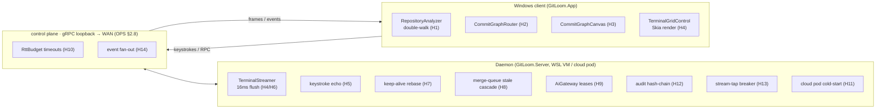

# GitLoom Performance Hotspot Register

**Status:** binding for Phase 2 · **Scope:** the paths whose *scale* — not correctness — is the risk · **Subordinate to** `GitLoom_Master_Implementation_Document_v2.md`; consistent with `GitLoom_Orchestration_Protocol_Spec.md` (OPS) §2.8/§2.9 and `GitLoom_Environment_Substrate_Contract.md` (ESC) §5.

## 0. Purpose and reading rules

Every task spec in the Master Doc carries correctness invariants. What no single task carries is a *numeric ceiling* on the paths that a large monorepo, a wide DAG, a 50 MB terminal flood, or eight concurrent agents will stress. This register is that ceiling. It exists so a performance regression **fails a named CI assertion** instead of surfacing as a support ticket after GA.

One row per hot path. Each row states, with **no blank cell**:

- **Hot path / type** — the file or subsystem, and whether it is CPU, render, IO, network, or memory bound.
- **Workload that stresses it** — the concrete scenario the budget is measured under.
- **Budget** — a single enforceable number (ms / fps / throughput / memory), on the reference runner (§0.1).
- **Failure at scale (symptom)** — what breaks and the user-visible sign, so a triager recognizes it.
- **Mitigation → owning task** — the design lever that holds the budget, folded into the task that already owns the code (cited `P2-xx` / `T-xx` / OPS §).
- **Measurement & bench type** — pure micro-bench · headless render bench · integration/soak · WAN-injected — and the harness it runs on.
- **CI assertion (leg)** — the test name it becomes and which CI leg gates it (PR · nightly · per-release).

A budget with no enforceable measurement path is raised as an **OPEN DECISION** (§4), never silently asserted.

### 0.1 Reference runner and profiles

Budgets are meaningless without a machine. Two profiles, both already in the test topology (`GitLoom_Test_Implementation_Strategy_v2.md` §CI legs):

| Profile | Machine | Governs |
|---|---|---|
| **PR runner** | the existing Windows + Linux CI runners (4 vCPU / 16 GB — matches the "4–6 agents on 16 GB" admission baseline, P2-08 step 4) | all PR-leg micro-benches and headless render benches |
| **Nightly/soak runner** | Linux Docker runner, same 16 GB class | integration/soak rows, WAN `tc netem` job (P2-25) |

Every latency budget below is a **local-profile** number unless it names an RTT; the WAN profile is the same number re-derived through OPS §2.8's `max(floor, k × RttBudget)`, never a second hardcoded constant (that is the whole point of §2.8 — a budget that only passes at localhost is a *failing* test, OPS §7.3).

### 0.2 Where the hot paths sit

---

## 1. The register

The table is the register; §2 expands the rows that carry rationale or an OPEN DECISION. Cells are terse by design — the expansion is authoritative where they differ.

| ID | Hot path / type | Workload that stresses it | Budget (reference runner) | Failure at scale (symptom) | Mitigation → owning task | Measurement & bench type | CI assertion (leg) |
|---|---|---|---|---|---|---|---|
| **H1** | `Analytics/RepositoryAnalyzer` gitignore + history **double-walk** — CPU/IO bound | Large monorepo: 50k working-tree files, 10k-commit history (the `DefaultCommitCap`), churn = diff-vs-first-parent per commit | Both walks complete **≤ 8 s** off-thread; cancellation observed **≤ 250 ms** after a repo switch; peak managed-heap delta **≤ 300 MB** | Per-commit tree diff is O(tree size); on a huge monorepo 10k diffs balloon to minutes — analytics tab spins forever or OOMs; a repo switch leaves a zombie walk burning a core | Keep the CT check per-directory + per-commit (already present); cap churn work and stream `CommitStat`s; per-directory `IsPathIgnored` cache stays bounded — **T-22** | Integration/soak on a synthetic large-history fixture (`RepositoryAnalyzer` over a `DualRepoFixture`-style seed) + a pure micro-bench on the aggregators | `RepositoryAnalyzer_LargeMonorepo_ShouldCompleteWithinBudget_AndCancelPromptly` (nightly, `Slow`) |
| **H2** | `Graph/CommitGraphRouter.RouteCommits` — CPU bound, O(commits × active-lanes) | Pathological wide DAG: 50k commits, up to 64 concurrent lanes (N agent branches fanned open), `List.IndexOf`/`Contains`/`FindIndex` linear scans per commit | Full 50k-commit route **≤ 250 ms** off-thread; incremental route of one 200-row page **≤ 4 ms** | Lane count L is unbounded and each commit scans the active-lane list → routing degrades toward O(N·L); a wide agent-swarm DAG takes seconds, blocking first paint of the graph tab | Bound/clamp the visible lane set and index active lanes by SHA (dict, not `IndexOf`); pinned tips already reserve left lanes — **T-09** (agent-branch density arrives with **P2-13**) | Pure micro-bench (BenchmarkDotNet over generated wide-DAG fixtures) | `CommitGraphRouter_WideDag_ShouldRouteWithinBudget` (PR micro-bench guard) |
| **H3** | `Controls/CommitGraphCanvas.Render` — GPU/render bound, one `Control` per node | Scroll a 50k-commit / 64-lane graph; `AffectsRender` + `InvalidateVisual` per node | Steady-scroll frame time **p95 ≤ 18 ms (≥ 55 fps)** with only viewport rows realized; realized `Control` count **≤ 2× viewport rows** | No row virtualization → 50k `Control`s instantiated → layout pass + memory explode, scroll drops to single-digit fps and the graph tab freezes on open | Viewport-virtualize node controls; damage-only redraw; glyph/geometry cache — **T-09** render path, hardened for swarm density under **P2-13** | Headless render bench (`CommitGraphRenderHarness`, frame-time histogram via TI-00 headless Avalonia) | `CommitGraphCanvas_ScrollFrameTime_ShouldHold55fps` (nightly, `Slow`, headless) |
| **H4** | `Terminal/TerminalStreamer` + P2-18 libvterm→`TerminalGridControl` (Skia) — render/throughput bound | `cat 50MB` / `yes \| head -c 100M` streamed through the 16 ms damage-coalesced `GridUpdate` path | Client CPU **< 1 core** steady-state; **zero full-grid re-sends** during linear scroll; grid render keeps **≤ 16 ms/frame**; scrollback capped at 10k lines | Streamer emits one gRPC frame per PTY read, or grid full-snapshots every tick → frame storm saturates loopback, render thread backs up, htop unreadable | 16 ms `ArrayPool` flush + `VtBoundaryDetector` holdback (never split a VT seq); damage-rect coalescing into cell-run `GridUpdate`; glyph-run cache — **P2-03** (streamer) + **P2-18** (grid) | Integration bench (scripted `cat`, daemon-side frame counter) + headless grid render bench; extends the **P2-04** replay harness | `TerminalGrid_50MBCat_ShouldBoundClientCpu_NoFullGridSend` (nightly, `Slow`) |
| **H5** | Keystroke **round-trip latency** `TerminalService.Attach` → echo (P2-02 bidi) — network/latency bound | Interactive typing while an agent PTY is live; measured local and under injected 80 ms RTT | Echo **p95 ≤ 30 ms local**; **≤ 100 ms at 80 ms injected RTT** (the P2-25 acceptance number) | A hardcoded flush cadence or a blocked control path spikes echo to seconds under load or WAN; typing lags, the product feels broken vs a local shell | PTY-input is a **loss-proof** small bounded queue (OPS §2.9); control stays live while data is shed; input flow-control is the 429 pause (P2-08) — **P2-03** + **P2-25** acceptance | Integration under `tc netem` 80 ms (the per-release WAN job, P2-25) | `TerminalEcho_At80msRtt_ShouldStayUnder100ms` (per-release, WAN) |
| **H6** | PTY output **backpressure** — memory bound (OPS §2.9 *lossy-with-resync*) | A flooding/wedged agent emitting `yes \| head -c 100M` faster than the UI drains | Daemon RSS attributable to PTY buffers **flat / bounded** (pooled buffers + 10k scrollback); **no unbounded queue growth** over a 10-min flood | Unbounded per-terminal queue → daemon RAM climbs until OOM-kill (the BlameCache "never unbounded" rule, generalized in OPS §2.9) | Pooled buffers + scrollback cap; coalesce then **drop-oldest raw frames behind a resync point**; grid re-snapshots per P2-18; PTY never blocked by a slow UI — **P2-03** + OPS §2.9 | Integration/soak (`ScriptedAgentHarness` flood; RSS sampled) | `PtyFlood_100M_ShouldKeepDaemonMemoryFlat` (nightly, `Slow`) |
| **H7** | `Agents/Orchestrator` **keep-alive rebase** (yield → `add -A && commit && rebase main` → resume) — IO/contention bound | N = 8 concurrent agents on one repo, each keep-alive-syncing a small WIP delta against a moving `main` | Single-agent cycle **p95 ≤ 3 s**; at N = 8, `.git/index.lock` collisions resolve via exponential-backoff **≤ 5 attempts / ≤ 2 s**; wall time **≤ 2×** the single-agent cycle (no serialization cliff) | Overlapping/ad-hoc `Repository` handles or unserialized writes to the shared bare mirror → `index.lock` collision — the exact bug this app exists to prevent — a rebase aborts and an agent falsely wedges `Conflict` | All git access through `ExecuteWithRepo` (deterministic handle); mutate only after a completed yield; `index.lock` exponential-backoff retry; daemon independently verifies worktree quiescence (OPS decision D) — **P2-09** | Integration/soak (`ScriptedAgentHarness` × N over `DualRepoFixture`, Linux Docker leg) | `KeepAlive_NConcurrentAgents_ShouldNotCollideOnIndexLock` (nightly, `Slow`, Linux leg) |
| **H8** | `Agents/Orchestrator/MergeQueue.NotifyMainMoved` **stale cascade** — throughput/scheduling bound | One merge to `main` flips N = 16 `Verified` workers → `StaleVerified` and auto re-queues (yield → keep-alive rebase → re-verify) | State-flip + persist of N = 16 **≤ 200 ms**; re-verify concurrency **capped at admission headroom** (never N simultaneous suites); queue drains without OOM and without livelock | N re-verifications launched at once → N test suites × N sandboxes exhaust the 16 GB box, it swaps, *every* agent's verification latency spikes; if each re-verify moves `main` again → livelock | In-memory flip + SQLite persist is the fast path; **re-verify launches are gated by P2-08 admission/gateway**, not fired eagerly; fan-out reaches hibernated workers too (OPS §4.2) — **P2-10** + **P2-08** | Integration (two-to-N scripted workers) + pure state-machine property suite | `StaleCascade_NWorkers_ShouldReverifyWithoutThunderingHerd` (nightly, `Slow`) + `MergeQueueStateMachine_*` (PR, pure) |
| **H9** | `Agents/AiGateway.AcquireAsync` **FIFO lease fairness** — scheduling bound | Sustained load: M = 6 agents sharing one key/token-bucket over a 5-min window | Lease-grant decision **≤ 5 ms** (pure bucket math); **no starvation** — most-served vs least-served acquire-count ratio **≤ 2×** over the window; 429 pause adds **≤ Retry-After + 200 ms** | An unfair scheduler lets one agent monopolize the bucket; others make zero progress while one races — the "retry storm" P2-08 exists to prevent, inverted into starvation | Token-bucket is **pure and property-tested** (burst/refill/fairness); FIFO-within-priority queue; leases released with actuals; no lock held across the grant — **P2-08** | Pure micro-bench + property test (bucket math) + integration soak with `FakeModelEndpoint` | `GatewayBucket_Fairness_NoStarvation` (PR, property) + `Gateway_SustainedLoad_FairnessRatio` (nightly, `Slow`) |
| **H10** | **Control-plane timeouts** at WAN latency — OPS §2.8 timing model, network bound | The P2-14 critical flows (OPS §5.1–5.4) re-run under injected 80 ms RTT (P2-25 floor) | **Zero spurious timeouts**; every formula scales — `ControlHello` ≤ max(3 s, 30×RTT), yield-ready ≤ max(10 s, 50×RTT), prompt action-ack ≤ max(60 s, 60×RTT), kill-switch fan-out ≤ max(5 s, 50×RTT) | Any bare localhost constant → at 80 ms RTT a healthy agent reads as timed-out → spurious `docker pause`, false `Unresponsive`, kill-switch misfire; agents die on a slow link | Every control timeout expressed as `max(floor, k × RttBudget)` off a measured per-channel EWMA — never a constant — OPS §2.8; **P2-25** WAN job is the standing guard | Integration under `tc netem` 80 ms (per-release WAN job) | `WanLatency_CriticalFlows_NoSpuriousTimeout` (per-release, WAN) |
| **H11** | **Cloud pod cold-start** — user-facing product metric (P2-25/P3-06), IO/schedule bound | "Spawn cloud agent" click → first rendered PTY byte: pod schedule + image pull + daemon boot + worktree provision | **Product SLO: first-byte PTY ≤ 10 s p50 / ≤ 20 s p95** from a warm image cache (interim WSL2 proxy budget: fresh VM import < 60 s per P2-05, `docker start` first-byte < 5 s) | Cold image pull on every spawn → 60 s+ cold-start; the cloud product feels broken vs local, spawn spinner hangs for a minute | Warm image cache + `Capabilities.SupportsWarmPoolPrestart`; report via ESC §5 `SubstrateBenchmark` (First-byte PTY / Substrate cold start) — **P2-25** guardrails now / **P3-06** implementation. *True cloud number is currently unmeasurable in CI → OPEN DECISION [PERF-1]* | ESC §5 `SubstrateBenchmark` (First-byte PTY, cold vs warm); interim WSL2 substrate soak; cloud number = staging telemetry until P3-06 | `Wsl2ColdStart_ShouldMeetSubstrateBudget` (nightly, `RequiresWsl`, manual matrix) — cloud SLO **deferred**, see [PERF-1] |
| **H12** | `Audit` hash-chain **append** (P2-15) — loss-proof, in the authority hot path (S-7) — CPU/IO bound | A swarm doing sustained authority actions (spawn/merge/kill/override), each emitting exactly one chained audit event that **blocks the action** until appended | Append (chain compute + transactional SQLite write) **p95 ≤ 5 ms**; sustains **≥ 1000 events/min** without the action-path stalling | A slow append serializes every authority action → merge/spawn throughput collapses under a busy swarm; an unbounded in-mem buffer would violate loss-proof (OPS §2.9) | `HashChain` is **pure + property-tested**; transactional write (no queue, torn records impossible); append blocks the *action* not the record — **except the kill switch (freeze-then-audit, never blocked, G-3)** — **P2-15** | Pure micro-bench (`HashChain`) + load soak | `HashChain_AppendThroughput` (PR micro-bench) + `AuditLog_1kEventsPerMinute_ShouldSustain` (nightly, `Slow`) |
| **H13** | `Agents/VibeOrchestrator` **stream-tap circuit breaker** (P2-26) — CPU bound, on the live PTY stream | Every agent + dev-server PTY tapped in-memory: port/OAuth/error regex + SHA-256 of each normalized error trace, N taps under a 50 MB error flood | Match + normalize + hash adds **≤ 1 ms per 16 ms flush per stream**; scales to N taps without starving `TerminalStreamer`; breaker decision O(1) | Heavy regex over every byte of a 50 MB stream → the tap becomes the bottleneck, delays `GridUpdate`, and spikes echo (H5) exactly when many agents error-spam; unbounded trace history leaks memory | ANSI-stripped, bounded normalized-trace window; O(1) breaker counters (3 identical / 5-in-10-min); tap is upstream of UI drops (data plane, S-9) — **P2-26** | Pure micro-bench (matcher vs recorded transcripts) + integration (scripted crashing dev-server) | `StreamTapMatcher_Throughput_ShouldNotStarveStreamer` (PR micro-bench) + `StreamTapBreaker_CrashingDevServer` (nightly integration) |
| **H14** | `AgentService.StreamAgentEvents` **fan-out** (OPS §3.4, *gap-detectable*) — throughput bound | Swarm emitting events to K UI subscribers, one of them slow/stalled | Per-event fan-out **≤ 2 ms**; per-subscriber ring **bounded**; a slow subscriber is **dropped-to-cursor**, never back-pressures the producer | A synchronous fan-out or unbounded per-subscriber ring lets one laggy client stall the daemon event loop → *every* client's activity feed freezes | Bounded ring per subscriber; drop-oldest-from-buffer (events persist in SQLite); client detects the `seq` gap and resumes from cursor (A4) — OPS §2.9 + **P2-08/P2-13** event plumbing | Integration/soak (K subscribers, one throttled) | `EventFanout_SlowSubscriber_ShouldDropAndResume_NotBlockProducer` (nightly, `Slow`) |

---

## 2. Row expansions (rationale where it matters)

Only the rows whose budget rests on a non-obvious mechanism, or that raise a decision, are expanded. The table cells are authoritative where they and this text differ in brevity.

### 2.1 H1 — RepositoryAnalyzer double-walk

The analyzer runs two independent `ExecuteWithRepo` walks (`RepositoryAnalyzer.cs`): a recursive gitignore-aware working-tree walk (`repo.Ignore.IsPathIgnored`, per-directory cached) and a single history walk `repo.Commits.Take(DefaultCommitCap=10_000)` computing churn as a **diff vs first parent per commit**. The language walk scales with file count; the history walk's cost is dominated by 10k tree diffs, and on a monorepo each tree diff is O(tree size). This is the row most likely to blow its budget on a real Chromium-scale repo. The mitigation is already partly in place (`CancellationToken` honored per directory and per commit, so a repo switch cancels the zombie walk) — the **budget makes the cancellation latency itself a tested number** (≤ 250 ms), because a walk that ignores the token for seconds between checks is a correctness-passing, budget-failing bug. Owner is **T-22** (v1 code, exercised harder by phase-2 swarm repos); no new subsystem.

### 2.2 H2 / H3 — Router vs canvas are two budgets, not one

They fail differently and are measured differently, so they are two rows. `CommitGraphRouter` (H2) is a **pure CPU** path — its wide-DAG quadratic risk (linear `IndexOf`/`Contains`/`FindIndex` over the active-lane list per commit) is caught by a **micro-bench on the PR leg**, cheap and deterministic. `CommitGraphCanvas` (H3) is a **render** path — its risk is un-virtualized `Control` instantiation, caught only by a **headless render bench** measuring frame time under scroll, which belongs on the nightly leg. Collapsing them would force one CI leg to carry both and hide which half regressed. Phase-2 relevance: N agent branches are exactly the wide-DAG input, so **P2-13**'s swarm graph is the workload that makes these bite.

### 2.3 H4 / H5 / H6 — the terminal is three budgets

The terminal seed ("grid throughput + keystroke round-trip latency") decomposes into three orthogonal ceilings so each has a single number:

- **H4 grid throughput** — client CPU + zero full-grid re-sends under a `cat` flood; a *render/throughput* budget on the nightly leg (extends the P2-04 replay harness).
- **H5 keystroke echo** — the *latency* budget, and the one the Master Doc already commits to a number for (**P2-25 acceptance: echo < 100 ms at 80 ms RTT**); it lives on the per-release WAN leg because that is the only leg where the RTT is real.
- **H6 output backpressure** — the *memory* budget; the flood must stay flat, enforcing OPS §2.9's lossy-with-resync class. This is where the "unbounded queue is a rejection trigger" rule becomes a soak assertion.

Keeping control (H5) live while data (H4/H6) is shed is the OPS §2.6(5) design consequence: they are different channels, so shedding terminal bytes can never delay a keystroke ack.

### 2.4 H8 — the cascade budget is a *concurrency cap*, not a speed

The stale cascade's danger is not that the flip is slow (it is fast — in-memory + one SQLite write) but that the **re-verify fan-out is a thundering herd**: N simultaneous test suites on a 16 GB box is self-inflicted DoS, and Master Doc P2-10 step 3 calls this "the single hardest coordination problem." So the budget has two halves: a *latency* number on the flip (≤ 200 ms) and a *concurrency* invariant on the re-verify launches (bounded by **P2-08 admission headroom**, never by N). The CI assertion asserts both, and the pure state-machine suite (PR leg) pins the transitions independently of timing.

### 2.5 H10 — the WAN job is the enforcement, §2.8 is the contract

H10 does not add a mechanism; it makes OPS §2.8 testable. Every control-channel timeout is `max(floor, k × RttBudget)` off a measured EWMA. The failure mode is a *latent* one — a bare constant passes every localhost test and only misfires in the field or the cloud — so the only enforcement is running the real flows under injected latency. The `tc netem` 80 ms per-release job (P2-25) is that enforcement; OPS §7.3 states the rule plainly: "a timeout that only passes at localhost is a **failing** §9 test." This register just adds the per-formula ceilings to the assertion.

---

## 3. Consolidated CI assertions — by leg

The budgets above become the following standing assertions. A regression trips the named test on the named leg; no budget lives only in prose.

| CI leg | When it runs | Assertions (row) |
|---|---|---|
| **PR — Windows** | every PR, < 3-min budget (v1 §A.5) | `CommitGraphRouter_WideDag_ShouldRouteWithinBudget` (H2) · `GatewayBucket_Fairness_NoStarvation` (H9, property) · `MergeQueueStateMachine_*` (H8, pure) · `HashChain_AppendThroughput` (H12) · `StreamTapMatcher_Throughput_ShouldNotStarveStreamer` (H13) |
| **PR — Linux** | every PR, Linux Docker runner | (H7/H8 integration rows have `RequiresDocker` variants that smoke here; full soak is nightly) |
| **Nightly / soak** | once daily, `Slow`-tagged | `RepositoryAnalyzer_LargeMonorepo_ShouldCompleteWithinBudget_AndCancelPromptly` (H1) · `CommitGraphCanvas_ScrollFrameTime_ShouldHold55fps` (H3, headless) · `TerminalGrid_50MBCat_ShouldBoundClientCpu_NoFullGridSend` (H4) · `PtyFlood_100M_ShouldKeepDaemonMemoryFlat` (H6) · `KeepAlive_NConcurrentAgents_ShouldNotCollideOnIndexLock` (H7) · `StaleCascade_NWorkers_ShouldReverifyWithoutThunderingHerd` (H8) · `Gateway_SustainedLoad_FairnessRatio` (H9) · `AuditLog_1kEventsPerMinute_ShouldSustain` (H12) · `StreamTapBreaker_CrashingDevServer` (H13) · `EventFanout_SlowSubscriber_ShouldDropAndResume_NotBlockProducer` (H14) |
| **Per-release** | once per release | `TerminalEcho_At80msRtt_ShouldStayUnder100ms` (H5) · `WanLatency_CriticalFlows_NoSpuriousTimeout` (H10) — both on the P2-25 `tc netem` 80 ms job |
| **Manual matrix / deferred** | dedicated Windows+WSL runner | `Wsl2ColdStart_ShouldMeetSubstrateBudget` (H11, `RequiresWsl`) — cloud SLO deferred, [PERF-1] |

### 3.1 Implied benchmark suite

Three harness families carry all of the above; two exist, one is new:

1. **Pure micro-benches (new project: `GitLoom.Benchmarks`, BenchmarkDotNet).** H2 router, H9 bucket math, H12 hash-chain, H13 matcher. These are deterministic, allocation-and-time bounded, and belong on the PR leg. *No such project exists today* — it is the one new piece of infrastructure this register requires (see [PERF-2]).
2. **Headless render benches (`*RenderHarness`, TI-00 headless Avalonia).** H3 graph scroll, H4 grid render — frame-time histograms, PR-adjacent but nightly by cost.
3. **Integration/soak (TI-P2-00 fixtures: `ScriptedAgentHarness`, `DualRepoFixture`, `FakeModelEndpoint`, `SandboxFixture`, `AuditProbe`) + ESC §5 `SubstrateBenchmark` + the P2-25 `tc netem` WAN job.** H1, H6, H7, H8, H10, H11, H12-load, H13-integration, H14. No hand-rolled timing — a hand-rolled bench is a bug, mirroring OPS §9 and ESC §5.2.

---

## 4. OPEN DECISIONS

> **OPEN DECISION [PERF-1]: Cloud pod cold-start (H11) has no CI-measurable budget until P3-06.**
> **Recommendation:** treat cloud cold-start as a **product SLO measured in staging telemetry** (≤ 10 s p50 / ≤ 20 s p95 first-byte-PTY from a warm image cache), and in CI enforce only the **interim WSL2 substrate proxy** (`Wsl2ColdStart_ShouldMeetSubstrateBudget`, nightly `RequiresWsl`) plus the unchanged P2-25 WAN suite. Do **not** invent a fake cloud number in CI.
> **Rationale:** there is no cloud runner in the CI topology today, and ESC §5 deliberately "fixes the metrics and the method, not the numbers" per substrate. A number asserted without the substrate is theatre. The WSL2 cold-start (VM import < 60 s per P2-05, `docker start` first-byte) is the only real, measurable proxy now, and the ESC §5 `SubstrateBenchmark` handle is the reporting seam so the cloud row drops in unchanged when P3-06 lands.
> **Affected tasks:** P2-25, P3-06, ESC §5.

> **OPEN DECISION [PERF-2]: There is no benchmark project; the pure micro-benches (H2/H9/H12/H13) have no home.**
> **Recommendation:** add a **`GitLoom.Benchmarks` project (BenchmarkDotNet), not in `GitLoom.slnx`** (like the existing scratch projects), invoked by a dedicated CI step with a **regression gate on a checked-in baseline JSON** (allowlist-shrinks discipline, mirroring the P2-04 known-failures pattern). Micro-benches must not run inside `dotnet test` (they would blow the < 3-min PR budget as timing-dependent xUnit facts — a v1 rejection trigger).
> **Rationale:** the alternative — asserting `Stopwatch` thresholds inside xUnit — makes CI flaky on a loaded runner and violates the "no timing-dependent replays" rule (P2-04). A separate bench project with a baseline diff is the standard shape and keeps the PR test suite pure.
> **Affected tasks:** P2-04 (baseline-diff pattern to reuse), the CI configuration, and every micro-bench row (H2, H9, H12, H13).

> **OPEN DECISION [PERF-3]: The reference-runner class (§0.1) fixes absolute ms/fps budgets to 16 GB / 4 vCPU hardware.**
> **Recommendation:** express render/latency budgets as **ratios or headroom against a same-run calibration baseline** where a cloud CI runner's variance would otherwise cause flakes (notably H3 frame time and H5 local echo), keeping absolute numbers only where the machine is pinned (the WAN job, the WSL runner). Re-cut the absolute numbers once the runner hardware is finalized.
> **Rationale:** absolute frame-time thresholds on shared CI hardware are the classic source of perf-test flake. A ratio-to-baseline (measured in the same job) is robust to a noisy neighbor while still catching a real 2× regression. The WAN and WSL rows keep absolutes because their runners are dedicated.
> **Affected tasks:** H3, H5, the CI configuration, [PERF-2].

---

## 5. Tests implied by this register

Every row's CI assertion, gathered as the concrete test contract this register hands the implementers (grouped by owning task so each lands with its feature):

- **T-22 (analytics):** `RepositoryAnalyzer_LargeMonorepo_ShouldCompleteWithinBudget_AndCancelPromptly` — walk time, cancellation latency, heap ceiling on a large-history fixture.
- **T-09 / P2-13 (graph):** `CommitGraphRouter_WideDag_ShouldRouteWithinBudget` (micro-bench) · `CommitGraphCanvas_ScrollFrameTime_ShouldHold55fps` (headless render, realized-control count assertion).
- **P2-03 / P2-18 / P2-04 (terminal):** `TerminalGrid_50MBCat_ShouldBoundClientCpu_NoFullGridSend` · `PtyFlood_100M_ShouldKeepDaemonMemoryFlat` (RSS-flat soak) · reuse of the P2-04 replay harness for the grid-render frame-time tap.
- **P2-25 (WAN):** `TerminalEcho_At80msRtt_ShouldStayUnder100ms` · `WanLatency_CriticalFlows_NoSpuriousTimeout` (per-formula §2.8 ceilings, no spurious timeout) — both on `tc netem` 80 ms.
- **P2-09 (keep-alive):** `KeepAlive_NConcurrentAgents_ShouldNotCollideOnIndexLock` — N scripted agents, index.lock backoff bound, no false `Conflict`.
- **P2-10 / P2-08 (cascade + admission):** `StaleCascade_NWorkers_ShouldReverifyWithoutThunderingHerd` (flip latency + re-verify concurrency cap) · `MergeQueueStateMachine_*` (pure transitions).
- **P2-08 (gateway):** `GatewayBucket_Fairness_NoStarvation` (property) · `Gateway_SustainedLoad_FairnessRatio` (soak).
- **P2-15 (audit):** `HashChain_AppendThroughput` (micro-bench) · `AuditLog_1kEventsPerMinute_ShouldSustain` (load soak).
- **P2-26 (stream taps):** `StreamTapMatcher_Throughput_ShouldNotStarveStreamer` (micro-bench) · `StreamTapBreaker_CrashingDevServer` (integration).
- **P2-13 / P2-08 (events):** `EventFanout_SlowSubscriber_ShouldDropAndResume_NotBlockProducer` (soak).
- **P2-25 / P3-06 / ESC §5 (cold-start):** `Wsl2ColdStart_ShouldMeetSubstrateBudget` (`RequiresWsl`) — interim; cloud SLO deferred per [PERF-1].
- **Infrastructure:** the `GitLoom.Benchmarks` project + baseline-diff CI step ([PERF-2]); calibration-baseline harness for ratio-based budgets ([PERF-3]).
