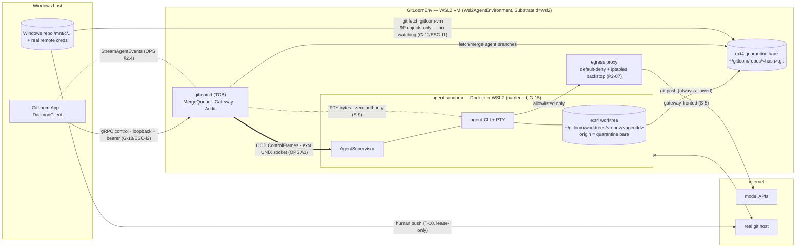

# GitLoom — WSL2 Substrate (B2 — the `SubstrateId = "wsl2"` implementation)

**Status:** Draft for review · **Revision:** 2026-07-11 (initial cut) · **Subordinate to:** `docs/phase-2/implementation_plans/GitLoom_Master_Implementation_Document_v2.md` (the binding spec) · **Implements:** `docs/phase-2/GitLoom_Environment_Substrate_Contract.md` (ESC / B1 — the umbrella) · **Consistent with:** `docs/phase-2/GitLoom_Orchestration_Protocol_Spec.md` (OPS v1). Where this document and the master doc disagree, **the master doc wins** and the disagreement is drift to be fixed here — the same precedence rule ESC applies to itself.

This is the WSL2 realization of the platform-agnostic `IAgentEnvironment` umbrella. It is one of the sibling B-docs ESC §0.3 enumerates; it renames nothing (`GitLoomOsBootstrapper`, `IRepoProvisioner`, `IAgentWorktreeManager`, `SandboxEngine`, `EgressProxyConfigurator`, `gitloom-vm`, `GitLoomEnv`, `ProvisionResult` keep their names and semantics from the master doc) and introduces no parallel system. The only new type is `Wsl2AgentEnvironment` — the concrete `IAgentEnvironment` for `SubstrateId = "wsl2"`, landed additively inside P2-06 per ESC SC-3, delegating health/upgrade into P2-05 bootstrap logic and teardown into P2-22.

## Contents

- §0 Scope — which ESC clauses this doc satisfies; task bindings
- §1 Topology + lifecycle — the WSL2 realization (bootstrapper / provisioner / sandbox)
- §2 The exhaustive WSL stress matrix — failure mode · detection · fallback · conformance test
- §3 Cold-start / mount-latency budgets — ESC §5 filled in for WSL2
- §4 Distribution / OOBE — Velopack `.exe`, diagnostics, enablement, teardown, upgrade, ARM64
- §5 WSL conformance results — the §4 `SubstrateConformance` suite + the WSL-specific tests
- §6 Open decisions
- §7 Conformance tests this document implies

---

# 0. Scope

## 0.1 What this document is

This document is the `SubstrateId = "wsl2"` implementation of the ESC contract. It **realizes ESC-I1…ESC-I9** on a WSL2 VM (`GitLoomEnv`) and **runs the ESC §4 `SubstrateConformance` suite** against `Wsl2AgentEnvironment`, pasting the WSL2 results (§5) and filling the ESC §5 metric framework with WSL2 numbers (§3). It owns exactly the WSL specifics ESC §0.3 delegates to B2: 9P object transfer, the `\\wsl.localhost\GitLoomEnv\...` UNC remote, the `.wslconfig` merge, and the `wsl --terminate GitLoomEnv` lifecycle dialect.

## 0.2 ESC clauses this doc satisfies

Every ESC invariant is realized here by a named WSL2 mechanism and mapped to a test in §5/§7. No invariant is left unrealized; no realization is left untested.

| ESC invariant | WSL2 realization (the mechanism that upholds it) | Class here | §5 test |
|---|---|---|---|
| ESC-I1 Git-objects-only boundary | the sandbox mounts only the **ext4** worktree under `~/gitloom/worktrees/...`; the host repo reaches the ext4 bare mirror through **9P object transfer only** (`git clone --bare /mnt/c/...` then `git fetch`), never a bind mount (G-11) | [STRUCT] | 1, 2 |
| ESC-I2 control-plane-only | UI speaks `gitloomd` gRPC over loopback; `Wsl2AgentEnvironment` and its members live daemon-side and are never referenced from `GitLoom.App` (G-18) | [STRUCT] | 6 |
| ESC-I3 quarantine remote | each agent worktree's `origin` is the daemon-owned `~/gitloom/repos/<hash>.git` bare and **only** that; the VM holds no credential for, and no remote pointing at, the user's real host (P2-06 quarantine ext.) | [STRUCT] | 3 |
| ESC-I4 no host-destroying teardown | `TeardownScope.Instance` = `wsl --terminate GitLoomEnv` → poll → `wsl --unregister GitLoomEnv`; **never `wsl --shutdown`** (G-12) — personal distros untouched | [STRUCT]+[CHECK] | 4, WT-16 |
| ESC-I5 no runtime image build | `SandboxEngine` starts a prebuilt, versioned base image (`/etc/gitloomos-release`); toolchains sideload via `devbox add` (G-16) — no `docker build` path | [STRUCT] | 7 |
| ESC-I6 hardened sandbox spec + anti-memory-inspection quartet | every `CreateContainerAsync` carries `no-new-privileges`, userns remap, memory+pids limits, default seccomp, default-deny egress (G-15); **plus the quartet the OPS A1 forgery-[STRUCT] claim depends on** (OPS §6.1 C / G2): **per-container** seccomp denying `process_vm_readv`/`process_vm_writev`/`ptrace` container-wide + no `CAP_SYS_PTRACE` (these two alone close the in-container memory scrape) + the supervisor-uid tmpfs 0400 (I7); **VM-wide at boot** (P2-05, not a container flag — `kernel.yama.ptrace_scope` is a non-namespaced sysctl Docker cannot set per-container) `kernel.yama.ptrace_scope ≥ 2` as defense-in-depth — so the agent uid cannot scrape K from supervisor memory | [STRUCT]+[CHECK] | 8, 9 |
| ESC-I7 secret channels only | credentials delivered to per-agent tmpfs `/dev/shm` mode 0400; the OOB session HMAC key **K** is a **separate tmpfs file mode 0400 owned by a dedicated supervisor uid distinct from the agent-CLI uid** — the agent uid **cannot** read K (this corrects the earlier drift where K shared the agent-readable credential path, which would have let the agent read K and forge ControlFrames — OPS decision C / G2, S-9); `// SECRET` gRPC masked (G-13) | [STRUCT]+[CHECK] | 9 |
| ESC-I8 transport-agnostic handles | `SyncRemote.Url` is the opaque `\\wsl.localhost\GitLoomEnv\...` UNC handle the Windows side registers verbatim; timeouts `RttBudget`-scaled, survive the P2-25 WAN job (G-14) | [CHECK] | 1, 10 |
| ESC-I9 audit on authority | every provision / worktree create-remove / teardown / egress-allowlist edit / upgrade emits exactly one `AuditLog.Append` (G-17) | [CHECK] | 11 |

## 0.3 Tasks this document binds

| Task | What B2 deepens | Governing ids |
|---|---|---|
| **P2-05** | `GitLoomOsBootstrapper`: `.wslconfig` merge, `dockerd` boot, `gitloomd` health-check, idempotent resume — the `HealthCheckAsync`/`UpgradeAsync` backing (§1.2) | G-12; ESC-I4, ESC-I9 |
| **P2-06** | `IRepoProvisioner`/`IAgentWorktreeManager`: `\\wsl.localhost` UNC remote, ext4 bare mirror, 9P-objects-only, quarantine remotes; the `Wsl2AgentEnvironment` facade + `ResolveSyncRemote` (§1.3) | G-11; ESC-I1, ESC-I3, ESC-I8 |
| **P2-07** | `SandboxEngine`/`EgressProxyConfigurator`: hardened spec on Docker-in-WSL2, default-deny egress, per-repo persistent jail (§1.4) | G-15, G-16; ESC-I5, ESC-I6, ESC-I7 |
| **P2-21** | Installer part 1: `SystemDiagnostics` preflight, OOBE/OS enablement, `GitLoomOS.tar.gz` payload, in-place upgrade (§4) | ESC-I9 |
| **P2-22** | Installer part 2: teardown (`--terminate` → poll → `--unregister`), adapter channel, loopback OAuth — the `TeardownAsync` backing (§4) | G-12; ESC-I4 |
| **P2-25** | WAN guardrails: `SyncRemote.Url` opacity, `RttBudget`-scaled timeouts, the once-per-release WAN CI job the WSL2 flows must survive unchanged (§3, §5 test 10) | G-14; ESC-I8 |

Anything outside `SubstrateId = "wsl2"` (native-Linux, macOS-VM, cloud-pod mechanics) is out of scope and lives in B3…B5.

---

# 1. Topology + lifecycle — the WSL2 realization

## 1.1 Topology

The WSL2 shape is ESC §2's reference topology with every abstract node bound to its WSL2 realization. `GitLoomEnv` is the SUBSTRATE boundary; the host↔bare edge is 9P object transfer; the sandbox mount source is the ext4 worktree; the sync remote is a `\\wsl.localhost` UNC handle.

The `x--x` sandbox→real-host edge is the structural absence ESC-I3/S-1 names: the sandbox has no credential and no configured route to `RHOST`. The `HREPO → BARE` edge is 9P **object transfer only** — file *watching* over 9P is the master-doc rejection trigger (P2-06 step 1), not the object read.

## 1.2 VM / session lifecycle

`Wsl2AgentEnvironment` drives `GitLoomEnv` through a check-then-act state machine (P2-05 idempotence). Every step is resumable: a partial bootstrap re-enters at the first failed check. The `Instance` teardown path uses `--terminate` → poll → `--unregister` and **never** `wsl --shutdown` (G-12 / ESC-I4).

```mermaid
stateDiagram-v2
    [*] --> Absent
    Absent --> Importing: wsl --list --quiet shows no GitLoomEnv
    Importing --> MergingConfig: import GitLoomOS.tar.gz (versioned tarball)
    Absent --> MergingConfig: GitLoomEnv already present
    MergingConfig --> Booting: .wslconfig merged (user keys preserved, WT-4)
    Booting --> DockerdStarting: /etc/wsl.conf boot cmd; raise inotify watches
    DockerdStarting --> GitloomdStarting: dockerd socket ready (waited, not assumed — WT-5)
    GitloomdStarting --> Running: HealthCheckAsync green (gRPC + docker info + disk headroom)
    Running --> Running: HealthCheckAsync (idempotent, read-only)
    Running --> Terminating: TeardownScope.Instance
    Terminating --> Stopped: wsl --terminate GitLoomEnv, poll until stopped
    Stopped --> Unregistered: wsl --unregister GitLoomEnv (uninstall only, P2-22)
    Unregistered --> [*]
    Running --> Absent: Windows fast-startup / hibernate kills the VM (WT-10)
    Terminating --> Running: user re-opens a project (idempotent re-boot)

    note right of Terminating
        NEVER wsl --shutdown (G-12) —
        that would kill the user's
        personal distros. Scope is
        GitLoomEnv only (ESC-I4).
    end note
    note right of Running
        HealthCheckAsync backs
        IAgentEnvironment.HealthCheckAsync;
        UpgradeAsync re-enters at Importing
        with PreserveProvisionedRepos (§4).
    end note
```

**Element → ESC invariant.** The lifecycle upholds ESC-I4 structurally: `TeardownScope` has no host member and the `Instance` verb is scoped to `GitLoomEnv`; the `Absent` transition on hibernate is Windows tearing down the VM, **not** GitLoom calling a host-wide verb (§2 WT-10). `HealthCheckAsync` is idempotent and read-only (ESC test 5). The `MergingConfig` step upholds the P2-05 "merge, never clobber" rule that WT-4 pins.

## 1.3 Bootstrapper (P2-05) and provisioner (P2-06)

`GitLoomOsBootstrapper` (client-side) runs the §1.2 machine: detect `GitLoomEnv` via `wsl.exe --list --quiet`; import the versioned tarball if absent; merge `%UserProfile%\.wslconfig` via the pure `WslConfigMerger` (INI parse, add only our keys under `[wsl2]`, back up first — defaults `memory=min(50% RAM, 8GB)`, `autoMemoryReclaim=gradual`); raise `fs.inotify.max_user_watches`; **set `kernel.yama.ptrace_scope=2` VM-wide** (via `/etc/sysctl.d` or the `/etc/wsl.conf` boot command — the ESC-I6 quartet's control (2), which cannot be a per-container flag); start `dockerd` via `/etc/wsl.conf` and wait for the socket; launch `gitloomd`; health-check gRPC. `HealthCheckAsync` and `UpgradeAsync` on `Wsl2AgentEnvironment` delegate here (ESC SC-3).

`RepoProvisioner` / `WorktreeManager` (P2-06, held by the facade as `Repos`/`Worktrees`) realize the Git-objects boundary:

- `<hash>` = SHA-256 of the normalized Windows repo path → `~/gitloom/repos/<hash>.git`; **first provision** `git clone --bare /mnt/c/...` (the one 9P read on the cold path — §3), **subsequent** `git fetch` (incremental, no re-clone).
- Worktrees under `~/gitloom/worktrees/<repo>/<agentId>` on branch `agent/<id>`, **ext4-native** — the sole mount source (ESC-I1). Never the Windows filesystem "temporarily" (P2-06 rejection trigger).
- Windows side registers remote **`gitloom-vm`** → `\\wsl.localhost\GitLoomEnv\home\<user>\gitloom\repos\<hash>.git` via the existing `AddRemote` (idempotent). This is exactly what `ResolveSyncRemote(repoHash)` returns: `SyncRemote(Name: "gitloom-vm", Url: <that UNC path>)`. Per ESC SC-2, WSL2 keeps `gitloom-vm`; the URL is an opaque handle (ESC-I8) the Windows side registers verbatim.
- Quarantine: each worktree's `origin` is the bare and only the bare (ESC-I3). `git push` inside the sandbox always works; promotion to the real remote is the human-gated `ForegroundMergeService` (`git fetch gitloom-vm && git merge agent/<id>`, T-19 journaled) — a prompt-injected `git push --force origin main` is structurally impossible (no credential, no such remote).

## 1.4 Sandbox (P2-07)

`SandboxEngine` (`Docker.DotNet CreateContainerAsync`, held as `Sandboxes`) starts the prebuilt, versioned base image (no runtime `docker build`, G-16/ESC-I5) with the hardened spec (ESC-I6): `no-new-privileges`, userns remap, default seccomp, memory+pids limits, worktree mount **from ext4 only**, tmpfs `/dev/shm` for credentials (mode 0400, per-agent — no `~/.claude`/global auth-dir mounts, ESC-I7), **plus the per-container half of the anti-memory-inspection quartet** (seccomp denying `process_vm_readv`/`process_vm_writev`/`ptrace` container-wide, no `CAP_SYS_PTRACE` — these two structurally close the in-container memory scrape) so the agent uid cannot scrape the OOB key K from supervisor memory. The quartet's fourth control, **yama `kernel.yama.ptrace_scope ≥ 2`, is a non-namespaced kernel sysctl that `CreateContainerAsync` cannot set** — it is provisioned **VM-wide at boot by `GitLoomOsBootstrapper` (P2-05)** as defense-in-depth, not on the container create request. The OOB session HMAC key **K** lives on a **separate** tmpfs file, **mode 0400 owned by a dedicated supervisor uid distinct from the agent-CLI uid** — it is **not** on the agent-readable credential path, so the agent uid cannot read K nor forge a `ControlFrame` (per OPS decision C / G2, S-9/S-6). `EgressProxyConfigurator` (held as `Egress`) builds the internal network whose only route out is the proxy container: default-deny; allowlist = model APIs + package registries (pull-only). Per OPS decision A6 (§3.7) the repo's git host is **not** on the *agent* proxy allowlist; git-sourced installs reach it through the daemon-mediated, push-refusing, prefix-allowlisted read-git-proxy (ESC-I3/§3 "git-host reach via the daemon read-proxy per A6"). DNS pinned to the proxy; `HTTP(S)_PROXY` env **and** iptables DROP on direct egress (proxy-env-only is the P2-07 rejection trigger). Per-repo persistent jail (`docker start` if stopped). The optional sbx "maximum isolation" backend (P2-07 MAY, `Capabilities.SupportsMaxIsolationBackend`) sits behind the same `ISandboxEngine` seam; the native Docker-in-WSL2 path is the zero-extra-install default.

---

# 2. The exhaustive WSL stress matrix

The core deliverable. Every failure mode carries a detection mechanism, a fallback/recovery, and a conformance test (a numbered ESC §4 test `1…11`, or a WSL-specific `WT-*` from §5). No blank cells. `PR` = automatable/PR-gating leg; `MM` = manual matrix / dedicated Windows runner (`RequiresWsl`), never in the PR gate (test strategy A.3).

| # | Failure mode | Detection | Fallback / recovery | Conformance test |
|---|---|---|---|---|
| 1 | **WSL absent** (feature never installed) | `SystemDiagnostics` parses `wsl.exe --status`/`--list`; absence → `Fail(actionable)` (P2-21) | hard-stop before any system change; OOBE offers `Enable-WindowsOptionalFeature` (P2-21), raw PowerShell surfaced; reboot-resume via elevated Scheduled Task | `WT-1` (parser PR; enablement MM) |
| 2 | **WSL disabled** (feature present, service off) | `wsl.exe --status` returns a disabled/stopped state; diagnostics flag it distinct from absent | re-enable the optional feature + restart `LxssManager`; resume OOBE at the enable step (idempotent) | `WT-1` (parser PR; MM) |
| 3 | **WSL v1, not v2** (default version 1 or distro on v1) | diagnostics parse `wsl -l -v` version column; `GitLoomEnv` imported as v2 explicitly (`--version 2`) | if a stale v1 `GitLoomEnv` exists, `--set-version GitLoomEnv 2`; set default `--set-default-version 2` before import | `WT-2` (parser PR; convert MM) |
| 4 | **GPO-locked WSL** (enterprise policy blocks WSL/virtualization) | `Enable-WindowsOptionalFeature` fails with an access/policy error; diagnostics classify the HRESULT | actionable failure naming the policy; no silent retry loop; doc link for IT; no partial system mutation left behind | `WT-15` (classify PR; MM) |
| 5 | **Virtualization off in BIOS** (VT-x/AMD-V or Hyper-V platform disabled) | `SystemDiagnostics` reads WMI virtualization flags before any mutation (P2-21) | hard-stop with BIOS-enablement guidance + `Enable-WindowsOptionalFeature VirtualMachinePlatform`; reboot-resume | `WT-3` (WMI parse PR; MM) |
| 6 | **`.wslconfig` merge corrupts a pre-existing user config** | pure `WslConfigMerger` round-trip: parse → merge → re-serialize; a fixture asserts every pre-existing key/section/comment survives | INI merge adds only our `[wsl2]` keys; backup written first (`.wslconfig.gitloom.bak`); on parse ambiguity, abort the merge and surface the raw file rather than rewrite | `WT-4` (pure, **PR**) |
| 7 | **dockerd socket startup race** (daemon queried before `dockerd` binds `/var/run/docker.sock`) | bounded wait-for-socket poll in the boot step; `docker info` probe gates the `Running` transition (§1.2) | poll with backoff up to a bounded deadline, then `Fail` loudly (not an infinite hang); `HealthCheckAsync.ContainerRuntimeUp=false` until green | `WT-5` (state-machine PR; live MM) |
| 8 | **`\\wsl.localhost` UNC not ready at startup** (VM booting; UNC path 404s when Windows registers `gitloom-vm`) | `AddRemote`/first `git fetch gitloom-vm` fails path-not-found; provisioner treats it as retryable-not-fatal | **bounded** retry until the VM's 9P/UNC provider is up, then register — modeled on the #156 windowless-startup fix (a startup wait must be bounded and rethrow loudly, never a silent forever-hang); provision blocks on `HealthCheckAsync` green first | `WT-6` (bounded-retry PR; live MM) |
| 9 | **9P cold-start latency on a large monorepo bare clone** (`git clone --bare /mnt/c/...` reads the whole tree over 9P/drvfs) | `SubstrateBenchmark` provision-time metric (§3) flags a cold clone exceeding the documented budget | first provision only; subsequent runs are incremental `git fetch` (warm, no re-clone); budget stated as a documented estimate (§3); see OPEN DECISION WSL-2 for the read-path mitigation | `WT-7` (MM) |
| 10 | **inotify watch exhaustion** (N agents × `node_modules` exceed `fs.inotify.max_user_watches`) | agent CLI/dev-server watch errors (`ENOSPC` on inotify); admission telemetry samples watch headroom | bootstrap raises `max_user_watches` (P2-05); per-agent watch budget enforced by admission (P2-08); degrade to poll-based watching when the budget is hit rather than crash the agent | `WT-8` (MM) |
| 11 | **memory reclaim vs agent OOM** (`autoMemoryReclaim=gradual` reclaims pages an active agent needs; or the VM cap starves a swarm) | `/proc/meminfo` sampling in admission (P2-08, ≤5 s); `HealthCheckAsync.DiskHeadroomBytes` sibling headroom check | admission holds a memory headroom floor before spawn ("4–6 agents on 16 GB" honest cap); reclaim mode is a `.wslconfig` default, not a hard reclaim; see OPEN DECISION WSL-1 | `WT-9` (MM) |
| 12 | **Windows fast-startup / sleep / hibernate kills the VM mid-session** (hybrid shutdown or hibernate stops `GitLoomEnv`; containers vanish) | on reconnect the daemon gRPC is unreachable → client re-runs `GitLoomOsBootstrapper` (idempotent); `SwarmReconciler` (P2-08) reconciles Docker on boot | re-boot `GitLoomEnv` (idempotent, §1.2); reconciler marks vanished agents `Dead`, prunes their worktrees, surfaces disposal in the UI; ext4 repos+worktrees on disk survive the VM stop; see OPEN DECISION WSL-3 (auto-resume policy) | `WT-10` (MM) |
| 13 | **antivirus scanning `/mnt/c`** (real-time AV inspects the Windows repo tree during the cold bare clone, inflating 9P read time) | provision-time metric regression (§3) with no code fault; the read path is `/mnt/c` (Windows-side, AV-visible) | the clone reads objects only (no watching); document an AV exclusion for the repo path as an advisory OOBE note; the ext4 bare + worktrees are **not** on `/mnt/c` so steady-state agent IO is never AV-scanned | `WT-11` (advisory MM) |
| 14 | **NTFS EPERM/EBUSY on post-merge installs** (post-`git merge` `pnpm/npm install` on the Windows repo hits NTFS lock/permission on native modules) | `ForegroundMergeService` wraps the post-merge install; NTFS `EPERM`/`EBUSY` surfaced as a typed, retryable failure | post-merge installs run `--ignore-scripts` wrapped in retry (P2-09 Windows side); bounded backoff; the merge itself (a git op) is unaffected — only the convenience install retries | `WT-12` (retry-wrapper PR; live MM) |
| 15 | **`wsl --terminate` / `kill -9` recovery + session-leader reattach** (VM or `gitloomd` killed out from under a live session) | client detects gRPC disconnect; on reconnect it re-boots (idempotent) and re-attaches to the running `gitloomd` session; `SwarmReconciler` adopts live containers | idempotent re-boot brings `GitLoomEnv` + `dockerd` + `gitloomd` back; reconciler adopts orphan-but-live containers and prunes dead ones (P2-08); the client re-subscribes `StreamAgentEvents` from its cursor (OPS A4) — a killed VM never wedges the next launch (the P2-05 re-run is a no-op past the green checks) | `WT-13` (reconciler PR leg + reattach MM) |
| 16 | **versioned-tarball VM upgrade must preserve repos + worktrees** (`vN → vN+1` in-place image upgrade) | `UpgradeAsync(TargetReleaseId, PreserveProvisionedRepos: true)`; `/etc/gitloomos-release` compared; a no-op when already current (`Applied=false`) | in-place upgrade re-imports the new `GitLoomOS.tar.gz` while preserving the `~/gitloom` repo+worktree tree (P2-21); the automated test asserts repos/worktrees survive the bump; idempotent re-run | `WT-14` (upgrade harness PR-where-CI-allows + MM), ESC test 5 |
| 17 | **`wsl --shutdown` would kill the user's personal distros (G-12)** | grep guard over `GitLoom.Core`/`GitLoom.Server`/`installer` for `wsl --shutdown`/`--shutdown` → 0 hits; `TeardownScope` has no host member | structurally absent: the only instance-teardown verb is `wsl --terminate GitLoomEnv` → poll → `--unregister` (P2-22); there is no code path to a host-wide stop (ESC-I4 [STRUCT]) | `WT-16` (grep guard, **PR**), ESC test 4 |

---

# 3. Cold-start / mount-latency budgets

This section fills the ESC §5 metric framework for `SubstrateId = "wsl2"`. All numbers are **documented estimates** (labeled as such), to be replaced by measured `SubstrateBenchmark` output once the P2-05/06/07 code lands; the *framework and method* are binding now, the numbers are targets.

## 3.1 Method (ESC §5.2)

1. **Same fixture repos** across all substrates: `small` (a few hundred files), `lockfile` (a `pnpm-lock.yaml` repo, to exercise the post-worktree install), `monorepo` (large history + large tree, to exercise the 9P cold read).
2. **Cold and warm both reported** per row; a row with no cold path states the reason, never a blank.
3. **RttBudget stated.** WSL2 numbers are measured under the **loopback** budget (`GitLoomEnv` on the same host, sub-ms to low-ms RTT). The P2-25 WAN job re-runs the same flows under `tc netem` 80 ms to prove no spurious timeout (ESC-I8); those numbers are reported separately and are not the WSL2 steady-state figures.
4. **Reported through the same handle.** `SubstrateBenchmark` emits one comparable record per metric; no hand-rolled per-platform timing.

**Transport precision (ESC SC-6 / ESC-I1).** `Capabilities.FilesystemTransport = "9p"` labels the **host↔bare object transport only** — the `git clone --bare /mnt/c/...` read on the cold provision. The sandbox's own worktree read latency is **ext4-native** (the ext4 worktree is the sole mount, ESC-I1), *not* 9P. The mount/FS row therefore reports both: the in-sandbox ext4 read (the number agents actually experience) and, separately, the 9P `/mnt/c` read that only the cold provision pays. Conflating them would misread the physics (ESC SC-6).

## 3.2 The filled ESC §5.3 template

> Substrate: `wsl2` · RttBudget: `loopback` · Fixtures: `small` / `lockfile` / `monorepo` · **All figures are documented estimates, not yet measured.**
>
> | Metric | Cold | Warm |
> |---|---|---|
> | Provision time | `small` ≈ 2 s · `lockfile` ≈ 4 s · `monorepo` ≈ 40 s (9P `/mnt/c` bare-clone read-bound; see WSL-2) | incremental `git fetch`, no re-clone: `small` ≈ 1 s · `monorepo` ≈ 3 s |
> | Worktree-create time | first worktree in a fresh repo, install populates the content-addressable store: `lockfile` ≈ 30–120 s (dep-count-bound) · `small` ≈ 2 s | Nth worktree, CAS hit (N agents ≈ 1× disk): ≈ 2–5 s |
> | First-byte PTY latency | sandbox not yet started (container start on the path): ≈ 1–3 s | persistent jail already running (`docker start` skipped): ≈ 100–150 ms |
> | Mount/FS read latency (`ext4-native` in-sandbox) | first `stat`+read (page cache cold): ≈ 1–3 ms | cache-warm: sub-ms |
> | Mount/FS read latency (`9p` host→bare, provision only) | cold `/mnt/c` object read: ≈ tens of MB/s effective; the dominant term in `monorepo` cold provision | not applicable — 9P is touched only on the cold provision read, never on the steady-state agent path (ESC-I1) |
> | Substrate cold start | import tarball + boot + `dockerd` + `gitloomd` health from nothing: **target < 60 s** (P2-05 fresh-import target) | `GitLoomEnv` already up: `HealthCheckAsync` green in ≈ 1 s |

The `monorepo` cold-provision figure is the one budget worth watching: it is 9P-read-bound and AV-sensitive (§2 WT-11), which is why WSL-2 raises the read-path question. Every other steady-state number rides ext4-native storage and is transport-fast.

---

# 4. Distribution / OOBE (P2-21 / P2-22)

## 4.1 Payload + preflight

The client ships as a **Velopack `.exe`** carrying the app plus the reproducible `GitLoomOS.tar.gz` payload (`build/gitloomos/`, versioned `/etc/gitloomos-release`, hash-stable given pinned inputs). Before any system modification, `SystemDiagnostics` runs the preflight (P2-21): Win11 x64 build check, WMI virtualization flags, WSL2 state parse (`wsl --status`/`-l -v`), ≥20 GB free disk. Each check returns `Pass | Fail(actionable message + doc link)`; the installer **hard-stops** before touching the system if any fails (§2 WT-1…WT-5, WT-15 all detect here).

## 4.2 OS enablement + OOBE

Unelevated OOBE; UAC prompts only at "Construct Sandbox" (an elevated helper relaunch). `Enable-WindowsOptionalFeature` runs with the raw PowerShell surfaced to the user. Reboot-resume uses an **elevated Scheduled Task** (never `RunOnce`) plus `oobe-state.json`, so a mid-enablement reboot resumes deterministically. Silent tarball import reuses the P2-05 bootstrapper (one code path, `HealthCheckAsync`-gated).

## 4.3 Teardown (P2-22 → `TeardownAsync`)

`Wsl2AgentEnvironment.TeardownAsync(TeardownScope, ct)` maps to the ESC teardown scopes:

| `TeardownScope` | WSL2 verb | Bounds (ESC-I4 / G-12) |
|---|---|---|
| `Worktree` | `IAgentWorktreeManager.RemoveAgentWorktree(repoHash, agentId, force)` | one agent worktree; dirty + `force:false` → typed failure |
| `Repo` | remove `~/gitloom/repos/<hash>.git` + its worktrees | one provisioned repo only; other repos untouched |
| `Instance` | `wsl --terminate GitLoomEnv` → poll until stopped → `wsl --unregister GitLoomEnv` | `GitLoomEnv` only; **never `wsl --shutdown`**; personal distros untouched (uninstall test) |

Uninstall additionally removes Explorer context menus, registry keys, Scheduled Tasks, and appdata; the user's repo is untouched; the `gitloom-vm` remote removal is offered, not forced (P2-22).

## 4.4 Upgrade (`UpgradeAsync`)

`UpgradeAsync(SubstrateUpgradeRequest(TargetReleaseId, PreserveProvisionedRepos), ct)` compares `/etc/gitloomos-release`; if current it returns `UpgradeResult(Applied:false, ...)` (idempotent no-op, ESC test 5). Otherwise it performs the in-place `vN → vN+1` tarball upgrade preserving the `~/gitloom` repo+worktree tree (§2 WT-14). CVE patch cadence documented in `docs/gitloomos-updates.md`.

## 4.5 ARM64 policy

`SystemDiagnostics` treats **ARM64 as an explicit unsupported gate** for v1 (P2-21): the preflight fails fast with a clear "unsupported architecture" message and no partial mutation. No ARM64 `GitLoomOS.tar.gz` is built for v1; the gate is a documented, honest hard-stop, not a silent degrade. Revisiting ARM64 is future work outside B2.

---

# 5. WSL conformance results

Two suites run against `Wsl2AgentEnvironment`: the ESC §4 `SubstrateConformance` suite (tests 1–11, generalized off the P2-06/P2-07 required tests) and the WSL-specific `WT-*` tests (§2). Each has a single pass/fail assertion, a trait, and a leg. Per the test strategy (A.3): a `RequiresWsl` test never gates a PR — it runs in the manual matrix / dedicated Windows runner — and **no test requires both WSL and Docker-in-WSL in the PR gate**. The ESC §4 Docker legs therefore run on the **Linux CI leg** (Docker present, PR-blocking) to prove the invariant logic; their **wsl2-native confirmation** (the identical assertions with Docker inside `GitLoomEnv`) is `RequiresWsl` + `RequiresDocker` and rides the manual matrix.

## 5.1 ESC §4 `SubstrateConformance` suite — WSL2 leg

| # | Test id | Trait | WSL2 pass assertion | Automatable vs MM |
|---|---|---|---|---|
| 1 | `GitObjectsRoundTrip_ShouldBeByteIdentical` | `RequiresDocker`+`SubstrateConformance` | agent commits in the ext4 worktree; Windows `git fetch gitloom-vm && git merge agent/<id>` yields **byte-identical** tree/blob SHAs (P2-06 inv.2) | Linux CI leg **PR**; wsl2-native MM |
| 2 | `NoHostPathMount_ShouldHoldForEveryContainer` | `RequiresDocker`+`SubstrateConformance` | `docker inspect` shows **zero** `/mnt/c`/`drvfs`/UNC mounts; the only mount is the ext4 worktree (G-11) | Linux CI leg **PR**; wsl2-native MM |
| 3 | `SandboxRemotes_ShouldBeExactlyQuarantine` | `RequiresDocker`+`SubstrateConformance` | configured remotes == `[quarantine]`; no real-remote credential; `git push --force origin main` reaches only the bare; no route to the real host exists (ESC-I3/S-1) | Linux CI leg **PR**; wsl2-native MM |
| 4 | `TeardownNoResidue_AndHostUntouched` | `RequiresDocker`+`SubstrateConformance` | `TeardownAsync(Repo)` then `(Instance)` leaves no residue for the scope; personal distros + host untouched; grep shows no host-destroying verb | grep leg **PR**; live `--terminate`/`--unregister` MM |
| 5 | `HealthAndUpgrade_ShouldBeIdempotent` | `SubstrateConformance` | `HealthCheckAsync` is side-effect-free and stable; `UpgradeAsync(current)` returns `Applied=false` twice; provisioned repos survive when `PreserveProvisionedRepos` | state-machine leg **PR**; live VM MM |
| 6 | `ControlPlaneOnly_UiHasNoSubstrateHandle` | (pure) `SubstrateConformance` | no `Docker.DotNet`/`Porta.Pty`/`IAgentEnvironment` reference in `GitLoom.App`; every substrate act is an RPC; `NoRpcWritesWindowsRepo` holds | pure **PR** |
| 7 | `NoRuntimeImageBuild_ShouldHold` | (pure) `SubstrateConformance` | no `ImageBuild`/`docker build` call path in the daemon or `Wsl2AgentEnvironment`; base image prebuilt with a versioned `ReleaseId` | pure **PR** |
| 8 | `HardenedSpec_EveryFlagAsserted` | `RequiresDocker`+`SubstrateConformance` | `no-new-privileges`, userns remap, memory+pids limits, seccomp (incl. the `process_vm_readv`/`process_vm_writev`/`ptrace` denylist), no `CAP_SYS_PTRACE`, default-deny egress all present on the create request; an un-hardened spec fails the builder unit test. **Plus a VM-boot assertion `kernel.yama.ptrace_scope ≥ 2`** (the quartet's control (2), boot-provisioned by P2-05 — not a container flag) | builder unit **PR**; live inspect Linux CI **PR** + VM-boot sysctl check **PR** + wsl2-native MM |
| 9 | `SecretChannelsOnly_NoArgvNoEnvFile` | `RequiresDocker`+`SubstrateConformance` | credential lands on the agent tmpfs 0400; the OOB session key **K** lands on a **separate supervisor-uid-owned tmpfs 0400 the agent uid cannot read**, and an agent-uid scrape of K from supervisor memory (`ptrace`/`process_vm_readv`) is **denied** (quartet); keyring / `// SECRET` gRPC honored; logging-mask test passes; no argv/env-file/proto-log site carries it | mask leg **PR**; tmpfs-mode Linux CI **PR** + wsl2-native MM |
| 10 | `WanLatency_ProvisionAndWorktree_NoSpuriousTimeout` | `SubstrateConformance` (per-release) | provision → worktree-create → merge round-trip under `tc netem` 80 ms fires no spurious timeout; echo < 100 ms @ 80 ms RTT (P2-25) | WAN CI job (per-release) |
| 11 | `AuditPerAuthorityAction_ExactlyOne` | `SubstrateConformance` | provision / worktree create-remove / egress-allowlist edit / teardown / upgrade each emit **exactly one** audit event via `AuditProbe` | `AuditProbe` coverage **PR** |

## 5.2 WSL-specific tests (from the §2 matrix)

| Test id | Trait | Pass assertion | Leg |
|---|---|---|---|
| `WT-1` `WslAbsent_ShouldDiagnoseActionably` | `RequiresWsl` (+ parser pure) | `wsl --status`/`--list` fixtures parse to the correct absent/disabled verdict + actionable message; hard-stop before mutation | parser **PR**; enablement MM |
| `WT-2` `WslV1NotV2_ShouldDetectAndConvert` | `RequiresWsl` (+ parser pure) | `wsl -l -v` fixtures classify a v1 distro; import forces `--version 2`; stale v1 `GitLoomEnv` is converted | parser **PR**; convert MM |
| `WT-3` `VirtualizationDisabled_ShouldDiagnoseWithBiosGuidance` | `RequiresWsl` (+ WMI parse pure) | WMI virtualization-flag fixtures yield a BIOS-guidance `Fail`; no system mutation attempted | WMI parse **PR**; MM |
| `WT-4` `WslConfigMerge_ShouldPreserveUserKeys` | (pure) | `WslConfigMerger` preserves every pre-existing key/section/comment; adds only `[wsl2]` GitLoom keys; backup written | pure **PR** |
| `WT-5` `DockerdSocketRace_ShouldWaitForSocketNotAssume` | `RequiresWsl`+`RequiresDocker` (+ state-machine pure) | boot step polls for `/var/run/docker.sock` and gates `Running` on `docker info`; a not-yet-ready socket never reads as green | state-machine **PR**; live MM |
| `WT-6` `UncRemoteNotReady_ShouldBoundedRetryNotHang` | `RequiresWsl` (+ retry logic pure) | `AddRemote`/first fetch against a not-ready UNC bounded-retries then rethrows loudly (never a silent forever-hang, per #156) | retry logic **PR**; live MM |
| `WT-7` `NinePCloudStart_LargeMonorepo_WithinBudget` | `RequiresWsl`+`RequiresDocker` | cold `monorepo` provision completes within the documented §3 budget; warm is incremental fetch | MM |
| `WT-8` `InotifyExhaustion_ShouldRaiseWatchesAndDegrade` | `RequiresWsl`+`RequiresDocker` | bootstrap raised `max_user_watches`; exceeding the per-agent budget degrades to poll-based watching, not an agent crash | MM |
| `WT-9` `MemoryReclaimVsOom_AdmissionHoldsHeadroom` | `RequiresWsl`+`RequiresDocker` | admission blocks spawn below the memory headroom floor with a typed reason; reclaim never OOM-kills an admitted agent | MM |
| `WT-10` `FastStartupVmDeath_ShouldReconcileAndSurface` | `RequiresWsl`+`RequiresDocker` | after a hibernate-induced VM stop, re-boot is idempotent, the reconciler marks vanished agents `Dead`, ext4 repos+worktrees survive | MM |
| `WT-11` `AntivirusMntCScan_ShouldNotBlockProvision` | `RequiresWsl` | cold provision succeeds with real-time AV active (advisory: an exclusion note is surfaced); steady-state agent IO is off `/mnt/c` | advisory MM |
| `WT-12` `NtfsEpermPostMerge_ShouldRetryIgnoreScripts` | `RequiresWsl` (+ retry-wrapper pure) | post-merge install wraps `--ignore-scripts` in bounded retry; NTFS `EPERM`/`EBUSY` surfaces typed after retries exhaust; the merge itself is unaffected | retry-wrapper **PR**; live MM |
| `WT-13` `WslTerminateKill_ShouldRecoverAndReattach` | `RequiresWsl`+`RequiresDocker` (+ reconciler `RequiresDocker`) | after `wsl --terminate`/`kill -9`, idempotent re-boot restores the stack, the reconciler adopts live + prunes dead containers, the client re-subscribes from its cursor | reconciler Linux CI **PR**; reattach MM |
| `WT-14` `VersionedTarballUpgrade_ShouldPreserveReposAndWorktrees` | `RequiresWsl` (+ harness where CI allows) | `vN → vN+1` in-place upgrade preserves `~/gitloom` repos+worktrees; a same-release upgrade is a no-op | harness **PR-where-CI-allows**; MM |
| `WT-15` `GpoLockedWsl_ShouldDiagnose` | `RequiresWsl` (+ HRESULT classify pure) | a policy-blocked `Enable-WindowsOptionalFeature` HRESULT classifies to an IT-actionable message; no retry loop; no partial mutation | classify **PR**; MM |
| `WT-16` `NeverWslShutdown_GrepGuard` | (pure) | grep over `GitLoom.Core`/`GitLoom.Server`/`installer` for `wsl --shutdown`/`--shutdown` → **0 hits**; `TeardownScope` has no host member (ESC-I4/G-12) | pure **PR** |

## 5.3 CI placement summary

- **PR-blocking, normal (Windows) leg:** the pure legs — 6, 7, WT-4, WT-16, and the parser/state-machine/retry-logic legs of WT-1/2/3/5/6/12/15.
- **PR-blocking, Linux CI leg (Docker present):** the invariant-logic legs of ESC tests 1, 2, 3, 4 (grep), 8, 9, and the `WT-13` reconciler leg — proving the invariants a real container is needed for, without requiring WSL.
- **Per-release:** ESC test 10 (the P2-25 WAN job) and `WT-14` where a fixture-VM harness exists.
- **Manual matrix / dedicated Windows runner (`RequiresWsl`, never a PR gate):** the wsl2-native confirmation legs of ESC tests 1–5, 8, 9, and `WT-7/8/9/10/11/13/14` — the failure modes only a real `GitLoomEnv` with Docker-in-WSL2 can exercise.

A green PR set + a green manual matrix + a filled §3 table is the definition of "`wsl2` is a supported substrate."

---

# 6. Open decisions

> **OPEN DECISION [WSL-1]:** `.wslconfig` defaults `autoMemoryReclaim=gradual` (P2-05), but gradual reclaim can page out memory an active agent needs, and the VM `memory` cap (`min(50% RAM, 8GB)`) can starve a swarm — reclaim policy and agent OOM pull against each other (§2 WT-9).
> **Recommendation:** keep `autoMemoryReclaim=gradual` as the default (it protects the host from a runaway VM) but make **admission (P2-08) hold a memory headroom floor** sampled from `/proc/meminfo` ≤ 5 s before every spawn, so the "4–6 agents on 16 GB" honest cap is enforced at admit time rather than discovered at OOM. Expose the reclaim mode and the cap in `SubstrateCapabilities`/health so the UI can surface the trade-off. Do **not** switch the default to `dropcache`/off — that hands the host to a busy swarm.
> **Rationale / tradeoffs:** admission-side headroom keeps the host safe *and* keeps agents alive without a hard reclaim off-switch. *Rejected — reclaim off:* trades a swarm bug for a host bug. *Rejected — a larger fixed cap:* still starves on a bigger swarm and hurts low-RAM machines; the honest admission cap is the master-doc line (P2-08).
> **Affected tasks:** P2-05 (`.wslconfig` defaults), P2-08 (admission headroom).

> **OPEN DECISION [WSL-2]:** the cold `monorepo` provision is 9P/drvfs-read-bound (`git clone --bare /mnt/c/...` reads the whole tree over 9P) and AV-sensitive (§2 WT-11) — the one WSL2 metric that can miss its budget (§3).
> **Recommendation:** keep the master-doc `git clone --bare /mnt/c/...` as the correctness path (it is objects-only, ESC-I1-safe), but treat the read-path speedup as an **optional cold-start optimization behind a capability flag**, not a boundary change: e.g. a `git bundle` produced on the Windows side and imported once, or reading via `\\wsl$`/`\\wsl.localhost` with a pre-warm, measured against the §3 budget before adoption. Any optimization MUST stay objects-only and MUST NOT introduce file *watching* over 9P (the P2-06 rejection trigger). Ship the plain clone first; adopt an optimization only if `SubstrateBenchmark` shows the `monorepo` cold path missing budget.
> **Rationale / tradeoffs:** avoids premature complexity while leaving a measured escape hatch. *Rejected — bind-mounting `/mnt/c` for a faster read:* violates G-11/ESC-I1 outright. *Rejected — always bundle:* adds a Windows-side step and a second code path before there is evidence it is needed.
> **Affected tasks:** P2-06 (provision read path), P2-21 (AV-exclusion OOBE note).

> **OPEN DECISION [WSL-3]:** when Windows fast-startup / hibernate stops `GitLoomEnv` mid-session (§2 WT-10, WT-13), the ext4 repos+worktrees survive but every agent container is gone. Should the daemon **auto-resume** the interrupted agents on re-boot, or mark them `Dead` and let the human re-spawn?
> **Recommendation:** on re-boot the `SwarmReconciler` marks vanished agents **`Dead`** (Docker is the sole source of truth, P2-08) and surfaces the disposal in the UI; it does **not** silently re-spawn. Auto-resume of a coding agent mid-task is unsafe (its in-flight, unpushed work is lost with the container; resuming would restart from an ambiguous point) and re-spawn is an authority-bearing action that belongs to the human. The worktree branch and any pushed commits on the quarantine bare survive, so the human loses nothing already committed and re-spawns deliberately.
> **Rationale / tradeoffs:** keeps spawn a human/Coordinator-gated authority action (OPS S-8) and avoids resurrecting agents into a torn state. *Rejected — auto-resume:* a silent re-spawn is an un-audited authority action and risks duplicate/torn work. *Rejected — freeze-and-restore via checkpoints:* the P2-37 checkpoint machinery can make this safe later, but it is out of B2 scope; until then, mark-`Dead` is the honest default.
> **Affected tasks:** P2-08 (reconciler policy), P2-37 (future checkpoint-based resume).

> **OPEN DECISION [WSL-4]:** the sync-remote URL uses the `\\wsl.localhost\GitLoomEnv\...` UNC alias, but older Windows builds expose the VM only under the legacy `\\wsl$\GitLoomEnv\...` alias, and the alias's provider is not ready the instant the VM boots (§2 WT-6).
> **Recommendation:** `ResolveSyncRemote` emits **`\\wsl.localhost\...`** as the canonical form (the current, documented alias) and the provisioner probes the resolved UNC path with a **bounded readiness wait** (modeled on #156) before registering `gitloom-vm`; if `\\wsl.localhost` is unavailable on an older build, fall back to the `\\wsl$` alias for the same path. The URL stays an opaque handle (ESC-I8): the Windows side registers whatever `SyncRemote.Url` resolves to, never a hardcoded string.
> **Rationale / tradeoffs:** one canonical alias with a bounded fallback keeps ESC-I8 intact and avoids a startup hang. *Rejected — hardcode `\\wsl$`:* the legacy alias is deprecated. *Rejected — no readiness wait:* reproduces the class of silent-hang #156 fixed.
> **Affected tasks:** P2-06 (`ResolveSyncRemote` + UNC readiness), P2-05 (startup ordering).

---

# 7. Conformance tests this document implies

Every ESC invariant is realized by a named WSL2 mechanism (§0.2) and closes on a §5 test. The WSL-specific failure modes (§2) each close on a `WT-*` test. The full traceability:

| Invariant / failure class | Class | Test(s) | Leg |
|---|---|---|---|
| ESC-I1 Git-objects-only (ext4 mount, 9P objects-only) | [STRUCT] | 1, 2 | Linux CI **PR** + wsl2-native MM |
| ESC-I2 control-plane-only | [STRUCT] | 6 | pure **PR** |
| ESC-I3 quarantine remote | [STRUCT] | 3 | Linux CI **PR** + wsl2-native MM |
| ESC-I4 no host-destroying teardown (never `wsl --shutdown`) | [STRUCT]+[CHECK] | 4, WT-16 | grep **PR** + live MM |
| ESC-I5 no runtime image build | [STRUCT] | 7 | pure **PR** |
| ESC-I6 hardened sandbox spec + anti-memory-inspection quartet (yama/seccomp/no-CAP_SYS_PTRACE) | [STRUCT]+[CHECK] | 8, 9 | builder **PR** + inspect MM |
| ESC-I7 secret channels only (K on a supervisor-uid tmpfs the agent cannot read) | [STRUCT]+[CHECK] | 9 | mask **PR** + tmpfs MM |
| ESC-I8 transport-agnostic handles (opaque UNC) | [CHECK] | 1, 10, WT-6, WT-4 (alias) | **PR** + per-release WAN |
| ESC-I9 audit on authority | [CHECK] | 11 | `AuditProbe` **PR** |
| `.wslconfig` merge safety | [CHECK] | WT-4 | pure **PR** |
| WSL enablement / diagnostics (absent/disabled/v1/GPO/BIOS) | [CHECK] | WT-1, WT-2, WT-3, WT-15 | parser **PR** + MM |
| dockerd socket race / UNC readiness | [CHECK] | WT-5, WT-6 | state-machine **PR** + live MM |
| 9P cold-start / inotify / memory reclaim | [CHECK] | WT-7, WT-8, WT-9 | MM |
| VM-death recovery / reattach / NTFS install | [CHECK] | WT-10, WT-12, WT-13 | reconciler **PR** + MM |
| versioned-tarball upgrade preservation | [CHECK] | WT-14, 5 | harness **PR-where-CI-allows** + MM |

**Close:** `wsl2` is a supported substrate iff its `Wsl2AgentEnvironment` passes the ESC §4 suite (§5.1) in full, passes the WSL-specific `WT-*` suite (§5.2), and its §3 metric table is filled with measured `SubstrateBenchmark` output. No ESC invariant is left without a test; no failure mode in §2 is left without a recovery and a test; the four `WSL-*` open decisions (§6) are the only unresolved seams, and none weakens an ESC invariant or an OPS S-invariant.

*End of GitLoom WSL2 Substrate (B2, draft 2026-07-11).*
