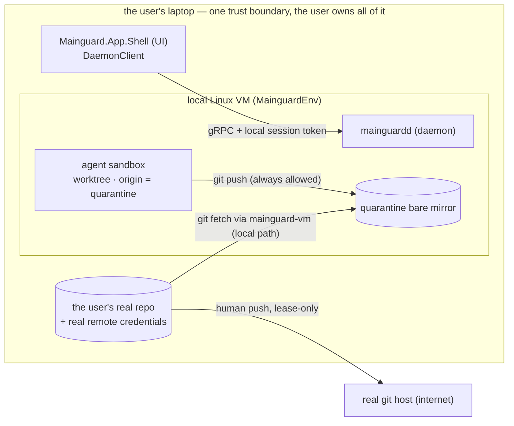
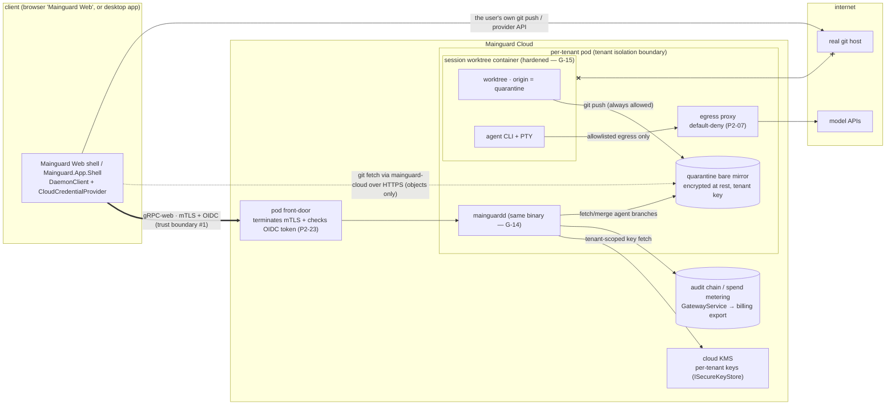
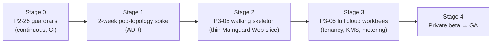

# Mainguard — Cloud + Vibe Companion (the explained, de-jargoned edition)

**Status:** Companion / explainer · **Revision:** 2026-07-11.2 (teaching pass + full cost & scaling model) · **Subordinate to:** `docs/phase-2/implementation_plans/Mainguard_Master_Implementation_Document_v2.md` (the binding spec). Consistent with `docs/phase-2/Mainguard_Environment_Substrate_Contract.md` (ESC / B1, the substrate umbrella) and `docs/phase-2/Mainguard_Orchestration_Protocol_Spec.md` (OPS v1). Where this document and the master doc disagree, **the master doc wins** and the gap is drift to fix here.

## Who this is for and what it is

This is the plain-language companion to Mainguard's cloud and "Vibe" roadmap. It exists so a founder or reader **without a cloud-infrastructure background** can follow the same story the engineering specs tell, without having to already know what "mTLS" or "tenant isolation" means. It defines every term the first time it appears, draws the picture of what runs where, lays out the order we should build (and prove) things in, resolves the open architecture questions, and shows a simple cost model.

It **adds nothing new** to the plan. Every claim here points back to a real task ID (like `P3-06`), a real code type (like `CloudCredentialProvider`), or a real invariant (like `G-14`) in the binding docs. Two threads run through everything:

- **The "Vibe" product** — a simplified, chat-first way to build software where an AI agent does the Git work for you. Specified in Wave 3: `P3-01` (auto-checkpoints + agent conflict resolution), `P3-02` (plain-language escalation), `P3-03` (the Vibe UI), plus the shared engine `P2-26`.
- **The cloud** — running all of that on our servers instead of the user's laptop, so sessions are instant-on, scale past a laptop's limits, and become a business we can meter and charge for. Specified in Wave 4: `P3-06` (cloud worktrees), `P3-07` (host parity), with guardrails from `P2-25` and identity from `P2-23`.

The one-line strategy the master doc locks (§6 preamble, §7): **the shared engine ships on the desktop; the Vibe product is cloud-first.** The desktop gets a simplified interim view; the real Vibe experience is "Mainguard Web" (`P3-05`) served from a cloud session (`P3-06`).

## Contents

- §1 Concepts glossary — every cloud term, in plain language, with where it appears
- §2 What runs where — desktop vs cloud topology and the trust boundaries drawn
- §3 The de-risking sequence — spike → P3-05 → P3-06 → GA, with go/no-go gates
- §4 Open ADRs, resolved — the four open cloud decisions, each with a recommendation
- §5 Cost & scaling model — what a session costs, how metering becomes a price, where the margin lives, and the business case for the cloud tier

---

# 1. Concepts glossary

Read this section first. Everything after it uses these terms. Each entry is: a one-sentence plain definition, **why Mainguard needs it**, and **the real type or task it appears in** so you can trace it back to the binding spec. Terms are grouped so related ideas sit together, not alphabetized.

## 1.1 The Git building blocks (these already exist in the shipped desktop client)

| Term | Plain-language definition | Why Mainguard needs it | Real type / task |
|---|---|---|---|
| **Worktree** | A working copy of a repository's files checked out to a folder, so more than one branch can be edited at once without cloning the whole repo again. | Every agent gets its **own** worktree so agents never trip over each other's files or each other's `index.lock`. In the cloud each session is one worktree. | `IAgentWorktreeManager.CreateAgentWorktree` (P2-06); the shipped desktop `AddWorktree` (T-07); "per-session worktree containers" (P3-06) |
| **Quarantine remote** | A worktree whose *only* configured "push destination" (`origin`) is a private, daemon-owned copy of the repo — never the user's real GitHub/GitLab. | So a misbehaving or prompt-injected agent **cannot** run `git push --force origin main` against the real repo. There is no credential and no route for it to do so — the escape is structurally impossible, not merely blocked by a firewall. | `ESC-I3` (Environment Substrate Contract); the "quarantine remotes" extension of P2-06 |

## 1.2 Identity and authentication (proving *who* is calling)

| Term | Plain-language definition | Why Mainguard needs it | Real type / task |
|---|---|---|---|
| **OIDC** (OpenID Connect) | A standard way for an app to let users "log in with" an identity provider (their company Google/Okta/Entra account) and receive a signed token proving who they are. | The cloud has no laptop to trust — it must know *which paying user/tenant* each request belongs to. OIDC is how enterprise SSO ("single sign-on") maps a company login to a Mainguard role. | `P2-23` OIDC SSO (the identity infrastructure P3-06 and P3-05 reuse) |
| **RBAC** (Role-Based Access Control) | Permissions are attached to *roles* (e.g. "can approve merges"), and users get roles — instead of granting permissions one user at a time. | So an org can say "reviewers approve merges, contributors don't" and have it enforced on the server, not just hidden in the UI. | `P2-23` role → permission set (`spawn_agents`, `approve_merges`, …); enforced in **daemon interceptors** |
| **SCIM** | A standard protocol for an identity provider to automatically create and deactivate user accounts in another system. | So when an enterprise adds or removes an employee in their directory, Mainguard access follows automatically — a hard requirement for enterprise deals. | `P2-23` SCIM 2.0 provisioning endpoint |
| **mTLS** (mutual TLS) | Ordinary HTTPS proves the *server's* identity to the browser; mutual TLS additionally makes the *client* prove its identity with its own certificate, so both ends are verified. | The cloud front-door must be sure the thing connecting is a genuine Mainguard client for that tenant, not an impostor on the open internet. On the laptop this was a local session token; in the cloud it becomes mTLS **plus** the OIDC user token. | `P3-06` "mTLS between client and pod front-door + user OIDC token" |
| **PKCE / loopback OAuth** | A technique for desktop/CLI apps to safely do "Sign in with GitHub"-style flows without a client secret: the app opens a browser, listens on a temporary local port (`loopback`), and uses a one-time cryptographic proof (`PKCE`) so an intercepted code is useless. | Every "connect your GitHub/Vercel account" button uses this so a token is never guessable or replayable, and never lands in a URL or a log. | RFC 8252 loopback + PKCE; the shared `LoopbackOAuthListener` (P2-22); reused by `P3-04`'s `IDeployProvider.AcquireTokenAsync` and P3-05/P3-06 repo connection |

## 1.3 Keeping tenants apart and their data safe

The word **tenant** means *one paying customer* (a person or an organization) whose data must never mix with another's. Multi-tenant software serves many tenants from shared infrastructure; the whole game is keeping them separated.

| Term | Plain-language definition | Why Mainguard needs it | Real type / task |
|---|---|---|---|
| **Tenant isolation** | The guarantee that one tenant can never read, reach, or affect another tenant's data or running sessions, even though they share the same cloud. | This is the cloud version of the desktop's whole promise ("you don't lose control of your code"). Two tenants on Mainguard Cloud must be as separated as two strangers' laptops. | `P3-06` "per-tenant pod"; the multi-tenant isolation acceptance test (two tenants, no cross-read) |
| **Per-tenant encryption at rest** | Each tenant's stored data (their repo copies, their audit log) is encrypted on disk with an **encryption key that is unique to that tenant** — not one shared key for everyone. | Even at the storage layer, one tenant's bytes are unreadable without that tenant's key — so a storage-level mistake cannot leak repo contents across customers. | `P3-06` "per-tenant encryption at rest (repo store + audit DB), tenant-scoped keys" |
| **KMS** (Key Management Service) | A hardened cloud service whose only job is to safely store and hand out encryption keys, so keys are never sitting in application code or config files. | The per-tenant keys have to live *somewhere* trustworthy. A KMS is that vault, plugged in behind Mainguard's existing key-storage interface so the rest of the code doesn't change. | `P3-06` "tenant-scoped keys in a cloud KMS behind `ISecureKeyStore`" (reusing the P2-24 Vault / AWS Secrets Manager backend pattern) |
| **Crypto-shred** | Permanently deleting data by **destroying its encryption key** rather than trying to scrub every copy — once the only key is gone, the encrypted bytes are unrecoverable noise. | When a tenant deletes their account, we must provably erase their data everywhere, including backups. Deleting one key is a clean, auditable way to make all of it unreadable at once. | `P3-06` edge case "tenant deletes account → … crypto-shredded (key deletion)"; verified by the crypto-shred test |

## 1.4 Running the work — pods, sessions, and the network

| Term | Plain-language definition | Why Mainguard needs it | Real type / task |
|---|---|---|---|
| **Pod** | The cloud unit that runs Mainguard's server ("the daemon") plus a tenant's agent sandboxes — think of it as *one tenant's private cloud computer*, created on demand. | Each tenant gets their own pod so their sessions run in an isolated box. Inside the pod, each agent session gets its own sandboxed worktree container. | `P3-06` "per-tenant pod, per-session worktree containers inside it"; the ESC `SubstrateId = "cloud-pod"` substrate (B5) |
| **Pod eviction** | The cloud platform stopping or moving a pod — routinely, to reclaim capacity or reschedule it onto other hardware — which can happen mid-session. | Because it *will* happen, the design must survive it: a user's session reattaches or ends in a clean "Dead" state, never a silent loss of work. | `P3-06` edge case "pod eviction/restart → session leader pattern re-used; reattach or clean `Dead` state, never silent loss" (reusing the P2-18 reattach/snapshot path) |
| **Egress** | The traffic that leaves a sandbox to reach the outside internet (model APIs, package registries, git hosts). | Agents must reach the model API and `npm`, but must **not** be able to reach anywhere else (data exfiltration). Egress is default-denied and allowlisted — and this rule applies in the cloud exactly as on the laptop. | P2-07 `EgressProxyConfigurator` / `IEgressPolicy`; `P3-06` invariant 2 "no repo bytes leave the tenant boundary except via the user's own `git push`/provider API calls" |
| **Metering** | Measuring how much a session actually consumed — compute time and storage — so it can be reported and, later, billed. | This is the **business model of the cloud**: usage becomes revenue. On the laptop the user brings their own model key (BYOK) and we see none of that usage; in the cloud we run the compute, so we can meter and charge for it. | `P3-06` "compute-seconds + storage per session streamed as `GatewayService` spend events → billing export" (built on P2-08 spend telemetry) |
| **WAN latency / `RttBudget`** | A WAN ("wide-area network") is the internet between distant machines; it adds delay ("round-trip time"), unlike a laptop where the daemon is right there. `RttBudget` is Mainguard's continuously-measured estimate of that delay, used to size every timeout. | So the *same* protocol that ran instantly on a laptop still works across the internet without timing out spuriously. Every timeout is `max(floor, k × RttBudget)`, never a hardcoded "localhost" number. | OPS §2.8 timing model; the `P2-25` WAN CI job (80 ms injected latency via `tc netem`) is the standing guard; `G-14` transport-agnostic |

## 1.5 The two credential handoffs the cloud changes

| Term | Plain-language definition | Why Mainguard needs it | Real type / task |
|---|---|---|---|
| **Local session token → `CloudCredentialProvider`** | On the laptop, the UI proves it's allowed to talk to the local daemon with a simple local secret ("session token"). In the cloud, that's replaced by a component that supplies mTLS + the user's OIDC token instead — **swapped in behind the same seam**, so the rest of the client is unchanged. | It lets one codebase talk to both a local daemon and a cloud pod, choosing the auth style per environment, with no fork of the client. | `P3-06` "the local session-token mechanism is replaced by a `CloudCredentialProvider` behind the existing `DaemonClient` seam" |
| **Sync remote (`mainguard-vm` → `mainguard-cloud`)** | The single Git "remote" the user's own machine uses to fetch the agent's finished branches. On the laptop it's a local path; in the cloud it's an HTTPS URL. | It's how reviewed agent work travels back to the human's real machine — over HTTPS in the cloud instead of a local file path — while the URL stays an opaque handle the client just registers. | `P2-25` / `P3-06` "`git push mainguard-cloud` over HTTPS"; `ESC` `ResolveSyncRemote(...).Name` (open decision SC-2) |

## 1.6 The money words (§5 uses these constantly)

These are business terms rather than cloud terms, but the cost model in §5 leans on them in every paragraph, so they get the same treatment: plain definition, why it matters here, where it's anchored.

| Term | Plain-language definition | Why Mainguard needs it | Real anchor |
|---|---|---|---|
| **BYOK** ("bring your own key") | The user supplies their *own* model-API key (their Anthropic/OpenAI account), so the model bill goes straight from the model vendor to the user — Mainguard never touches that money. | It's the desktop pricing stance: no inference cost on our books, no "inference margin death" (reselling model tokens at a loss when prices move). The flip side: on desktop we earn nothing from usage — which is exactly what the cloud tier changes. | GTM Pricing §8 ("BYOK … no inference margin death"); `P3-06` "the usage-revenue lever BYOK forfeits locally" |
| **COGS** ("cost of goods sold") | What it directly costs us to serve one unit of the product — for the cloud, the compute, storage, bandwidth, and model spend behind one session. | You can't price a session until you know what serving it costs. §5.2–5.3 is a COGS breakdown, line by line. | §5.3 worked sessions; the ADR-4 metering stream is what *measures* COGS in production |
| **Pass-through cost** | A cost we pay on the customer's behalf and re-bill at (or near) what it cost us, rather than marking it up as product revenue. | Model-API spend is the textbook case: it dominates session cost, its price is set by model vendors, and pretending it's *our* revenue inflates the numbers. §5 treats it as pass-through plus a thin handling fee. | §5.4 pricing rules; the Copilot "AI Credits" model is the market precedent |
| **Gross margin** | Revenue minus COGS — the money left from a sale after paying what it directly cost to deliver, before salaries and fixed costs. | The honest health metric for the cloud tier. Because most session revenue is pass-through, *revenue* will look impressive while meaning little; gross-margin dollars are the number to watch. | §5.5–5.6 |
| **Fixed vs variable cost** | Variable costs rise with each session served (compute-seconds, tokens). Fixed costs exist whether anyone shows up (the front-door fleet, KMS, observability, on-call). | Variable costs set the per-session price floor; fixed costs set the *break-even user count* — how many active users the margin must cover before the tier contributes anything. | §5.6 break-even math |
| **GB-month** | One gigabyte stored for one month — the standard unit clouds charge storage in (2 GB for half a month = 1 GB-month). | Repo copies and audit data sit in storage between sessions; GB-months is how that idle-but-kept data turns into cost. | ADR-4 storage metering; §5.2 |
| **Markup / handling margin** | Markup: selling a metered unit above its cost (compute at 3.5× cost). Handling margin: a small percentage on a pass-through cost, as compensation for carrying the billing and the risk. | These are the *only two places* platform profit comes from in §5. Naming them separately keeps the model honest about which lever is which. | §5.4 pricing rules A7 |
| **Unit economics** | Whether one unit — one session, one active user-month — makes or loses money once everything it consumes is counted. | The §3 Stage-4 gate is literally "beta unit economics match the §5 model within tolerance." This model is the yardstick that gate measures against. | §3 Stage 4; `P3-06` milestone |

**Every term used later in this document is defined above.** If a §2–§5 sentence uses a cloud term, it appears in this glossary.

---

# 2. What runs where

The cloud does **not** invent a second product. It takes the exact same daemon binary that runs inside the desktop's Linux VM and runs it in a cloud pod instead. That is the entire discipline behind invariant `G-14` (transport-agnostic) and the `P3-06` rule "same binary — no cloud-only fork." So the right way to read the two pictures below is: *same shape, two homes.*

## 2.1 Desktop today (the shipped/planned local shape)

Here everything is inside one machine the user already trusts. The "trust boundary" — the line that separates *the code we vouch for* from *code and networks we don't* — is simply the edge of the laptop. Authentication to the daemon is a **local session token** (§1.5).

## 2.2 Cloud (P3-06), same shape, new homes and new boundaries

### The trust boundaries, in plain terms

A **trust boundary** is a line where something less-trusted hands work to something more-trusted, so the crossing has to be checked. The cloud picture has three that the laptop picture did not need:

| # | Boundary (the line being crossed) | What crosses it | How it is checked (plain terms) | Real control |
|---|---|---|---|---|
| 1 | **Client → pod front-door** (open internet → our cloud) | Every UI command (gRPC-web) | The front-door demands the client prove itself with a certificate (mTLS) *and* carry a valid signed login token (OIDC), then checks the user's role before acting. | `P3-06` mTLS + OIDC; `P2-23` role enforcement in daemon interceptors; `CloudCredentialProvider` behind `DaemonClient` |
| 2 | **Pod ↔ another tenant's pod** (customer A → customer B) | Nothing — this crossing must not exist | Each tenant gets a separate pod and separate encryption keys; there is no shared path, and a test proves two tenants can't read each other. | `P3-06` per-tenant pod + multi-tenant isolation test; per-tenant keys via KMS |
| 3 | **Sandbox → the internet** (agent code → anywhere) | Only allowlisted traffic (model APIs, registries) | Default-deny egress proxy; the real git host is **not** on the agent's allowlist, and there's no credential for it — so agent code cannot push to or exfiltrate through the real repo. | P2-07 egress + `ESC-I3` quarantine; `P3-06` invariant 2 |

The one edge drawn as `x--x` (session → real git host) is a **deliberate absence**: the agent's sandbox has no route and no credentials to the user's real remote. Reviewed work leaves only two honest ways — the user fetches it over the `mainguard-cloud` HTTPS sync remote, or the *user's own* `git push` / provider API sends it out. That is the same promise the desktop makes (`ESC-I3`, OPS safety invariant S-1), preserved in the cloud.

### Follow one message through the picture

Diagrams compress; a walkthrough teaches. Here is one Vibe chat message — *"make the header sticky"* — traced through every box in the §2.2 diagram, and then the finished work traced home. Every step names the real component it crosses.

**The message goes in:**

1. **Browser → front-door.** The user types the message in Mainguard Web (`P3-05`). `DaemonClient`, using `CloudCredentialProvider` (§1.5), sends it as a gRPC-web call carrying the mTLS client certificate and the user's OIDC token. This is trust boundary #1: the front-door verifies both before anything else happens, and `P2-23`'s role check confirms this user may drive sessions in this tenant.
2. **Front-door → daemon.** The verified call reaches `mainguardd` — the *same binary* that runs in the desktop's local VM (`G-14`). From the daemon's point of view, nothing about this request says "cloud"; it is an ordinary orchestrator command.
3. **Daemon → session container.** The daemon routes the message to that session's worktree container, where the agent CLI is running against its own checked-out copy of the repo (§1.1 worktree). The container's `origin` is the quarantine mirror — the agent can commit and push freely, and none of it can reach the real GitHub.
4. **Agent → model API, through the proxy.** To produce the code change, the agent calls a model API. That traffic exits only through the egress proxy (P2-07), which allows the model API because it's on the allowlist and would refuse anywhere else. The spend that call drives is recorded as a `GatewayService` event (P2-08) — the same stream that §5's metering rides (ADR-4).
5. **Checkpoint.** The agent edits files, and the Vibe engine commits an auto-checkpoint in the session worktree (`P3-01` `CreateCheckpoint`). The chat shows a friendly "checkpoint created" card (`P3-03`); the live preview refreshes from the session's dev server. Verification runs; if it goes green, the checkpoint is marked `VerifiedGreen`.
6. **Audit, in the same breath.** Every step above — the command, the spend, the checkpoint, the verification result — lands in the tenant's audit chain (P2-15), stored encrypted at rest under that tenant's KMS key (§1.3).

**The work comes home:**

7. **User's machine → quarantine mirror, read-only pull.** When the user wants the result on their own computer, their machine runs `git fetch mainguard-cloud` — plain Git over HTTPS (ADR-3) against the tenant's quarantine mirror. Only Git objects cross; this is the *user pulling*, never the cloud pushing.
8. **User → the real world.** From there it is the user's own `git push` to their real remote, with their own credentials, from their own machine — or `P3-04`'s explicit "Publish to Web," which uses the user's connected accounts. At no step did the agent, the pod, or Mainguard's cloud hold a credential for the user's real repo. The deliberate absence held the whole way.

Two things are worth noticing about this trace. First, steps 2–6 are *identical on the desktop* — only steps 1, 7, and 8 change homes, which is the `G-14` discipline made visible. Second, the metering that §5 turns into a price is not a bolt-on: it is step 4 and step 6's existing event stream, read by one more consumer.

### What is identical vs what is new

| Element | Desktop | Cloud | Why it can move without a rewrite |
|---|---|---|---|
| The daemon binary | runs in the local VM | runs in the pod | Same OCI image; `G-14` forbids a cloud-only fork (`P3-06` invariant 1) |
| Auth to the daemon | local session token | mTLS + OIDC | Swapped behind the `DaemonClient` seam via `CloudCredentialProvider` (§1.5) |
| Sync remote | `mainguard-vm` (local path) | `mainguard-cloud` (HTTPS) | URL is an opaque handle the client just registers (`G-14`; ESC SC-2) |
| Substrate | `SubstrateId = "wsl2"` | `SubstrateId = "cloud-pod"` | Both are `IAgentEnvironment` implementations of the same ESC contract (B5) |
| Timeouts | sized for sub-ms local link | sized for ~80 ms+ WAN | Every timeout is `RttBudget`-relative (OPS §2.8); the `P2-25` WAN job proves it |
| Storage & audit | on the user's disk | encrypted at rest, per-tenant key | New in cloud: KMS + crypto-shred (`P3-06`) |
| Metering → revenue | none (user brings own key) | compute-seconds + storage metered | New in cloud: the usage-revenue lever (`P3-06`; §5) |

---

# 3. The de-risking sequence

"De-risking" means: spend money in the order that buys down the *biggest unknown* first, and put a **go/no-go gate** at each step — an explicit thing that must be proven true before we fund the next, more expensive step. The cloud is capital-intensive and off the desktop's critical path, so this discipline matters. The sequence the master doc implies is: **guardrails (continuous) → pod-topology spike → P3-05 walking skeleton → P3-06 full build → GA/beta.**

The cheapest, most reversible work is first; the expensive, hard-to-unwind work is last and gated by everything before it.

**How to read a gate.** A gate is one sentence that must be *observably true* — a test that passes, a document that exists, numbers that match — written down before the stage starts, so nobody can quietly redefine success after the fact. And a gate that fails is the process *working*, not failing: it means an assumption was wrong and we found out at the cheap stage instead of the expensive one. Failing Stage 1 costs two weeks and a rethink; discovering the same wrong assumption during Stage 3 would cost the whole cloud build. Each gate below is priced in exactly those terms — what it proves, and what skipping it would have put at risk.

| Stage | What we do | Cost / commitment | **Go/no-go gate — must be TRUE to fund the next stage** | Backing task(s) |
|---|---|---|---|---|
| **0. Guardrails** (already running) | Keep every protocol change transport-agnostic; run the whole `P2-14` end-to-end suite once per release under injected 80 ms WAN latency (`tc netem`). | Near-zero — it's a CI job on work we're already doing. | **The unchanged desktop suite passes over simulated WAN, and terminal echo stays < 100 ms at 80 ms RTT.** If a change only works at localhost, it fails here — long before any cloud spend. | `P2-25`; OPS §2.8; `G-14` |
| **1. Pod-topology spike** | A time-boxed 2-week investigation answering the one architecture fork: do we nest session containers inside one per-tenant pod, or run one pod per agent? Output is a written ADR, not production code. | Two weeks of one engineer. Fully reversible — it's a decision doc. | **A decided, written ADR (see §4, ADR-1) with a load/eviction/isolation test result behind it — and the cloud merge-linearization question (OPS §10.1) answered for the chosen topology.** No ADR, no build. | `P3-06` ("decided by a 2-week spike, documented ADR"); OPS §10.1 cloud-merge-linearization deferral |
| **2. P3-05 walking skeleton** | Build the *thinnest possible* real thing: a browser shell ("Mainguard Web") that drives **one** cloud pod through the **unchanged** gRPC contract — chat + live preview from a hosted session. Prove the shape end-to-end; don't build tenancy/billing yet. | Small team, weeks. Mostly reusable if we stop. | **The web shell drives a pod through the unchanged proto suite; a preview is served from a per-session origin with no cross-session bleed; a web session's actions land in the same audit chain; a web session can be adopted by the desktop.** If the same protocol can't serve a browser, stop before building the expensive backend. | `P3-05` (its required tests are exactly this gate) |
| **3. P3-06 full build** | Now spend on the hard cloud parts: per-tenant pods, per-tenant encryption + KMS, the `CloudCredentialProvider` auth swap, HTTPS repo sync, eviction/reattach survival, and metering → billing. | The big, capital-intensive stage. | **All four `P3-06` required tests pass: the unchanged WAN suite against a real pod; two tenants with no cross-read; metering accurate against a scripted session; crypto-shred verified.** These are the launch-blocking acceptance tests. | `P3-06`; `P2-23`; `P2-24` KMS pattern |
| **4. Private beta → GA** | Roll out to a small set of tenants behind the `RemoteEnvironment` picker (`Local VM | Mainguard Cloud`, per-repo, never a silent default), watch real cost/margin, then general availability. | Operational scale-up. | **Beta unit economics match the §5 model within tolerance, and desktop→cloud remains an explicit per-repo choice.** Target window: private beta ≤ 2 quarters after desktop GA (`P3-06` milestone). | `P3-06`; `P2-25` `RemoteEnvironment` picker; `P3-10` team layer follows |

The point of the gates: **each stage proves the assumption the next stage's budget depends on.** Stage 0 proves the protocol is WAN-safe before any pod exists. Stage 1 proves the pod shape before we build on it. Stage 2 proves one pod is drivable from a browser before we build tenancy. Stage 3 proves tenancy/metering/shred before we take a paying customer. Nothing expensive is funded on an unproven assumption.

---

# 4. Open ADRs, resolved

An **ADR** ("Architecture Decision Record") is a short written answer to one architecture question, with the reasoning and the rejected alternatives kept on record so nobody re-litigates it later. Below are the four open cloud decisions, each resolved. They follow the same `OPEN DECISION → Recommendation → Rationale → Affected tasks` shape the ESC and OPS docs use. (The ESC already resolves the *substrate-facing* cloud questions SC-1…SC-6, e.g. the `mainguard-vm`→`mainguard-cloud` rename; these four are the ones `P3-06` explicitly leaves open.)

> **OPEN DECISION [ADR-1] — Pod topology: nested containers, or one pod per agent?**
> Inside a tenant's cloud pod, each agent session needs an isolated worktree sandbox. Two shapes are possible: **(a) nested** — one per-tenant pod that itself runs multiple session containers inside it (mirrors the desktop's "one VM, many sandboxes" shape from P2-07); or **(b) flat** — one whole pod per agent session.
> **Recommendation:** default to **(a) nested containers inside a per-tenant pod**, with **(b) one-pod-per-agent kept as a declared fallback** for tenants or session classes that need the strongest possible blast-radius isolation. Confirm with the 2-week spike (Stage 1) before committing production code.
> **Rationale / what we reject:** Nested reuses the exact desktop topology (`P2-07` sandbox-in-VM), so the daemon and the merge queue run **unchanged** — the whole `G-14` "same binary" bet pays off, and per-tenant isolation (the boundary that actually matters for customers) is preserved at the pod edge. It also packs many cheap session containers onto one pod, which is far better for the §5 unit economics than paying for a full pod per idle agent. *Rejected — flat one-pod-per-agent as the default:* stronger inter-*agent* isolation, but agents of the **same tenant** don't need to be isolated from each other (the tenant already trusts their own work), so we'd be paying pod-sized overhead for isolation no customer asked for, and worse, a per-agent pod pool means **multiple front-doors per tenant**, which reopens the cloud merge-linearization problem (OPS §10.1: A5's single-daemon lock+CAS may need a distributed lock). Nested keeps one daemon = one linearization point per tenant. We keep (b) available because some enterprise/security tiers will pay for maximum isolation, and declaring it as a capability (not a fork) costs little.
> **Affected tasks:** `P3-06` (the ADR it names), `P2-07` (sandbox spec reused), OPS §10.1 (merge linearization re-cut against the chosen topology), ESC B5 (`cloud-pod` substrate).

> **OPEN DECISION [ADR-2] — Replacing the local session token with `CloudCredentialProvider`.**
> The desktop client authenticates to its daemon with a simple local session token. The cloud needs mTLS + an OIDC user token instead. Do we branch the client for cloud, or swap the mechanism behind a seam?
> **Recommendation:** introduce a **`CloudCredentialProvider` behind the existing `DaemonClient` seam** — the client keeps one code path and simply resolves a *different credential provider* depending on the selected `RemoteEnvironment`. No cloud fork of the client.
> **Rationale / what we reject:** This is exactly what `P3-06` specifies, and it mirrors how the desktop already hides credential differences behind interfaces (the shipped `CredentialResolver` / `ISecureKeyStore` pattern). One seam means the same `Mainguard.App.Shell` (and the same `Mainguard.Web` shell) drives both a local VM and a cloud pod; the auth style is a resolved implementation detail, not a build variant. *Rejected — a separate cloud client build:* it splits the surface we must test and instantly violates the "no cloud-only fork" discipline (`P3-06` invariant 1, `G-14`). *Rejected — carrying the local session token to the cloud too:* a bearer secret good enough for loopback on one machine is not good enough across the open internet; the cloud front-door needs the client to *prove* its identity (mTLS), which a shared token cannot do, plus per-user roles (`P2-23`) a single session token doesn't carry.
> **Affected tasks:** `P3-06`, `P2-23` (OIDC/roles the provider carries), `P2-25` (`RemoteEnvironment` picker selects it), OPS §10.1 (OOB channel gains a cloud/mTLS binding).

> **OPEN DECISION [ADR-3] — Repo sync over HTTPS (how reviewed work moves host ↔ cloud).**
> On the desktop the user's machine fetches agent branches over a local file path. In the cloud that path must cross the internet. What transport?
> **Recommendation:** **`git push`/`git fetch` over HTTPS to a `mainguard-cloud` remote**, reusing the *existing authenticated git CLI path* — the same audited code that already pushes to GitHub, with the token only ever in a header, never in the URL or argv (`G-13`/G-4). The provisioner's remote-registration step simply learns a cloud variant: an HTTPS URL instead of a local UNC path.
> **Rationale / what we reject:** HTTPS git is boring, universal, firewall-friendly, and — critically — it is **already an audited path in the shipped client**, so the cloud inherits its security properties for free. It keeps the sync remote a plain opaque handle the client registers (ESC SC-2), so nothing downstream changes. *Rejected — SSH transport:* the pinned `libgit2` build has no SSH transport (an existing, deliberate constraint noted across the codebase), so this would add a whole new dependency for no benefit. *Rejected — a bespoke object-sync protocol over the gRPC channel:* reinvents Git's own battle-tested transfer, fragments the "it's just Git objects" boundary (`ESC-I1`), and gains nothing HTTPS git doesn't already give. Git-objects-only over HTTPS keeps the boundary honest: the only cross-boundary repo data is still Git objects.
> **Affected tasks:** `P3-06` (repo sync), `P2-25` (`git push mainguard-cloud`), `P2-06` (provisioner remote registration gains the cloud URL variant), ESC SC-2 (sync-remote name).

> **OPEN DECISION [ADR-4] — Metering → billing (turning usage into revenue).**
> The cloud runs the compute, so it can measure and charge for it — the lever BYOK forfeits locally. How do we get from "a session ran" to "a line on an invoice" without building a parallel telemetry system?
> **Recommendation:** **meter `compute-seconds + storage` per session and stream them as `GatewayService` spend events into the existing audit/telemetry pipeline, then export to billing.** Reuse `P2-08` spend telemetry as the source; billing is a *consumer* of that stream, not a new measurement path.
> **Rationale / what we reject:** `P2-08` already meters spend for the in-app budget/telemetry features, and `P3-06` explicitly routes metering through `GatewayService` spend events. Making billing a downstream export of that one stream means the number the user sees ("your usage") and the number we bill are **the same number from the same source** — which is exactly what a metering-accuracy test can pin (`P3-06` required test). It also keeps metering inside the audited control plane, so a spend event is as trustworthy as an audit event. *Rejected — a separate billing meter that samples the pod independently:* two sources of truth for "how much did this cost" is a reconciliation nightmare and a customer-trust risk (their dashboard and their invoice disagree). *Rejected — billing on wall-clock pod uptime instead of session compute:* punishes a tenant for idle pods and misprices the nested-container packing that ADR-1 relies on; meter the *session's* consumption, not the pod's clock.
> **Affected tasks:** `P3-06` (metering → billing export), `P2-08` (spend telemetry source), `P2-15` (audit chain the events ride), §5 (the model this feeds).

---

# 5. Cost & scaling model

This section shows *how* a cloud session turns into a cost, a price, and a margin — and why the tier is worth building at all. **Every number below is an illustrative placeholder chosen to show the shape of the math — not a quote, not a committed price, not measured infrastructure cost.** Real numbers come from Stage 4 beta telemetry (§3) and the ADR-4 metering stream. Two disciplines hold throughout: every assumption is named and numbered in one ledger (§5.1), and every derived number shows its arithmetic, so a skeptical reader can recompute any line with a calculator. The money vocabulary (COGS, pass-through, gross margin, GB-month) is defined in §1.6.

## 5.1 The assumptions ledger

Every number in §5.2–5.8 traces to a row here. Change a row, and the sections downstream change mechanically — that is the point of a model.

| # | Assumption | Illustrative value | Anchor / source |
|---|---|---|---|
| A1 | **Compute rate** for one session container (1 vCPU + 2 GiB) | \$0.054/hr = **\$0.000015 per compute-second** | Serverless-container list prices circa 2026 (~\$0.040 per vCPU-hr + ~\$0.0044 per GiB-hr ⇒ \$0.049/hr), plus ~10% as the session's share of pod overhead (daemon, front-door, egress proxy). The 10% is only plausible because ADR-1's nested packing spreads that overhead across many sessions. |
| A2 | **Storage rate** (repo store + audit, object-class) | \$0.02 per GB-month | Object-storage list ~\$0.023/GB-month, with a committed-use discount. |
| A3 | **Bandwidth rate** (preview traffic + `mainguard-cloud` fetches leaving our cloud) | \$0.09 per GB | Standard cloud internet-egress list price. |
| A4 | **Model-token rates** | \$3 per million input tokens, \$15 per million output | Mid-band frontier-model list pricing; no prompt-caching discount assumed (§5.7 treats caching as upside). Model prices move often — this is the model's most volatile input. |
| A5 | **Session profiles** (duration; model tokens; bandwidth) | Light: 5 min, 60k in / 4k out, 30 MB · Typical: 20 min, 300k in / 20k out, 100 MB · Heavy: 60 min, 1M in / 60k out, 300 MB | Shaped on the P3-01 loop: each chat turn ≈ one generation + checkpoint + verification; a typical "build me X" session ≈ 15–25 turns. |
| A6 | **An active cloud user's month** | 12 typical + 4 light + 1 heavy session; 2 GB stored | The profile the per-user math (§5.5) uses. |
| A7 | **Pricing rules** | Platform units (compute + storage + bandwidth) billed at **3.5× our cost**; model spend passed through at **cost + 10% handling** | The markup is the product revenue; the 10% compensates for carrying the model vendor's bill and its risk (§5.4). |
| A8 | **Fixed platform cost** at beta scale | \$10,000/month | Front-door fleet, KMS, audit infrastructure, observability, on-call amortization. Grows step-wise with scale, not per-session. |
| A9 | **GTM price anchors** | Free \$0 · Pro \$20/mo · Team \$50+/seat · Cloud worktrees usage-based (2027) | `docs/go-to-market/Mainguard_GTM_Plan_2026-07.md` §8. Market context: GitHub Copilot moved to metered "AI Credits" (June 2026, Pro \$10 / Pro+ \$39); MergeLoom prices per outcome at £4/PR (`docs/go-to-market/Mainguard_Master_Market_Document_2026-07.md`). |

## 5.2 What one session consumes — the full bill of materials

A cloud "session" is one Vibe worktree container running inside a tenant's pod for some stretch of time (§2's trace, steps 3–6). Its cost has two big lines and some small print, and it is worth seeing *all* of it once, so the later shorthand is earned:

| Cost line | What it is | Metered by | Size |
|---|---|---|---|
| **Compute-seconds** | The container holding CPU/RAM while the session is active (A1) | ADR-4 stream | Small but real |
| **Storage GB-months** | The tenant's encrypted repo copy + audit data held between sessions (A2) | ADR-4 stream | Small |
| **Bandwidth** | Live-preview traffic to the browser + Git objects fetched home over `mainguard-cloud` (A3) | Pod front-door | Small |
| **Model-API tokens** | The generation loop's input/output tokens (A4) — a **pass-through** cost (§1.6) | Already metered by P2-08 `GatewayService` spend events | **Dominant** |
| KMS operations | Per-session key fetches (§1.3) | — | Negligible (fractions of a cent per 10k operations) |
| Audit rows | Kilobytes per session in the audit chain | — | Negligible (inside the storage line) |

The negligible lines are listed deliberately: a cost model earns trust by showing what it checked and dismissed, not by omitting things silently.

## 5.3 Three worked sessions (arithmetic shown)

Applying A1–A5. Every cell shows its math; recompute any of them.

| Cost line | Light (5 min) | Typical (20 min) | Heavy (60 min) |
|---|---|---|---|
| Compute | 300 s × \$0.000015 = **\$0.0045** | 1,200 s × \$0.000015 = **\$0.018** | 3,600 s × \$0.000015 = **\$0.054** |
| Storage share¹ | **\$0.004** | **\$0.004** | **\$0.004** |
| Bandwidth | 0.03 GB × \$0.09 = **\$0.003** | 0.10 GB × \$0.09 = **\$0.009** | 0.30 GB × \$0.09 = **\$0.027** |
| **Platform subtotal** | **\$0.0115** | **\$0.031** | **\$0.085** |
| Model input | 60k × \$3/M = \$0.18 | 300k × \$3/M = \$0.90 | 1.0M × \$3/M = \$3.00 |
| Model output | 4k × \$15/M = \$0.06 | 20k × \$15/M = \$0.30 | 60k × \$15/M = \$0.90 |
| **Model subtotal (pass-through)** | **\$0.24** | **\$1.20** | **\$3.90** |
| **Total COGS** | **\$0.2515** | **\$1.231** | **\$3.985** |

¹ 2 GB × \$0.02 = \$0.04 of tenant storage per month, apportioned across ~10+ sessions ⇒ ~\$0.004 each. In production ADR-4 meters storage directly; the apportionment is only for these per-session illustrations.

The single most important fact in this model is visible in that table: **model spend is 87–95% of session cost, and the platform's own cost is cents.** Everything in pricing (§5.4) and margin (§5.5) follows from that ratio.

## 5.4 How metering becomes a price

ADR-4 fixed the mechanism: compute-seconds, storage, and model spend stream as `GatewayService` events, and billing is a *consumer of that same stream* — so the customer's usage dashboard and their invoice are the identical number. The pricing rules (A7) then map units to money:

| Price line | Light | Typical | Heavy |
|---|---|---|---|
| Platform units × 3.5 | \$0.0115 × 3.5 = \$0.040 | \$0.031 × 3.5 = \$0.109 | \$0.085 × 3.5 = \$0.298 |
| Model pass-through × 1.10 | \$0.24 × 1.10 = \$0.264 | \$1.20 × 1.10 = \$1.320 | \$3.90 × 1.10 = \$4.290 |
| **Session price** | **\$0.304** | **\$1.43** | **\$4.59** |
| Gross margin (price − COGS) | \$0.052 (17.3%) | \$0.198 (13.9%) | \$0.603 (13.1%) |

Three deliberate choices sit inside that table:

- **Model spend is never bundled into a flat price.** A flat "\$25/month, everything included" tier dies the moment heavy users arrive: one A5-heavy session per day is ~\$117/month of model COGS against \$25 of revenue. This is the "inference margin death" the GTM plan's BYOK stance exists to avoid (A9) — and the cloud tier must not reintroduce it through the back door. Metered pass-through means a heavy user is simply a bigger invoice, never a loss.
- **Two key modes, because two audiences.** *Managed-key* (Mainguard's model account, +10% handling) is a product necessity for the Vibe founder — the person §P3-02 serves has no API console and cannot BYOK; the handling margin is compensation for carrying that bill. *Cloud-BYOK* (the user's own key, exactly as on desktop) suits developers using cloud sessions for scale: model spend drops out of our revenue *and* our risk, and we bill platform units only.
- **Transparent metering is the trust posture, not just plumbing.** The market has already punished opaque usage caps (the Cursor/Windsurf "quota rage" documented in the market doc); Copilot's metered AI Credits trained users to expect a meter. "Dashboard = invoice, from one stream" (ADR-4) is the pricing expression of the same honesty the product shows everywhere else.

For context against A9's anchors: a typical session at \$1.43 sits well under MergeLoom's £4 per opened PR, and a month of A6-profile usage (§5.5, ~\$22.85) lands in the band users already pay for AI tooling (Pro \$20, Copilot Pro+ \$39) — the price is *credible* before any sales motion.

## 5.5 Where the margin lives

Price one active cloud user's month (A6: 12 typical + 4 light + 1 heavy, 2 GB stored):

| Line | Math | Value |
|---|---|---|
| Compute COGS | (12×1,200 + 4×300 + 1×3,600) s = 19,200 s × \$0.000015 | \$0.288 |
| Storage COGS | 2 GB × \$0.02 | \$0.040 |
| Bandwidth COGS | 12×\$0.009 + 4×\$0.003 + 1×\$0.027 | \$0.147 |
| **Platform COGS** | sum | **\$0.475** |
| Model COGS (pass-through) | 12×\$1.20 + 4×\$0.24 + 1×\$3.90 | **\$19.26** |
| **Total COGS / user-month** | | **\$19.74** |
| Revenue: platform × 3.5 | \$0.475 × 3.5 | \$1.66 |
| Revenue: model × 1.10 | \$19.26 × 1.10 | \$21.19 |
| **Revenue / user-month** | | **\$22.85** |
| **Gross margin / user-month** | \$22.85 − \$19.74 | **\$3.11** |

The decomposition is the teaching point. That \$3.11 is exactly two levers: **platform markup** \$0.475 × 2.5 = \$1.19, plus **model handling** \$19.26 × 0.10 = \$1.93. There is no third source. Platform markup is small because platform COGS is small; handling margin is larger but rides a number (model prices) we don't control. Which is why the *operational* levers — the ones that protect those two — are design decisions already made in §4:

| Lever | Effect on the model | Tied to |
|---|---|---|
| **Container packing** | Nesting many cheap session containers inside one per-tenant pod spreads pod overhead across sessions — it is what makes A1's 10% overhead share (rather than a whole pod per agent) true. §5.7 prices the alternative. | ADR-1 (nested topology) |
| **Idle reclamation** | Because sessions survive pod eviction by reattaching (`P3-06`), idle sessions can be stopped aggressively — the compute meter stops when the user does. A user never pays for stillness, and neither do we. §5.7 prices the failure mode. | `P3-06` eviction/reattach; §1.4 |
| **Storage discipline** | Crypto-shred on deletion and per-tenant stores keep GB-months bounded and cleanly reclaimable — no orphaned data quietly accruing cost forever. | ADR-4 storage line; §1.3 |
| **One metered number** | Metering = billing source means no reconciliation overhead and no "dashboard ≠ invoice" support burden eating a thin margin. | ADR-4 |

## 5.6 The monthly picture at scale

Fixed costs (A8, \$10K/month) don't scale per session, so the tier has a **break-even user count**: \$10,000 ÷ \$3.11 ≈ **~3,200 active cloud users/month** before the tier contributes a dollar. Above it, contribution grows linearly with users:

| Active cloud users | Revenue/mo (× \$22.85) | Gross margin/mo (× \$3.11) | − fixed \$10K = contribution/mo |
|---|---|---|---|
| 1,000 | \$22.9K | \$3.1K | **−\$6.9K** |
| 3,200 | \$73.1K | \$10.0K | **≈ \$0** (break-even) |
| 10,000 | \$228.5K | \$31.1K | **+\$21.1K** (≈ \$253K/yr) |
| 25,000 | \$571.3K | \$77.8K | **+\$67.8K**² (≈ \$813K/yr) |

² Fixed costs step up with scale (more pods to operate, bigger on-call); treat the 25K row as directional.

An honesty note that matters when this table meets a pitch deck: the revenue column is **mostly pass-through model spend** — at 10,000 users, \$212K of the \$228K is the model vendor's money passing through our invoice. Quoting it as "ARR" without that caveat would flatter the business; the number to run the tier on is **gross-margin dollars**, and §3's Stage-4 gate ("beta unit economics match the §5 model within tolerance") is measured against *this* table, not the revenue column.

## 5.7 Sensitivity — what moves these numbers

A model is only as honest as its named failure modes. The four that matter, priced:

| If this changes… | The arithmetic | Effect |
|---|---|---|
| **Model prices fall 50%** (A4) | Handling margin halves: \$1.93 → \$0.97/user-month; per-user margin \$3.11 → \$2.16; break-even rises to ~4,600 users | The biggest exposure. Two mitigations: usage historically expands as prices fall (more sessions per user), and platform markup — the lever we control — is untouched. This is why the model is *volume-and-markup driven, not model-spend driven* by design. |
| **Prompt caching lands** (A4 upside) | With ~60% of input tokens cached at ~10× discount, effective input ≈ \$1.38/M; a typical session's model COGS falls \$1.20 → ~\$0.71 | Whoever holds the key captures it: in managed-key mode it can widen handling margin or cut prices; in cloud-BYOK it is simply the user's savings. Either way it helps. |
| **ADR-1 goes flat instead of nested** | One pod per agent ≈ 4× the per-session compute overhead: platform COGS/user-month \$0.475 → ~\$1.34; at the same 3.5× rule, platform price nearly triples for identical value | This is ADR-1's economics in one number — the topology decision *is* a pricing decision. It is why §4 keeps flat pods as a paid capability for tenants who want maximum isolation, not the default. |
| **Idle reclamation fails** (sessions idle 4× their active time, unreclaimed) | Compute-seconds ×5: compute COGS \$0.288 → \$1.44/user-month — and users get billed for stillness | Both a margin leak and a trust breach ("why was I charged while asleep?"). The `P3-06` eviction/reattach machinery is what makes aggressive reclamation safe; §5.5's lever table is the guard. |

## 5.8 The business case for the cloud tier

Assembled from the pieces above, in five arguments — each anchored:

1. **It is the revenue that BYOK forfeits.** On desktop, the user's own key pays the model bill and we meter nothing — deliberately (no inference risk, A9). The cloud runs the compute, so usage finally becomes revenue: the GTM plan's pricing table lists cloud worktrees as its only usage-based tier, and the market doc's principle is explicit — *"be honest about scale locally; monetize scale in the cloud."*
2. **The Vibe segment can only be served this way.** The Vibe founder (`P3-02`'s audience) has no terminal, no WSL2, and no API console — they cannot install the substrate or bring a key. `P3-05` says it plainly: the local install cannot win time-to-first-magic. For this segment, cloud + managed-key isn't an upsell of the desktop product; it is the only door into the product at all.
3. **The Team tier rides the same rails.** `P3-10`'s org dashboard and shared queue run *"server-side over the P3-06 tenant store"* — the \$50+/seat governance tier's server features are carried by cloud infrastructure. Part of the cloud's return therefore lands as Team-tier revenue, on top of §5.6's session margin.
4. **The price is credible in the 2026 market.** Metered AI usage is normalized (Copilot AI Credits; MergeLoom's £4/PR outcome pricing), and §5.4's \$1.43 typical session / ~\$23 heavy month sit comfortably inside bands users already pay — with a transparency posture (dashboard = invoice) the incumbents have been punished for lacking.
5. **The capital is gated, not gambled.** §3's sequence means the expensive build (Stage 3) starts only after the protocol is proven WAN-safe, the topology ADR is decided, and a walking skeleton works — and the tier goes GA only when beta telemetry matches this §5 model within tolerance. The business case is not "trust the spreadsheet"; it is "the spreadsheet is the acceptance test."

The model's one-line summary: **platform costs are cents, model spend passes through, margin = markup + handling, and the tier breaks even at a few thousand active users — provided ADR-1's packing and P3-06's reclamation hold.** The real curve gets drawn from Stage 4 beta data; this is the shape it will have.

---

*End of Mainguard Cloud + Vibe Companion (revision 2026-07-11.2 — teaching pass + full cost & scaling model). Companion to the master doc; if any number or claim here drifts from `docs/phase-2/implementation_plans/Mainguard_Master_Implementation_Document_v2.md`, the master doc wins and this file is corrected.*
