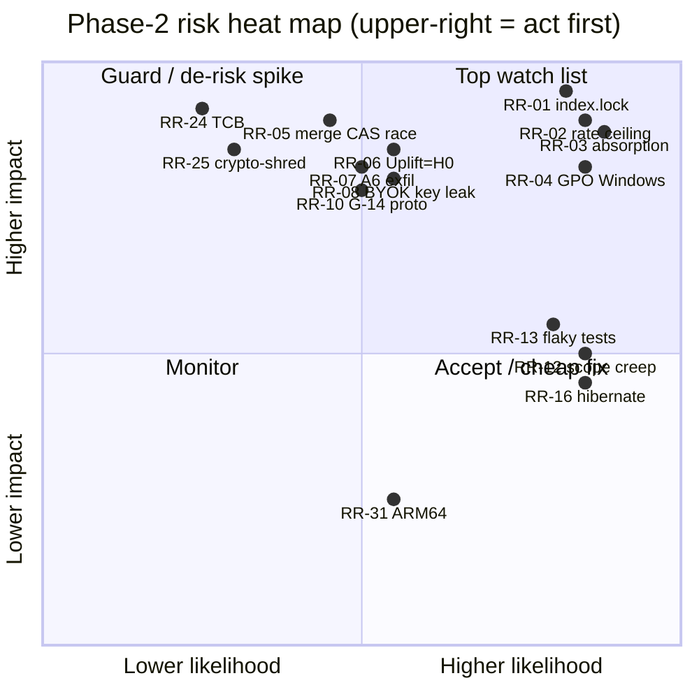

# Mainguard — Phase-2 Agent-Platform Risk Register

**Status:** Draft for review · **Revision:** 2026-07-11 (initial whole-plan red-team) · **Subordinate to:** `Mainguard_Master_Implementation_Document_v2.md` (the binding spec). Where this document and the master doc disagree, **the master doc wins** and the disagreement is drift to be fixed here — the same precedence rule AGENTS.md applies to CLAUDE.md and OPS applies to itself.

This is a program-wide, principal-engineer + program-risk red-team of the Phase-2 agent platform spanning **DEVELOPMENT**, **SCALE**, and **DEPLOYMENT** risk. It deepens the existing architecture; it names no parallel system. Every risk cites the invariants it threatens (**G-11…G-18**, master §2; **S-1…S-9**, OPS §1.2; **ESC-I1…ESC-I9**, ESC §1.3) and folds its mitigation into an owning `P2-xx`/`P3-xx`/`T-xx` task or a named open decision (**A1…A6** OPS §3.7/§6; **SC-1…SC-6** ESC §6; **WSL-1…WSL-4** WSL §6).

Security-specific adversarial risks (prompt-injection payloads, egress-bypass fuzzing, forged-frame attacks, exfil red-teaming) are the province of the **Lane-C orchestration red-team plan** (`docs/phase-2/Mainguard_Orchestration_RedTeam_Plan.md`, RT v1). That document ranks 18 attacks (RT-1…RT-18) impact × likelihood, ties each to the one invariant that must hold and a runnable test, and raises four residual seams as **RT-D1…RT-D4**. It is **referenced, not duplicated** here — this register carries the program-risk framing and the residual it leaves. The rows that hand their adversarial detail to it name the RT-x attack + RT-Dx seam in their mitigation cell (chiefly RR-05, RR-07, RR-08, RR-09, RR-20, RR-24, RR-28).

---

## 0. How to read this register

**Ranking.** Each risk carries an **Impact** and a **Likelihood**, each High/Med/Low, and a **rank score** = Impact × Likelihood on the 3/2/1 scale (max 9). The table is **sorted by rank score descending**; ties break by Impact (High > Med > Low), then by whether the risk is flagged existential/trust-ending. Row IDs `RR-01…RR-31` are assigned in final sorted order, so **ID == rank position**.

**Category** is the dominant lens: **DEV** (build-time correctness/architecture), **SCALE** (behaviour under N agents / cloud / large repos), **DEPLOY** (getting the product onto a real machine and adopted). Many risks touch two; the tag is the sharpest one and the prose names the others.

**No blank cells.** Every row has a real early-warning signal and a real owning task; a risk with no owner is an unmanaged risk.

### 0.1 Impact × likelihood heat map

---

## 1. The risk register (sorted by impact × likelihood)

| Rank / ID | Cat | Risk (description) | Impact | Likelihood | Score | Early-warning signal | Mitigation / de-risking spike (owning task) | Residual |
|---|---|---|---|---|---|---|---|---|
| **RR-01** | DEV / SCALE | **`.git/index.lock` contention under N agents + keep-alive rebase — the exact bug the product exists to prevent (EXISTENTIAL).** During a keep-alive rebase the daemon takes a worktree the agent may still be writing; a torn index or a lost `index.lock` race corrupts a worker tree or, worse, the pattern re-emerges anywhere `ExecuteWithRepo` overlaps an agent CLI's own git. If it escapes to a user repo it invalidates Mainguard's founding promise. | High | High | **9** | Rising `index.lock`-retry/backoff counts in daemon logs; `Verifying_Quiescence → Paused` transitions spiking (OPS §4.3); yield-ready timeouts → `docker pause` on every cycle; corrupt-tree verification failures with no code change. | **[STRUCT]-lean the design:** each agent owns a **separate** worktree/index (no cross-agent shared index by construction); the daemon **never trusts `YieldReady`** and independently verifies quiescence — checks `index.lock`, in-progress-op markers, HEAD attached, no dirty writer — before any mutation, with exponential-backoff on lock contention (**OPS A1 decision D; P2-09**; all mutations journaled via T-19). **Spike:** a 4-agent chaos harness that injects mid-write yields and asserts zero torn trees over 10⁴ cycles (feeds TI-P2-09). | **Med** — the daemon-vs-agent single-worktree race stays a fail-closed **[CHECK]**, not [STRUCT]; carried by decision D + the chaos test. |
| **RR-02** | SCALE | **Provider rate-limit ceiling caps real concurrency far below the "swarm of N agents" story.** A single BYOK key's RPM/TPM (P2-01 `EstimatedConcurrentAgents`) plus per-agent budgets bound true parallelism to a handful; the marketing "swarm" and WSL "4–6 agents on 16 GB" collide with 429 reality. | High | High | **9** | `rate_limited` events (OPS §3.4) frequent at low agent counts; `EstimatedConcurrentAgents` health result of 1–2 on real keys; gateway 429 backoff dominating wall-clock; users reporting "agents just wait". | Gateway-fronted proxy pauses PTY input on 429 so **no agent sees a raw 429 (S-5)**; admission control + per-agent budgets prevent oversubscription (**P2-08**); key-health check surfaces the honest ceiling *before* first 429 (**P2-01**). **De-risk:** publish an honest concurrency-ceiling metric (see **OPEN DECISION OD-R1**) and tier "swarm" claims to it. | **Med** — physics of provider limits is external; honesty + gateway smoothing make it a UX/marketing bound, not a failure. |
| **RR-03** | DEPLOY | **First-party absorption / commoditization.** Claude Code Desktop, GitHub Copilot app + Agent HQ, Codex app, Cursor 3 (+Origin forge) make "agents in worktrees + a GUI" free table stakes (GTM Part III). Mainguard's wedge erodes before the §5 differentiators (verify → review → merge queue, provenance, audit) are shipped and understood. | High | High | **9** | Competitor release notes adding local worktrees/verification/review-queue; free-tier feature parity announcements; declining trial→retain on the "free native client" wedge; analyst framing Mainguard as "another agent GUI". | The moat is the **governed pipeline**, not the GUI: stale-invalidating merge queue (P2-10), review cockpit + provenance (P2-11), audit chain (P2-15), **vendor-neutral PR intake (P2-12)** that ingests *their* output. **De-risk:** front-load the §5 P0 spine (P2-27/P2-34/P2-35/P2-37/P2-38) and lead GTM with governance, not orchestration. See **OPEN DECISION OD-R2** (cloud sequencing vs absorption). | **High** — a well-capitalized incumbent can copy governance features; durable edge is Windows-first + local + audit + intake breadth. |
| **RR-04** | DEPLOY | **MainguardOS/WSL2 silent-provisioning bet on corporate-locked / GPO Windows.** The beachhead is Windows enterprises, yet enterprise GPO frequently blocks WSL/virtualization; if provisioning fails on exactly the target machines the funnel dies at install (WSL §2 WT-4/WT-5/WT-15). | High | High | **9** | Preflight `Fail` rates for GPO/BIOS/virtualization high in install telemetry; support tickets citing "access/policy error"; enterprise pilots stalling at IT approval. | **Honest hard-stop, never silent:** `SystemDiagnostics` classifies the HRESULT, names the policy, links IT docs, and **leaves no partial system mutation** (**P2-21 preflight; WSL WT-15/WT-3**); ARM64 and virtualization-off gated the same way. **De-risk spike:** an IT-enablement kit (GPO/Intune package + doc) so admins can pre-clear WSL org-wide; validate on a locked-down VM image. | **High** — an honest failure is still a lost install; conversion depends on IT cooperation the product cannot force. Motivates the eventual cloud path (P3-06). |
| **RR-05** | DEV | **A5 merge linearization race — "the single bug that would let one unverified state through and end the product's trust" (OPS §6.5).** Two workers `Verified@X`; concurrent/overlapping merges compute onto `X` and both commit; a worker verified against `X` lands on a main that is no longer `X`. | High | Med | **6** | `ABORTED` (CAS mismatch) rate on `ConfirmMerge`; two `BeginMerge` leases contending; any merge landing with `VerificationRecord.MainSha ≠ main@sha` in audit. | Per-repo **single-writer merge lock + compare-and-swap** that `VerificationRecord.MainSha == main@sha` (read Windows-side, never the lagging mirror — red-team RT-6) at the linearization point; two independent mechanisms (lock **and** CAS); idempotent `ConfirmMerge` (retry after commit = no-op) (**P2-10; OPS A5; red-team RT-5/RT-6**). **Spike:** `TwoWorkersRaceToMerge` + `MergeAfterMainMoved_ShouldFailCas` in the §9 suite under injected latency. | **Low–Med** — the race + boundary legs are well-specified [STRUCT]+[CHECK], but **crash-mid-merge exactly-once reconciliation is an unresolved seam (red-team RT-7 → RT-D1)**: a daemon death between the Windows commit and the `ConfirmMerge` record needs T-19-journal reconciliation that isn't yet specified. |
| **RR-06** | DEPLOY | **The Uplift Study returns H0 — the value proposition is empirically unproven.** If the pipeline shows no significant drop in escaped-defect rate / no yield gain vs ungoverned output, every GTM claim ("governed agent adoption") is unsupported and the differentiation spine is marketing, not fact (Uplift §0). | High | Med | **6** | Pre-registered study confidence intervals straddling zero; escaped-defect rate flat across arms; over-block rate high with no recall gain (blocking without catching). | Run the **pre-registered, held-out-oracle Uplift Study** with the model held constant and measurement at merge, before escalating GTM claims (**Uplift Study spec; P2-10/P2-11/P2-35 are the arms**). **De-risk:** treat the study as a **go/no-go gate on governance messaging** (see **OPEN DECISION OD-R4**). | **Med** — an honest negative is a strategy signal, not a build defect; the risk is discovering it late. |
| **RR-07** | DEV / Sec | **A6 unresolved: git-host egress is simultaneously required and an exfiltration channel.** S-1 says the sandbox has no route to the real remote, but P2-07's default allowlist lists "the repo's git host" for legitimate git-dependency fetches — a reachable host is also where an injected agent can push stolen repo contents. The contradiction is open. | High | Med | **6** | Any sandbox `git push` to a host destination in `egress_denied`/audit; package installs failing because the host is blocked (the pull-toward-allow pressure); reviewers flagging the allowlist/S-1 conflict. | Resolve **A6** to the recommended posture: git host **not** on the agent allowlist; git-dependency fetches go through a **push-refusing, prefix-allowlisted daemon read-proxy**; any push denied + audited (**P2-07 egress; OPS §3.7 A6**). Adversarial validation is **red-team RT-1 (force-push) + RT-17 (git-host exfil)** → `ForcePushToRealRemote_…` / `GitHostExfil_ShouldBeDeniedAndAudited`. | **Med** — a read-proxy narrows but does not eliminate covert-channel encoding in fetch traffic; residual carried by red-team RT-17. |
| **RR-08** | DEV / DEPLOY / Sec | **BYOK "zero-exfil" claim vs how real agent CLIs/SDKs actually handle keys.** Mainguard injects keys via tmpfs 0400 (G-13), but Claude Code / Codex / others may cache credentials to `~/.claude`, write env files, log tokens, or spawn children that inherit them — undermining the promise at the CLI layer Mainguard does not control. | High | Med | **6** | Credential files appearing on persistent disk in a live sandbox (P2-44 exfiltration panel); tokens in agent-CLI logs; the `// SECRET` mask test passing while the *CLI* still writes the key elsewhere. | Per-agent tmpfs 0400 injection, **no `~/.claude`/global auth-dir mounts, ever** (**P2-01/P2-07 invariant**); default-deny egress means a leaked-to-disk key still cannot be sent out (**S-6 + A6**); the **Sandbox health & exfiltration panel (P2-44)** surfaces on-disk credential material; the HMAC session key is additionally memory-isolated (red-team RT-4 G2 quartet) and no secret crosses argv/env/log (red-team RT-12 channel matrix). **Spike:** an adapter-conformance probe per supported CLI that asserts where it persists creds. | **Med** — Mainguard cannot rewrite third-party CLIs; the honest claim is "key cannot *leave*", not "CLI never writes it locally". Per-CLI matrix carried by red-team RT-4/RT-12. |
| **RR-09** | DEV / Sec | **A1 not yet built — interim in-band PTY markers are spoofable (S-9 is [CHECK], not [STRUCT], until A1 lands).** During M6–M7 the yield handshake and port/error signals ride stdout; any process (or prompt-injected README text) can forge `[IPC_UPDATE_READY]`/`ERR!` (OPS §2.6). | High | Med | **6** | Yield fired with no corresponding supervisor state; breaker pausing a healthy agent; a repo file containing marker strings altering behaviour; conformance `ForgedIpcReady` failing. | Ship the **OOB `ControlFrame` channel (A1)**: HMAC-authed, sequenced, key unreadable by the agent uid (decision C), daemon independently verifies quiescence (decision D); markers demoted to a **loud, audited, capability-reduced degraded mode** (**OPS §6.1; P2-09; P2-26 taps stay advisory**). Adversarial validation: **red-team RT-2 (forged frame/marker), RT-3 (replay), RT-18 (forged `ERR!` flood)**. | **Med** — degraded marker mode retains a reduced in-band surface; carried by capability reduction + loud audit until every adapter ships a supervisor. |
| **RR-10** | DEV / SCALE | **G-14 "zero-proto-change / transport-agnostic" fragility as cloud lands.** A single leaked localhost assumption or daemon filesystem path in the proto means cloud (P3-06) requires proto breaks and a de-facto fork — the opposite of the "same binary, same contract" bet (master §P2-25). | High | Med | **6** | The P2-25 WAN CI job (`tc netem` 80 ms) going red or being skipped; proto reviews surfacing localhost constants or path fields; timeouts hardcoded instead of `RttBudget`-scaled (OPS §2.8). | Every proto change transport-agnostic; **WAN-latency CI job runs the P2-14 flows unchanged once per release** as the standing guard; all control timeouts expressed as `max(floor, k×RttBudget)` (**P2-25; OPS §2.8; ESC-I8**). **De-risk:** make the WAN job a required merge check, not advisory. | **Med** — the guard is only as good as its coverage; a rarely-exercised RPC can still smuggle a localhost assumption. |
| **RR-11** | SCALE | **Cloud pod topology ADR unresolved — nested containers may not hold the hardened spec.** P3-06 leaves "per-tenant pod with nested per-session worktree containers vs one-pod-per-agent" to a 2-week spike; nested Docker/userns in a cloud pod can silently drop `no-new-privileges`/userns-remap/seccomp (G-15/ESC-I6). | High | Med | **6** | Spike inspect showing missing hardening flags in the nested container; egress backstop not enforceable inside a pod network; the spike slipping past its 2 weeks with no ADR written. | Run the **documented 2-week topology spike** and write the ADR before P3-06 build; assert the full hardened spec on the *nested* container via the ESC §4 `HardenedSpec` test parametrized by substrate (**P3-06; ESC SC-5**). See **OPEN DECISION OD-R2**. | **Med** — nested isolation is achievable but fiddly; residual until the spike proves the inspect passes in-cloud. |
| **RR-12** | DEV / Program | **§5 competitive-match-wave scope creep vs the M-milestones.** M7.75 adds P2-27…P2-45 (19 tasks: ticket pipelines, multi-repo tasks, boards, automations, dispatcher, context vault, flight recorder…). "Match every competitor, then beat it" can swallow the M7 launch and the audit-pair deadline (before 2026-08-02). | Med | High | **6** | Milestone burndown flat while §5 tasks open; the M7.5 audit pair (P2-15/P2-16) slipping; P0 spine (P2-27/34/35/37/38) not started while P1-parity tasks are; reviewer fatigue. | Hold the **milestone contract**: M7 = verified swarm + installer; the §5 wave is M7.75 and its **P0 spine is fixed** while the rest parallelize (**master §3 milestones**). **De-risk:** enforce a WIP cap and treat P1-parity §5 tasks as post-launch. | **Med** — competitive pressure (RR-03) pulls the other way; residual is a standing program-management tension. |
| **RR-13** | DEV / SCALE | **Flaky repo test suites poison verification** (and its adversarial sibling: a worker *gaming* its own repo-configured test command — red-team RT-8 → RT-D2, owned there). P2-10 verification runs the *repo-configured* command; a flaky suite yields false `Verified`/false stale-invalidation, eroding trust in the green badge and churning the stale cascade. | Med | High | **6** | Verification pass/fail flipping on identical trees; users overriding failed verifications routinely; verification-cache (P2-42) hit-rate low due to nondeterminism. | Verification cache keyed by `agentId+treeHash+cmdHash` de-dups deterministic re-runs; **test-impact ordering + merge-train simulation (P2-42)** reduce redundant runs; typed `FAILED_PRECONDITION` when no test command exists (never a silent pass) (**P2-10/P2-42**). **De-risk:** a flakiness detector that flags a command whose result varies on the same tree. | **Med** — flakiness is a property of the user's repo Mainguard cannot fix; honest surfacing is the ceiling. |
| **RR-14** | SCALE | **Stale-cascade verification compute amplification (thundering herd).** Every merge to main flips all `Verified` workers to `StaleVerified` and auto re-queues them (OPS §4.2). With many in-flight workers each re-verification is a full test-suite run — merges get quadratically expensive and the gateway/CPU saturate. | Med | High | **6** | Verification queue depth spiking after each merge; CPU/token spend per merge climbing with worker count; re-verify latency growing super-linearly. | **Verification cache + merge-train simulation (P2-42)** avoid re-running unaffected suites; admission control paces re-verifications (P2-08); conflict radar (P2-19) can pre-serialize colliding branches. **Spike:** model re-verify cost at 10/25/50 workers and confirm cache hit-rate holds. | **Med** — cache helps only when the tree is unaffected; a broad merge legitimately invalidates many workers. |
| **RR-15** | DEV | **Adapter-channel / `AgentSupervisor` version drift → silent fallback to degraded marker mode.** Upstream CLIs (Claude Code / Codex) change output/format/tool-call streams; a stale pinned adapter or missing supervisor negotiates *down* to the spoofable in-band surface (OPS §0.5, RR-09) without the user noticing the capability loss. | Med | High | **6** | `oob_degraded` audit events rising; `ControlHello` negotiating to N−1 or absent; features silently unavailable (progress signal, prompt-action-ack); users on old adapter builds. | **Version-pin adapters via the P2-22 adapter channel**, independent of app releases; OOB protocol carries its **own** version and negotiates (not lockstep); degrade is **loud + audited + UI-badged**, never silent (**P2-22; OPS §0.5/§6.1**). **De-risk:** a simulated breaking-upstream-release test (master P2-22 invariant). | **Med** — upstream instability is external; the mitigation makes drift visible, not impossible. |
| **RR-16** | DEPLOY | **Windows fast-startup / hibernate kills `MainguardEnv` mid-session.** Hybrid shutdown or hibernate stops the VM; every agent container vanishes and in-flight, unpushed agent work is lost (WSL §2 WT-10/WT-12/WT-13). | Med | High | **6** | VM-unreachable-on-resume events; `SwarmReconciler` marking many agents `Dead` after resume; user reports of "my agents disappeared". | ext4 repos + worktrees + pushed commits on the quarantine bare **survive** the VM stop; on re-boot the reconciler marks vanished agents `Dead` and surfaces disposal (never silent re-spawn — **WSL-3 recommendation**); idempotent re-boot of `MainguardEnv` (**P2-08 reconciler; WSL §1.2**). Later, P2-37 checkpoints make resume safe. | **Med** — committed work is safe; in-flight generation is genuinely lost until P2-37 checkpointing lands. |
| **RR-17** | DEV / SCALE | **SC-4: native-Linux ESC-I4 teardown collapses "the host" and "the instance".** On a native-Linux substrate the host *is* the Linux environment, so `TeardownScope.Instance` and "the host" merge — the [STRUCT] guarantee that teardown can never destroy the host is not obviously preserved (ESC §6 SC-4). | Med | Med | **4** | The native-Linux B-doc (future B3) having no [STRUCT] answer for I4; a teardown path with host-root reach; conformance `TeardownNoResidue` unable to assert host-untouched on native Linux. | Resolve **SC-4** before any native-Linux substrate ships: define `Instance` as a Mainguard-owned namespace/cgroup/VM even on native Linux so teardown targets only Mainguard-owned resources (**ESC-I4; owning B3 doc + ESC SC-4**). | **Med** — an open decision on an unbuilt substrate; low urgency but must be resolved before B3. |
| **RR-18** | SCALE / DEPLOY | **WSL memory reclaim vs agent OOM undercuts the swarm cap.** `autoMemoryReclaim=gradual` can page out memory an active agent needs, and the VM `min(50% RAM, 8 GB)` cap starves a swarm — the honest "4–6 agents on 16 GB" ceiling is modest against the swarm story (WSL §2 WT-9, WSL-1). | Med | Med | **4** | Agent OOM-kills in the VM; admission refusing spawns on the memory floor; reclaim thrashing under a live swarm. | Admission holds a **memory-headroom floor before spawn** via `/proc/meminfo` sampling + `HealthCheckAsync.DiskHeadroomBytes` (**P2-08; WSL-1**); reclaim is a `.wslconfig` default, not a hard reclaim. **De-risk:** tune reclaim/cap per the WSL-1 decision; publish the honest cap (ties RR-02/OD-R1). | **Med** — a real hardware ceiling; honesty + admission are the ceiling, not elimination. |
| **RR-19** | DEPLOY | **9P cold-start on a large monorepo misses the provision budget.** `git clone --bare /mnt/c/...` reads the whole tree over 9P/drvfs and is AV-sensitive; the one WSL2 metric that can blow its budget on first provision (WSL §2 WT-11, WSL-2). | Med | Med | **4** | `SubstrateBenchmark` provision-time metric exceeding the §3 budget on a monorepo; users abandoning during first-provision spinner; AV scans serializing the clone. | Keep the objects-only `git clone --bare` as the correctness path; treat read-path speedup as an **optional cold-start optimization behind a capability flag** (git bundle import / pre-warm), adopted only if the benchmark misses budget; subsequent runs are warm incremental `git fetch` (**WSL-2 recommendation; P2-06**). Never introduce file *watching* over 9P (P2-06 rejection trigger). | **Med** — first-run latency on huge repos is physics; mitigations are one-time-cost optimizations. |
| **RR-20** | DEV / Sec | **Secret sprawl across new ticket/host REST transports.** P2-27 adds Jira/Linear/Azure Boards/monday clients (keyring `ticket_<provider>`), P3-07 adds GitLab/Bitbucket/AzDO; each is a new token-bearing egress surface that must not duplicate token-scrub logic or leak tokens (G-13/G-4). | Med | Med | **4** | New `HttpClient`/`ProcessStartInfo` sites in review without the shared redaction path; a token in a log/exception/argv; a duplicated resolver (rejection trigger). | **One audited transport per host** reusing the shared `Redact`/`HostConnectionResolver`/`GitHubApiClient` pattern; tokens header-only, keyring-stored (**P2-27/P3-07; G-4/G-13; the existing single-source token path**). **De-risk:** the token-never-leaks sweep test extended per new provider (T-23 precedent). Adversarial matrix = red-team RT-12 (secret exfil across every G-13 channel). | **Med** — each new provider is additive attack surface; discipline + the sweep test keep it bounded. |
| **RR-21** | DEV | **A3 silent-wedge: a healthy container with an idle/deadlocked agent shows "working" on a corpse.** Docker liveness catches death, the breaker catches error loops, but neither catches a hung tool call / infinite "thinking" with no output (OPS §3.7 A3). The queue waits forever; the human trusts a false badge. | Med | Med | **4** | Agents in `Working` with zero `ProgressSignal` for long stretches; wall-clock-per-task outliers; the progress watchdog never firing because it isn't wired. | **Heartbeat + `ProgressSignal` + progress watchdog (A3)**: 3 missed heartbeats → `Unresponsive`; a configurable progress watchdog (default 10 min) escalates a silent wedge; distinct from Docker death (**OPS §3.7 A3; P2-09**). | **Low** — once A3 is wired the wedge is observable; residual is watchdog tuning (false escalations vs slow tasks). |
| **RR-22** | DEV | **SC-5: the `SubstrateConformance` suite has no fixture home.** ESC §4 defines 11 portability tests but no fixture is parametrized by substrate; OPS §9 fixtures aren't either — so the umbrella contract that lets a second platform "just work" is unenforceable (ESC §6 SC-5). | Med | Med | **4** | ESC §4 tests existing on paper but not runnable; a second substrate (B3+) landing with no green conformance run; drift between ESC and the WSL2 impl going undetected. | Resolve **SC-5**: parametrize the TI-P2-00 fixtures (`DaemonFixture`, `SandboxFixture`, `DualRepoFixture`, `AuditProbe`) by `SubstrateId` so the ESC §4 suite runs against each impl (**ESC SC-5; owning TI-P2-00 + ESC §4**). | **Med** — until fixtures exist, portability is asserted, not proven; low urgency while WSL2 is the only substrate. |
| **RR-23** | DEPLOY | **Netherlands beachhead is a beachhead, not a market.** ~575k ICT workers (<1.5% of a global category) is where partners/subsidies/first logos come from, not the ARR ceiling (GTM Part V "honest caveat"). Over-indexing on Twente/Enschede can cap growth. | Med | Med | **4** | Pipeline concentrated in one region; churn on non-NL trials; subsidy-dependent runway; no international logos after the beachhead phase. | Treat NL explicitly as **beachhead → then international**; the product bets (Windows-first, BYOK-local, audit) are globally applicable, not NL-specific (**GTM Part V/VI**). **De-risk:** an international expansion trigger tied to beachhead milestones. | **Med** — a strategy risk, not a build risk; owned by GTM, tracked here for whole-plan completeness. |
| **RR-24** | DEV / Sec | **TCB compromise (daemon + egress proxy + audit store).** Their compromise defeats every [STRUCT] control — S-1/S-2 and the whole thesis rest on the daemon being honest (OPS §1.1). A supply-chain or memory-safety bug in the daemon is catastrophic. | High | Low | **3** | Anomalous daemon behaviour vs the source-available build; audit-chain verification (`VerifyAll`) reporting a bad seq; dependency CVEs in the daemon/proxy. | Compensating controls: **source-available daemon + network transparency (P2-17)**, tamper-evident hash chain (P2-15), supply-chain & secrets compliance (P2-24). TCB compromise is **T3 — explicitly out of scope** in the red-team threat model (§0.2/0.3), compensated only by P2-17 + P2-15. | **Low-Med** — a trusted core is unavoidable; the bet is transparency + tamper-evidence make compromise detectable, not impossible. |
| **RR-25** | SCALE / DEPLOY | **Tenant crypto-shred correctness (P3-06).** On account deletion, per-tenant repo store + audit DB must be crypto-shredded (key deletion) with no residue in shared buckets; a bug leaves recoverable tenant data — a compliance/legal failure (master §P3-06). | High | Low | **3** | `crypto-shred verification` test absent or flaky; tenant data found in shared buckets without per-tenant keys (rejection trigger); KMS key-deletion not actually reaping ciphertext. | Per-tenant encryption at rest with tenant-scoped KMS keys behind `ISecureKeyStore`; **crypto-shred = key deletion, verified by test**; multi-tenant isolation test (two tenants, no cross-read) (**P3-06; P2-24 backends pattern**). | **Low** — deferred to P3-06 and well-specified; residual is implementation correctness, gated by the required test. |
| **RR-26** | DEV | **SQLite-in-VM as the single durable store for queue + audit + events.** Queue restart-durability, audit chain, and event `seq` all live in daemon SQLite; corruption or a torn write under VM crash risks losing queue state or breaking the chain (OPS §2.4/§2.9; P2-10 step 1). | Med | Low | **2** | Audit `VerifyAll` failing; queue state not surviving a daemon restart in test; SQLite `database is locked`/malformed errors in logs. | Transactional, no-queue audit appends (torn records impossible — P2-15); queue state persisted and restart-durable (P2-10 step 1); event log is the durable source behind the gap-detectable ring (**P2-10/P2-15; OPS §2.4/§2.9**). **De-risk:** a kill-9-mid-write durability test; note the durable T-19 journal is also the reconciliation input the crash-mid-merge seam needs (**red-team RT-7 → RT-D1**). | **Low** — SQLite is robust with WAL + transactions; residual is disk-full/corruption edge cases + the RT-D1 reconciliation wiring. |
| **RR-27** | DEV | **Audit fail-closed becomes an availability bottleneck.** Audit appends are loss-proof: an unappendable audit store **halts the action** (S-7). A wedged audit store could freeze all authority-bearing operations. | Med | Low | **2** | Actions blocking on audit writes; audit-store latency spikes; disk-full on the audit volume. | Fail-closed is deliberate (the chain is the evidence); the **one exception is the kill switch — freeze-then-audit best-effort, never blocked by an audit failure** (**OPS §2.9 audit row; P2-14/P2-15**). **De-risk:** audit-volume headroom monitoring. | **Low** — intended behaviour; the kill-switch carve-out prevents the worst case (can't stop agents because audit is down). |
| **RR-28** | DEV / Sec | **Coordinator tool-call schema-validation gaps (S-8).** The Coordinator is an untrusted LLM; if a `spawn_worker` `TaskPlan` payload has a validation hole, a compromised Coordinator could exceed its intended surface (OPS §1.2 S-8 residual). | Med | Low | **2** | Malformed tool-call payloads accepted in tests; new tool fields landing without schema coverage; `coordinator_tool_call` audits with unexpected shapes. | Tool table is **exactly four** calls, JSON-schema-validated, role-limited daemon-side, budget-capped, human-plan-approval-gated; no merge/kill/approve/budget/egress tool exists (**[STRUCT]** absence) (**P2-14; OPS §3.3/S-8**). Adversarial validation: **red-team RT-14 (hostile Coordinator) + RT-15 (managed-worker input / privileged-RPC via hand-crafted client)** → `CompromisedCoordinator_ExfilAttempt_…`, `CoordinatorMergeRpc_ShouldPermissionDeny_…`. | **Low** — worst case is bounded to "what N sandboxed workers could do"; residual is the validation corpus completeness. |
| **RR-29** | SCALE | **Kill-switch fan-out bound degrades under cloud WAN.** P2-14's "< 5 s" kill is the *local* profile of `max(5 s, 50×RTT)`; at WAN RTT the emergency-stop fan-out could take much longer (OPS §2.8). | Med | Low | **2** | Kill-switch completion time climbing with agent count / RTT; the WAN CI job showing kill fan-out near its bound. | The bound is **documented, not violated** — the formula scales and the WAN CI job asserts it; kill is freeze-then-audit best-effort so it never blocks (**OPS §2.8/§2.9; P2-14**). **De-risk:** a fan-out parallelism target validated under the `tc netem` job. | **Low** — an honest WAN profile; residual is user expectation-setting for cloud. |
| **RR-30** | DEV | **SC-2: sync-remote name inconsistent across substrates.** P2-06 hardcodes `mainguard-vm`, P2-25 uses `mainguard-cloud`, and native-Linux has no "VM" — a hardcoded name breaks transport-agnosticism at the naming layer (ESC §6 SC-2). | Low | Med | **2** | Hardcoded `mainguard-vm` strings in code review; the cloud/native paths needing string special-cases; SC-2 unresolved when B3/P3-06 start. | Resolve **SC-2**: a substrate-provided remote name via `Capabilities`, URL an opaque handle (ESC-I8) (**ESC SC-2; P2-06/P2-25**). | **Low** — cosmetic/naming; cheap to fix once decided. |
| **RR-31** | DEPLOY | **ARM64 unsupported gate excludes the growing Windows-on-ARM segment.** v1 hard-stops on ARM64 with no `MainguardOS.tar.gz` built (WSL §4.5). As Windows-on-ARM (Snapdragon laptops) grows, the honest gate becomes an addressable-market cap. | Low | Med | **2** | Rising ARM64 preflight hard-stops in telemetry; enterprise fleets standardizing on ARM laptops; trials failing at install on ARM. | Honest, documented hard-stop now (no partial mutation); **ARM64 `MainguardOS` build is scoped future work** outside B2 (**WSL §4.5**). **De-risk:** track ARM64 install-attempt telemetry to time the port. | **Low** — a deliberate scope cut; residual is opportunity cost, revisited when telemetry justifies it. |

---

## 2. OPEN DECISIONs (strategic forks this red-team raises)

These are **program-level** forks beyond the spec-local open decisions (A1–A6, SC-1–SC-6, WSL-1–WSL-4), which remain owned by their documents. Each follows the master-doc register format: decision → recommendation → rationale → affected tasks.

> **OPEN DECISION [OD-R1] — Publish an honest, tiered concurrency ceiling, or keep the "swarm" story unqualified?** RR-02 and RR-18 collide the "swarm of N agents" narrative with the BYOK single-key rate ceiling (P2-01) and the WSL "4–6 agents on 16 GB" memory floor (WSL-1).
> **Recommendation:** derive and publish a single **effective-concurrency metric** = `min(key-health ceiling, admission memory floor, budget cap)` and tier every "swarm" claim to it in-product and in GTM.
> **Rationale:** the trust wedge (GTM) dies on a broken swarm promise; an honest ceiling shown *before* the first 429 (P2-01 already computes it) converts the risk into a credibility asset. *Rejected — unqualified swarm claims:* they invite the exact "agents just wait" churn signal.
> **Affected tasks:** P2-01 (`EstimatedConcurrentAgents`), P2-08 (admission floor), WSL-1; GTM messaging.

> **OPEN DECISION [OD-R2] — Pull cloud (P3-06) forward to answer first-party absorption, or hold post-GA and double down on the intake moat?** RR-03 (absorption) and RR-04 (locked-Windows funnel loss) both pull toward cloud; RR-11 (nested-pod hardening) and RR-10 (proto fragility) and the master doc ("cloud execution is capital-intensive, off-thesis") pull against it.
> **Recommendation:** **hold cloud post-GA**; answer absorption with the governance moat + **vendor-neutral PR intake (P2-12)** that ingests competitors' output, and treat cloud as the answer to RR-04's locked-Windows funnel *only after* the topology spike (RR-11) and WAN guard (RR-10) are green.
> **Rationale:** racing well-capitalized incumbents on cloud execution is off-thesis and capital-intensive (master §5 "unchanged" note); the durable edge is Windows-first + local + audit + intake breadth. *Rejected — cloud-first:* forfeits the BYOK/local differentiation and the RR-11/RR-10 debt is unpaid.
> **Affected tasks:** P2-12, P2-25, P3-06, the §5 P0 spine; ties RR-03/RR-04/RR-10/RR-11.

> **OPEN DECISION [OD-R3] — Make A6 (worker git-host egress) a launch-blocking resolution before P2-07 ships?** RR-07 flags the live S-1 ↔ P2-07-allowlist contradiction.
> **Recommendation:** **yes** — resolve A6 to the daemon read-proxy posture *before* P2-07's egress allowlist is finalized, so S-1 is never shipped in a self-contradictory state.
> **Rationale:** S-1 is a thesis invariant; shipping an allowlist that lists the git host while claiming "no route to the real remote" is a demo-able contradiction and an exfil channel. *Rejected — defer A6:* leaves the flagship safety claim falsifiable at launch.
> **Affected tasks:** P2-06, P2-07, OPS A6; adversarial validation → Lane-C.

> **OPEN DECISION [OD-R4] — Gate governance GTM claims on a green Uplift Study?** RR-06: the entire "governed adoption" pitch is empirically unproven until the study runs.
> **Recommendation:** treat the pre-registered Uplift Study as a **go/no-go gate on escalating governance/efficacy claims** — pre-register, run on the shipped pipeline arms, and only make quantified efficacy claims the study supports.
> **Rationale:** a late H0 discovery after the market message is built is far costlier than an early honest read; the study is designed to be ungameable (held-out oracle, both axes reported). *Rejected — claim efficacy pre-study:* risks a falsifiable public claim.
> **Affected tasks:** Uplift Study spec; P2-10/P2-11/P2-35 (the arms); GTM.

> **OPEN DECISION [OD-R5] — Give the four red-team seams RT-D1…RT-D4 owning task-branches and make them M7 ship-gates, or let them ride as accepted residual?** The Lane-C plan's §4 go/no-go checklist declares RT-D1 (crash-mid-merge exactly-once reconciliation), RT-D2 (verification-command pinning/flagging), RT-D3 (kill-switch audit-gap self-declaration), and RT-D4 (`RttBudget` hard ceiling) as **launch-blockers** — yet none appears as a scheduled task in the master §3 build order, so they are red boxes with no owner.
> **Recommendation:** fold each into its already-named owning task as an explicit acceptance criterion — **RT-D1 → P2-10** (reboot reconciliation reads the T-19 Windows-side journal), **RT-D2 → P2-10/P2-35** (test-command provenance + must-ack flag; optional out-of-branch pin), **RT-D3 → P2-14/P2-15** (recovery-time `killswitch_audit_gap` marker), **RT-D4 → P2-14/OPS §2.8** (hard ceiling `min(ceiling, max(floor, k×RTT))`) — and make their guard tests part of the M7/M7.5 exit criteria.
> **Rationale:** RT-D1 and RT-D2 touch S-3/S-4 directly; shipping the swarm with them unresolved ships the trust thesis with a known hole. They are small, absorbable hardenings of existing `[CHECK]`s — cheap now, expensive as a post-launch trust incident. *Rejected — accept as residual:* the red-team's own checklist forbids it (red boxes block ship).
> **Affected tasks:** P2-10, P2-14, P2-15, P2-35; OPS §2.8; red-team RT-D1…RT-D4.

---

## 3. Top-5 watch list

The five to steer by; each links to its row and the signal that means it is materializing.

1. **RR-01 — `.git/index.lock` under N agents + keep-alive rebase (EXISTENTIAL).** *Watch:* index.lock-retry counts and `Verifying_Quiescence → Paused` transitions. This is the exact bug the product exists to prevent; if it escapes once to a user repo, the thesis is dead.
2. **RR-03 — First-party absorption.** *Watch:* competitor release notes adding local verification/review-queue/worktrees. The clock on the governance moat is set by incumbents, not by us.
3. **RR-04 — GPO-locked / corporate Windows provisioning.** *Watch:* preflight `Fail` rates on the exact target machines. The beachhead funnel can die at install on the target market.
4. **RR-02 — Provider rate-limit ceiling vs the swarm story.** *Watch:* `rate_limited` events at low agent counts and real-key `EstimatedConcurrentAgents`. The core value narrative must survive contact with 429s.
5. **RR-05 — A5 merge linearization race (trust-ending).** *Watch:* `ConfirmMerge` `ABORTED`/CAS-mismatch rate. The one bug that lets an unverified state through and ends trust.

---

## 4. Spikes and tests that retire the highest-ranked risks

The cheapest de-risking work, ordered by the risk it retires. Each folds into an owning task's test contract (TI-P2-xx) — none is a parallel system.

| Spike / test | Retires | Owning task | What "green" means |
|---|---|---|---|
| **4-agent keep-alive chaos harness** — inject mid-write yields, assert zero torn trees over 10⁴ cycles; assert daemon quiescence check (decision D) refuses to rebase a locked/dirty tree | RR-01 | P2-09 / OPS A1-D (TI-P2-09) | index.lock contention degrades to bounded backoff, never corruption |
| **Concurrency-ceiling bench** — real BYOK keys → `EstimatedConcurrentAgents`; admission memory floor on 16 GB; publish `min(...)` | RR-02, RR-18, OD-R1 | P2-01 / P2-08 | the published swarm ceiling matches measured reality |
| **Locked-Windows install matrix** — GPO-blocked WSL, virtualization-off, ARM64 → honest classified hard-stop, zero partial mutation | RR-04, RR-31 | P2-21 (WT-3/WT-15) | every failure names the policy + leaves the system untouched |
| **A5 race suite under latency** — `TwoWorkersRaceToMerge`, `MergeAfterMainMoved_ShouldFailCas`, idempotent-`ConfirmMerge`, under `tc netem` 80 ms | RR-05, RR-29, RR-10 | P2-10 / OPS §9 + P2-25 | no double-merge, no stale main, no spurious WAN timeout |
| **Pre-registered Uplift Study run** — held-out oracle, model held constant, both axes reported | RR-06, OD-R4 | Uplift Study spec | escaped-defect reduction is significant, yield not collapsed |
| **Egress exfil probe** — git-host push denied+audited; DNS/direct-IP exfil fails fast; A6 read-proxy prefix-allowlist holds | RR-07, OD-R3 | P2-07 / OPS A6 → Lane-C | no sandbox→real-remote route exists; every attempt audited |
| **Per-CLI credential-persistence probe** — where each supported agent CLI writes keys; assert egress still blocks exfil | RR-08 | P2-01/P2-07/P2-44 → Lane-C | key cannot leave the sandbox even if the CLI writes it locally |
| **`SubstrateConformance` fixture parametrization** — run ESC §4's 11 tests against WSL2; wire nested-pod `HardenedSpec` for the cloud spike | RR-11, RR-17, RR-22, RR-30 (SC-2/4/5) | ESC §4 / TI-P2-00 | the umbrella contract is proven, not asserted |
| **Kill-9 durability + audit-chain verify** — crash daemon mid-write; `VerifyAll` clean; queue state survives restart | RR-26, RR-27 | P2-10/P2-15 | no torn audit record; queue restart-durable |
| **Simulated breaking-upstream-release** — stale adapter negotiates to degraded mode loudly + audited (`oob_degraded`) | RR-09, RR-15 | P2-22 / OPS §6.1 | drift is visible + capability-reduced, never silent |

---

## 5. Tests implied by this register

Folded into the owning task's TI section (never a parallel verifier):

- **RR-01:** `KeepAliveRebase_MidWriteYield_ShouldNeverTearTree` (chaos, TI-P2-09); `DaemonQuiescenceCheck_ShouldRefuseLockedOrDirtyTree` (OPS decision D).
- **RR-02 / RR-18 / OD-R1:** `EffectiveConcurrency_ShouldEqualMinOfCeilings`; `Admission_ShouldHoldMemoryFloorBeforeSpawn` (TI-P2-08).
- **RR-03:** no unit test — a standing competitive-watch review cadence (program control, not code).
- **RR-04 / RR-31:** `GpoLockedWsl_ShouldClassifyAndHardStop`, `Arm64_ShouldHardStopNoPartialMutation`, `VirtualizationOff_ShouldGiveBiosGuidance` (WT-3/WT-15).
- **RR-05:** `TwoWorkersRaceToMerge_ShouldSerialize`, `MergeAfterMainMoved_ShouldFailCas`, `ConfirmMerge_RetryAfterCommit_IsNoOp` (OPS §9, P2-10).
- **RR-06:** the Uplift Study meta-test suite (Uplift §8) — the bench that tests the bench.
- **RR-07 / RR-08 / RR-20 / RR-28:** `GitHostExfil_ShouldBeDeniedAndAudited`, `ForcePushToRealRemote_ShouldBeStructurallyImpossible`, per-CLI credential-persistence probe, token-never-leaks sweep per provider, `CompromisedCoordinator_ExfilAttempt_ShouldBeBlocked` — **owned by Lane-C**, referenced here.
- **RR-09 / RR-15:** `ForgedIpcReady_ShouldBeRejected_OverOob`, `StaleAdapter_ShouldNegotiateDegradedLoudly` (OPS §6.1, P2-22).
- **RR-10 / RR-29:** the P2-25 WAN CI job (`tc netem` 80 ms) as a **required** merge check running the §5.1–5.4 flows.
- **RR-11 / RR-17 / RR-22 / RR-30:** the substrate-parametrized ESC §4 suite incl. `HardenedSpec` on the nested container (ESC SC-5).
- **RR-13 / RR-14:** `Verification_ShouldBeDeterministicOnSameTree` (flakiness detector); `StaleCascade_ReVerifyCost_ShouldHoldCacheHitRate` (P2-42).
- **RR-16:** `VmStopMidSession_ShouldMarkDeadNotRespawn_AndPreserveCommitted` (WT-10, WSL-3).
- **RR-21:** `SilentWedge_ShouldTripProgressWatchdog` (OPS A3).
- **RR-25:** `CryptoShred_ShouldRenderTenantDataUnrecoverable`, `TwoTenants_ShouldNotCrossRead` (P3-06).
- **RR-26 / RR-27:** `Daemon_Kill9MidWrite_ShouldNotTearAudit`, `KillSwitch_ShouldNotBlockOnAuditFailure` (P2-15/P2-14).

---

## 6. Deferred / not covered here

- **Security-specific adversarial detail** (prompt-injection payloads, forged/replayed frames, exfil, hostile Coordinator) lives in the **Lane-C red-team plan** (`docs/phase-2/Mainguard_Orchestration_RedTeam_Plan.md`, RT-1…RT-18) — referenced, not duplicated. Its four residual seams **RT-D1…RT-D4** are launch-blockers that need owning task-branches (see **OD-R5**).
- **Spec-local open decisions** (A1–A6 OPS, SC-1–SC-6 ESC, WSL-1–WSL-4 WSL2, RT-D1–RT-D4 red-team) remain owned by their documents; this register raises only the **program-level** forks OD-R1…OD-R5 and cites the spec-local ones where they gate a risk.
- **Quantified financial/runway risk** (subsidy stack, burn) — GTM's remit, out of scope for an engineering-and-program risk register beyond RR-23.
